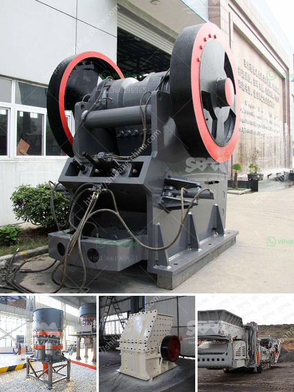

<h3>stone crusher conveyors belt price</h3>
Belt conveyor consists of two or more pulleys, with a continuous loop of material - the conveyor belt - that rotates about them. One or both of the pulleys are powered, moving the belt and the material on the belt forward. The powered pulley is called the drive pulley while the unpowered pulley is called the idler pulley. There are two main industrial classes of belt conveyors; those in general material handling such as those moving boxes along inside a factory and bulk material handling such as those used to transport large volumes of resources and agricultural materials, such as grain, salt, coal, ore, sand, overburden and more.

Belt conveyors are used to transport all types of bulk material and unit loads—both horizontally and sloping. Belt conveyor machine consist of conveyor frame, conveyor belt, conveyor pulley, conveyor rollers, tension devices, driving unit and other components etc.

Belt conveyor system can transport materials in bulk and bagged, such as stone, sand, coal, concrete, cement, gravel, fertilizer, mineral ore, limestone, coke, sawdust, wood chip, bulk material, grain, corn flakes, carbon black, etc.

In industrial production lines, belt conveyors are often used to transport bulk materials or packaged materials, such as ore, sand, coal, concrete, cement, gravel, fertilizer, mineral ore, limestone, coke, sawdust, wood chip, bulk material, grain, corn flakes, carbon black, etc. These materials can be transported with belt conveyors because of their excellent bulk and crushing resistance properties. Belt conveyors are commonly used in various industries, such as mining, metallurgy, power plants, ports, construction, and chemical plants.

When working near a crusher or mill, large stones and high-pressure drop from crushers or mills onto the belts can cause significant damage, especially when the belts are under tension. To prevent such damage, it is crucial to choose a belt with sufficient impact strength to resist high-pressure drop onto the belt. 

- Belt width: The most important factor that determines the price of the conveyor belt is its width. The wider the belt, the higher the price, as wider belts require more materials and have a higher carrying capacity.

- Length of the conveyor: Longer conveyors require more material and labor, which affects the price. Similarly, shorter conveyors are cheaper.

- Belt material: The type of material used for the belt affects the price. Rubber belts cost less than steel belts, but they are less durable and have a shorter lifespan.

- Power requirements: More powerful motors are more expensive. The power requirements depend on the weight and speed of the material being transported.

- Additional features: Special features such as self-cleaning mechanisms, impact beds, and belt tracking systems increase the price.

In conclusion, stone crusher conveyors belt price is influenced by various factors such as belt width, length, speed, material, power requirements, and additional features. The price of a conveyor belt can range from several hundred dollars to several thousand dollars depending on the factors mentioned above. It is important to choose the right belt conveyor for the specific application to ensure cost-effective and efficient material handling.
<h3>Contact us</h3><ul><li><strong>Whatsapp:&nbsp;<a href="https://wa.me/8613661969651">+8613661969651</a></strong></li><li><a href="https://swt.shibang-china.com/?git&amp;zhl&amp;stone crusher conveyors belt price"><strong>Online Service(chat now)</strong></a></li></ul><h3>Related</h3><ul><li><a href='cement plant machinery supplier in korea.md'>cement plant machinery supplier in korea</a></li><li><a href='crushed stone prices per ton.md'>crushed stone prices per ton</a></li><li><a href='lates hammer mill.md'>lates hammer mill</a></li><li><a href='sand making machine application.md'>sand making machine application</a></li><li><a href='cost of coal washing plant.md'>cost of coal washing plant</a></li></ul>