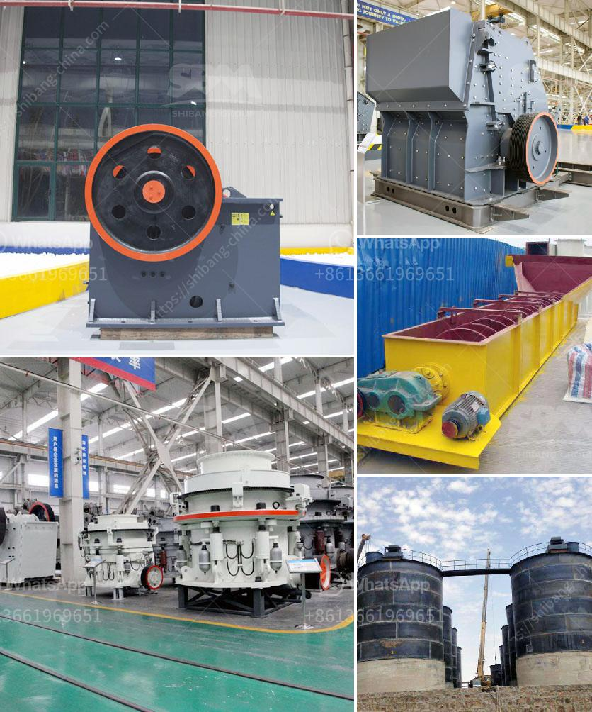

<h3>stone crusher details</h3>
A stone crusher is a machine designed to reduce large rocks into smaller rocks, gravel, or rock dust. Crushers may be used to reduce the size, or change the form, of waste materials so they can be more easily disposed of or recycled, or to reduce the size of a solid mix of raw materials (such as in rock ore), so that pieces of different composition can be differentiated. Crushing is the process of transferring a force amplified by mechanical advantage through a material made of molecules that bond together more strongly, and resist deformation more, than those in the material being crushed do.

The earliest crushers were hand-held stones, where the weight of the stone provided a boost to muscle power, used against a stone anvil. Querns and mortars are types of these crushing devices. In industry, crushers are machines which use a metal surface to break or compress materials into small fractional chunks or denser masses. Throughout most of industrial history, the greater part of crushing and mining part of the process occurred under muscle power as the application of force concentrated in the tip of the miners pick or sledge hammer driven drill bit.

With the rapid development of mining technology, the cone crusher can be divided into four types: compound cone crusher, spring cone crusher, hydraulic cone crusher and gyratory crusher. According to different models, the cone crusher is divided into VSC series cone crusher (compound cone crusher), Symons cone crusher, PY cone crusher, single cylinder hydraulic cone crusher, multi-cylinder hydraulic cone crusher, gyratory crusher, etc.

A cone crusher is similar in operation to a gyratory crusher, with less steepness in the crushing chamber and more of a parallel zone between crushing zones. A cone crusher breaks rock by squeezing the rock between an eccentrically gyrating spindle, which is covered by a wear-resistant mantle, and the enclosing concave hopper, covered by a manganese concave or a bowl liner. As rock enters the top of the cone crusher, it becomes wedged and squeezed between the mantle and the bowl liner or concave. Large pieces of ore are broken once, and then fall to a lower position (because they are now smaller) where they are broken again. This process continues until the pieces are small enough to fall through the narrow opening at the bottom of the crusher.
<h3>Contact us</h3><ul><li><strong>Whatsapp:&nbsp;<a href="https://wa.me/8613661969651">+8613661969651</a></strong></li><li><a href="https://swt.shibang-china.com/?git&amp;zhl&amp;stone crusher details"><strong>Online Service(chat now)</strong></a></li></ul><h3>Related</h3><ul><li><a href='granite business plan ppt.md'>granite business plan ppt</a></li><li><a href='crusher plant equipment supplier in saudi arabia.md'>crusher plant equipment supplier in saudi arabia</a></li><li><a href='business plan for a quarry.md'>business plan for a quarry</a></li><li><a href='high capacity stone hammer crusher manufacturer.md'>high capacity stone hammer crusher manufacturer</a></li><li><a href='mobile crusher wanted for rent in johor.md'>mobile crusher wanted for rent in johor</a></li></ul>