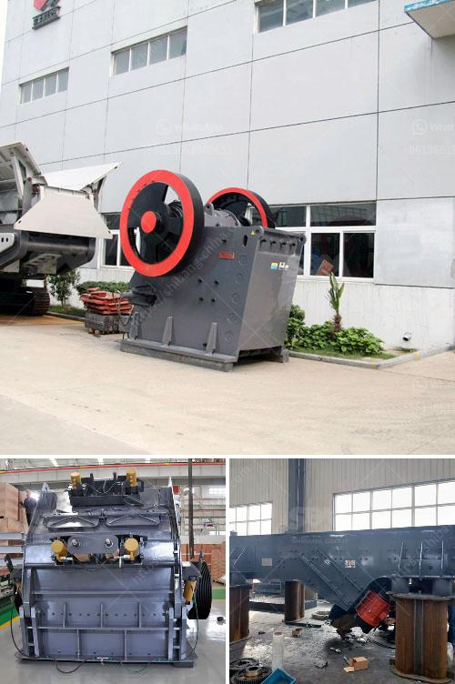

<h3>stone crusher dijual</h3>
Stone crusher dijual, a crusher for sale, is a machine that processes materials into smaller pieces suitable for use in construction projects or other industries. With its wide range of applications, stone crusher dijual is not only used in aggregate or gravel production line, but also in the organic fertilizer manufacturing process, mining operations, and recycling operations. In this article, we will discuss the features, benefits, and applications of stone crusher dijual.

One of the key features of stone crusher dijual is its ability to crush materials into various sizes. This capability allows for the production of different grades of aggregate or gravel, which are essential for constructing roads, buildings, and other infrastructures. By using stone crusher dijual, construction contractors can save time and money by producing their own materials on-site, instead of relying on external suppliers.

Another benefit of stone crusher dijual is its versatility. It can process various types of materials, including limestone, granite, basalt, and more. This flexibility makes stone crusher dijual suitable for different applications. For example, in the organic fertilizer manufacturing process, it can crush animal manure, crop residues, and other organic materials into fine particles, which can then be used as fertilizer.

In mining operations, stone crusher dijual is used to crush and grind ores, allowing for the extraction of valuable minerals. It can also be used to crush waste rock and tailings, reducing the environmental impact of mining activities. Moreover, stone crusher dijual can be used in recycling operations, crushing construction and demolition waste into reusable materials. This helps reduce landfill usage and promotes a more sustainable approach to waste management.

Stone crusher dijual is equipped with advanced technology to ensure its efficiency and reliability. It features a powerful motor, high crushing ratio, and durable wear parts, which contribute to its long service life. Additionally, stone crusher dijual is designed with safety features such as a hydraulic overload protection system, which prevents damage to the crusher and ensures operator safety.

In conclusion, stone crusher dijual offers a range of benefits for various industries. Its ability to process materials into various sizes, versatility, and advanced technology make it an essential tool for construction, mining, and recycling operations. By investing in stone crusher dijual, businesses can improve their productivity, reduce costs, and contribute to sustainable development. Whether it is used in aggregate production, organic fertilizer manufacturing, or mining operations, stone crusher dijual plays a crucial role in various industries.
<h3>Contact us</h3><ul><li><strong>Whatsapp:&nbsp;<a href="https://wa.me/8613661969651">+8613661969651</a></strong></li><li><a href="https://swt.shibang-china.com/?git&amp;zhl&amp;stone crusher dijual"><strong>Online Service(chat now)</strong></a></li></ul><h3>Related</h3><ul><li><a href='quarry equipment china.md'>quarry equipment china</a></li><li><a href='hammer mill 200 mesh.md'>hammer mill 200 mesh</a></li><li><a href='quarry crusher equipments for sale in ibadan nigeria.md'>quarry crusher equipments for sale in ibadan nigeria</a></li><li><a href='gypsum powder production process pdf.md'>gypsum powder production process pdf</a></li><li><a href='dealers of hammer mill in nigeria.md'>dealers of hammer mill in nigeria</a></li></ul>