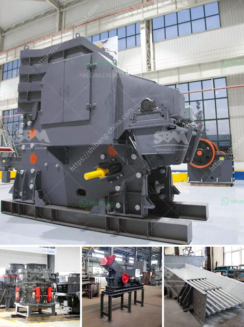

<h3>stone crusher fairs</h3>
Stone crusher fairs are the perfect medium to showcase technological advancements and innovations in the stone crushing industry. For the manufacturers and suppliers who are participating in these fairs, it is an opportunity to connect with potential customers, gauge the pulse of the market, and unveil their latest product offerings.

Stone crushing is an essential industry that plays a crucial role in the infrastructure development of any country. It provides the raw materials needed for various construction activities such as building roads, bridges, and residential buildings. The stone crushing process involves breaking down large rocks into smaller sizes that are suitable for construction purposes. This is achieved through the use of crushing equipment, such as jaw crushers, impact crushers, and cone crushers.

Stone crusher fairs bring together manufacturers and suppliers of these crushing equipment, along with industry experts, government officials, and prospective buyers. These fairs serve as a platform for knowledge sharing, networking, and business transactions. Participants can learn about the latest technological advancements in the field, understand the demands of the market, and forge lucrative partnerships.

One of the key highlights of stone crusher fairs is the exhibition of cutting-edge crushing machinery. Manufacturers showcase their innovative products that are designed to increase efficiency, reduce operating costs, and minimize environmental impact. Attendees can witness the latest models of crushers that are capable of crushing rocks of different hardness levels and sizes. Some crushers are equipped with advanced features like remote control operation, real-time monitoring, and automatic adjustment of settings.

Stone crusher fairs also provide an opportunity for manufacturers to educate their target audience about the benefits of their products. They can conduct live demonstrations to showcase the performance, durability, and ease of use of their crushers. Experts from the industry can impart knowledge through seminars and presentations, discussing best practices, safety guidelines, and maintenance tips. This information helps the attendees in making informed decisions while choosing the right crusher for their specific requirements.

Government officials and regulatory bodies also have an active presence at stone crusher fairs. They use this platform to address concerns related to the stone crushing industry, enforce existing regulations, and propose new policies for a sustainable future. These interactions foster a healthy dialogue between the industry and the authorities, ensuring that the sector functions in compliance with environmental and safety standards.

Stone crusher fairs are not just about business. They also offer an opportunity for networking and building long-lasting relationships. Participants can meet with potential customers, suppliers, and collaborators, leading to fruitful partnerships and collaborations. These fairs serve as a melting pot of ideas, enabling industry players to exchange insights, share success stories, and discuss challenges.

In conclusion, stone crusher fairs provide a comprehensive platform for manufacturers, suppliers, experts, and customers to come together and showcase the latest developments in the stone crushing industry. These fairs facilitate knowledge sharing, networking, and business transactions, enabling the sector to grow and thrive. Attending these fairs can be highly beneficial for all stakeholders involved, helping them stay abreast of the latest trends, forge valuable connections, and contribute towards the sustainable development of the industry.
<h3>Contact us</h3><ul><li><strong>Whatsapp:&nbsp;<a href="https://wa.me/8613661969651">+8613661969651</a></strong></li><li><a href="https://swt.shibang-china.com/?git&amp;zhl&amp;stone crusher fairs"><strong>Online Service(chat now)</strong></a></li></ul><h3>Related</h3><ul><li><a href='to buy second hand cement plant in india.md'>to buy second hand cement plant in india</a></li><li><a href='mobile crusher wanted for rent in johor.md'>mobile crusher wanted for rent in johor</a></li><li><a href='limestone mobile crusher supplier in malaysia.md'>limestone mobile crusher supplier in malaysia</a></li><li><a href='gravel making crusher.md'>gravel making crusher</a></li><li><a href='mini ball mill crusher.md'>mini ball mill crusher</a></li></ul>