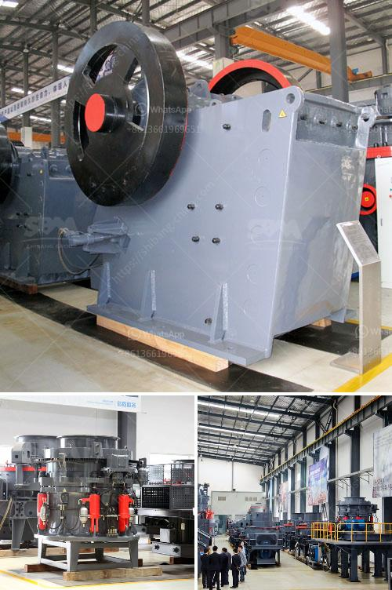

<h3>stone crusher for concrete</h3>
Stone crusher for concrete crushing is the equipment used in the field of building materials and stone crushing, requiring high crushing force, high output, and high quality. According to the production capacity requirements (rough crushing more than 1 200 t / h), the characteristics of raw materials containing more soil and the market demand for sand and gravel aggregate products, combined with the general map of the plant, the process layout, the coarse crushing equipment uses the rotary crusher. Stone crushing can be divided into four stages: coarse crushing, medium crushing, fine crushing, and sand shaping.

The stone crusher for concrete crushing is suitable for medium crushing and fine crushing of various ores and rocks with a compressive strength of 350 MPa, such as iron ore, non-ferrous metal ore, granite, limestone, quartzite, sandstone, pebble, etc. It is widely used in construction waste disposal, mining, coal mining, concrete mixing station, cement production, sand and stone manufacturing, etc.

Stone crusher for concrete crushing is the main stone processing machine used for crushing stones, rocks into small particles for aggregate and sand production. SBM can offer portable jaw crusher, portable impact crusher, portable cone crusher and crawler-type mobile crusher for sale used as stone crushing machine. The stone crushing machine is widely used in mining industry, bridge and high building construction sectors.

New and used stone crushing machine for sale in Philippines are very popular. SBM is a professional and famous ore crusher machine supplier from China and we will provide the equipment you need. Used Stone Crushing Machine: No matter the used stone crushing machine used in ore mining process site or the new one, it can process the materials into small size for the next production requirements. For the used stone crushing machine, we can find that it can be divided into jaw crusher machine, cone crusher machine and impact crusher machine according to the main crushing working equipment.

These stone crusher machines have different capacity which can meet different requirements for stone crushing, especiallly for the concrete processing. There are several crushers machine used in the concrete processing equipment, our jaw crusher is generally used as primary crusher and the impact crusher is use as secondary crusher.

Cement is vital for producing concrete, the demand for which is ever-increasing with the development of construction. As the most commonly used construction material, concrete is indispensable in the construction of buildings, bridges, dams, and sidewalks. Concrete is composed of cement, water, sand, and crushed stone. The crushed stone, also called aggregate, provides the bulk and strength to the concrete, while the cement binds the entire mixture together.

In the process of recycling concrete, the concrete waste is processed by crushing equipment, breaking the steel reinforcement bars, and separating the concrete waste from the steel bars using an electromagnetic separator. The concrete waste is then crushed into various sizes using a crusher machine. After crushing, the crushed concrete pieces are screened to separate the aggregate sizes required for the final product.

With the increase of environmental protection consciousness and the emphasis on resource utilization, recycling concrete waste has become an important trend in the construction industry. Through the use of stone crushers for concrete recycling, concrete waste can be turned into high-quality sand and gravel aggregate, increasing the utilization rate of resources, reducing waste pollution, and saving on construction costs.

In conclusion, the stone crusher for concrete recycling is your best bet in ensuring the sustainability of your project. With impressive power, reliability, and efficiency, it plays a crucial role in market recycling operations. It's all about increasing efficiency and productivity, ultimately leading to higher profitability.
<h3>Contact us</h3><ul><li><strong>Whatsapp:&nbsp;<a href="https://wa.me/8613661969651">+8613661969651</a></strong></li><li><a href="https://swt.shibang-china.com/?git&amp;zhl&amp;stone crusher for concrete"><strong>Online Service(chat now)</strong></a></li></ul><h3>Related</h3><ul><li><a href='mineral industrial crusher.md'>mineral industrial crusher</a></li><li><a href='potential of mica wet grinding plant.md'>potential of mica wet grinding plant</a></li><li><a href='gold mill tailings processing equipment.md'>gold mill tailings processing equipment</a></li><li><a href='alluvial diamond processing plant cost.md'>alluvial diamond processing plant cost</a></li><li><a href='ball mill specification limestone grinding.md'>ball mill specification limestone grinding</a></li></ul>