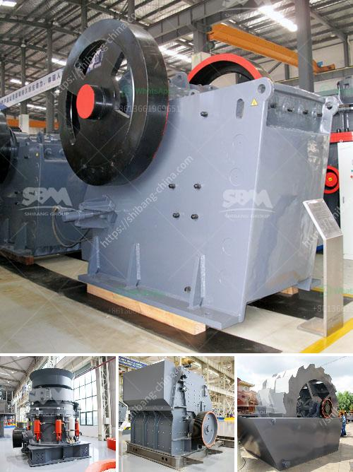

<h3>stone crusher for tractor</h3>
Stone crusher for tractors is a machine designed to break rocks into smaller pieces. It can be used for various construction purposes, such as roads, highways, driveways, and even parking lots. With its wide range of applications, the stone crusher for tractor is essential equipment for many industries.

One of the advantages of using a stone crusher for tractor is its versatility. It can be used for crushing rocks of any hardness, from soft to hard rocks. This makes it suitable for a wide range of applications. Whether you need to crush small rocks for landscaping or large rocks for construction projects, a stone crusher for tractor can handle it all.

Another benefit of using a stone crusher for tractors is its efficiency. These machines are designed to crush rocks quickly and efficiently, saving you time and labor. They have a high crushing capacity, allowing them to process large amounts of material in a short period. This means that you can complete your projects faster and more efficiently, increasing your productivity and profitability.

Stone crushers for tractors also have an environmentally friendly design. They are equipped with a dust suppression system that minimizes dust emissions during the crushing process. This is particularly important in urban areas where dust pollution can be a significant concern. By reducing dust emissions, stone crushers for tractors help to create a healthier and cleaner environment.

In addition to their versatility, efficiency, and environmental friendliness, stone crushers for tractors are also easy to operate. They are equipped with user-friendly controls, making them suitable for both skilled operators and inexperienced users. Whether you are a seasoned professional or a novice, you can operate a stone crusher for tractor with ease.

Furthermore, stone crushers for tractors are built to last. They are made from high-quality materials and undergo rigorous testing to ensure their durability and reliability. This means that you can rely on your stone crusher to withstand the toughest conditions and perform consistently for many years to come. Investing in a stone crusher for tractor is a wise choice that will pay off in the long run.

In conclusion, a stone crusher for tractor is a versatile, efficient, and environmentally friendly machine that can process various materials. Whether you need to crush small rocks for landscaping or large rocks for construction projects, a stone crusher for tractor is a reliable and cost-effective option. Its versatility, efficiency, and durability make it an essential piece of equipment for many industries. So, if you are in need of a stone crusher for your tractor, consider investing in one and experience the many benefits it can offer.
<h3>Contact us</h3><ul><li><strong>Whatsapp:&nbsp;<a href="https://wa.me/8613661969651">+8613661969651</a></strong></li><li><a href="https://swt.shibang-china.com/?git&amp;zhl&amp;stone crusher for tractor"><strong>Online Service(chat now)</strong></a></li></ul><h3>Related</h3><ul><li><a href='impact crusher supplier.md'>impact crusher supplier</a></li><li><a href='coal crushing process.md'>coal crushing process</a></li><li><a href='raymond grinding mill machine.md'>raymond grinding mill machine</a></li><li><a href='silica water washing plant manufacturers in india.md'>silica water washing plant manufacturers in india</a></li><li><a href='complete crusher for sale in ghana.md'>complete crusher for sale in ghana</a></li></ul>