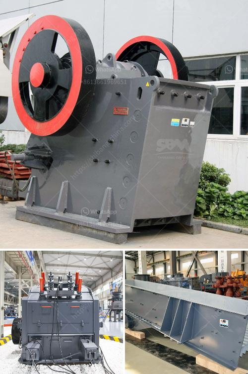

<h3>stone crusher hire south yorkshire</h3>
Stone crushing has long been an essential process in the construction industry. With the increasing demand for building materials and the significant rise in infrastructure development projects, the importance of stone crushers in creating aggregates for construction purposes cannot be underestimated. In South Yorkshire, there is a proliferation of companies offering stone crusher hire services, making it difficult for individuals to choose the most reliable one. This article aims to provide an overview of stone crusher hire in South Yorkshire, highlighting the benefits, common types of crushers available, and factors to consider when hiring a stone crusher.

The concept of stone crusher hire originated from countries like the United States and Australia, where large construction companies have their crushers on-site for crushing and recycling various materials. In recent years, this practice has gained popularity in South Yorkshire due to its cost-effectiveness and convenience. Stone crusher hire allows individuals and construction companies to crush materials on-site and use them immediately for different purposes, reducing transportation costs and eliminating the need for stockpiling materials.

There are several types of stone crushers available on the market, each with different capabilities and applications. Jaw crushers are commonly used for primary crushing of materials, and they excel at processing hard and abrasive materials. Cone crushers, on the other hand, are suitable for secondary and tertiary crushing, producing finer and more uniform aggregates. Impact crushers are versatile machines that can be used for primary, secondary, or tertiary crushing, depending on the application. They are ideal for crushing materials with low to medium hardness, such as limestone and dolomite.

When hiring a stone crusher in South Yorkshire, there are a few factors to consider to ensure a smooth and successful operation. Firstly, it is essential to choose a reputable and experienced company that offers reliable equipment and excellent customer service. Reading online reviews and checking the company's track record can help in making an informed decision. Secondly, it is crucial to assess the type and size of the materials to be crushed, as different crushers have different capacities and capabilities. Determining the required output size of the aggregates is also important to choose the appropriate crusher. Lastly, the duration and scope of the project should be considered when hiring a stone crusher, as some companies charge by the hour or day, while others provide long-term rental options.

Stone crusher hire in South Yorkshire offers numerous benefits for individuals and construction companies alike. By crushing materials on-site, transportation costs and associated risks of material loss or damage are significantly reduced. Moreover, using recycled aggregates from on-site crushing helps in conserving natural resources and reducing the carbon footprint associated with the production and transportation of new materials. Stone crusher hire also provides an opportunity for individuals to handle their projects independently, eliminating the need to rely on external suppliers.

In conclusion, stone crusher hire services in South Yorkshire play a vital role in the construction industry by providing individuals and construction companies with cost-effective and efficient solutions for crushing materials on-site. However, it is essential to choose a reliable company and consider factors such as the type and size of materials and the duration of the project before hiring a stone crusher. With careful planning and proper equipment selection, stone crusher hire can contribute to a successful construction project while reducing costs and environmental impacts.
<h3>Contact us</h3><ul><li><strong>Whatsapp:&nbsp;<a href="https://wa.me/8613661969651">+8613661969651</a></strong></li><li><a href="https://swt.shibang-china.com/?git&amp;zhl&amp;stone crusher hire south yorkshire"><strong>Online Service(chat now)</strong></a></li></ul><h3>Related</h3><ul><li><a href='what is the best granite crusher machine.md'>what is the best granite crusher machine</a></li><li><a href='address of stone crasher plant in westbengal.md'>address of stone crasher plant in westbengal</a></li><li><a href='grinding unit and plant in india.md'>grinding unit and plant in india</a></li><li><a href='small ore crusher.md'>small ore crusher</a></li><li><a href='cement plant machinery supplier in korea.md'>cement plant machinery supplier in korea</a></li></ul>