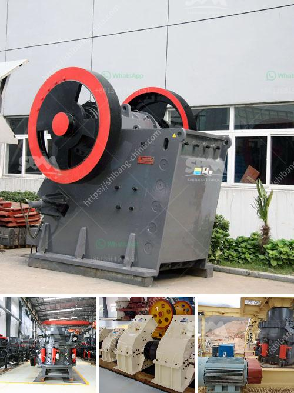

<h3>stone crusher in goa</h3>
Stone crushing industry is an important industrial sector in the state engaged in producing crushed stone which is raw material for various construction activities like construction of roads, highways, bridges, buildings, canals, etc. Transportation of stone over long distances adds to cost of the crushed stone products, crushers need to be necessarily located nearer to the demand centers such as cities, bridges, highways, etc.

Stone crushers are responsible for a significant amount of minerals extracted and processed, like limestone, granite, marble, sandstone, etc. These industries generate substantial employment opportunities and provide vital raw materials for infrastructure development projects in Goa.

The availability of raw materials like stone aggregates and sand has boosted the growth of the construction industry in Goa. However, this growth comes with environmental concerns. The stone crushing activities mainly release large quantities of dust, which can have adverse effects on human health as well as on the environment.

To tackle these issues, the government of Goa has implemented various measures to minimize the impact of stone crushers on the environment. Strict regulations are in place to control the emission of dust particles, noise pollution, and other harmful pollutants. The crushers are required to use appropriate technologies to reduce dust generation and adopt proper waste management practices.

Additionally, the government encourages the use of eco-friendly practices in the stone crushing industry. The use of efficient machinery, such as cone crushers and impact crushers, is encouraged to minimize energy consumption and reduce environmental impact. Recycling of construction waste is also given importance to reduce the demand for fresh raw materials.

Overall, stone crushers play a crucial role in the construction industry in Goa. While they contribute to economic growth through the supply of raw materials, their operations should also be conducted responsibly, keeping in mind the environmental concerns associated with this industry. With proper regulations and sustainable practices, the stone crushing industry can continue to thrive while minimizing its impact on the environment.
<h3>Contact us</h3><ul><li><strong>Whatsapp:&nbsp;<a href="https://wa.me/8613661969651">+8613661969651</a></strong></li><li><a href="https://swt.shibang-china.com/?git&amp;zhl&amp;stone crusher in goa"><strong>Online Service(chat now)</strong></a></li></ul><h3>Related</h3><ul><li><a href='german jaw crusher manufacturers.md'>german jaw crusher manufacturers</a></li><li><a href='cement boll mill grinding media charging formula.md'>cement boll mill grinding media charging formula</a></li><li><a href='portable rock crusher rental.md'>portable rock crusher rental</a></li><li><a href='raymod 5 roller mill for pulverizing unit.md'>raymod 5 roller mill for pulverizing unit</a></li><li><a href='alluvial gold plants for sale south africa.md'>alluvial gold plants for sale south africa</a></li></ul>