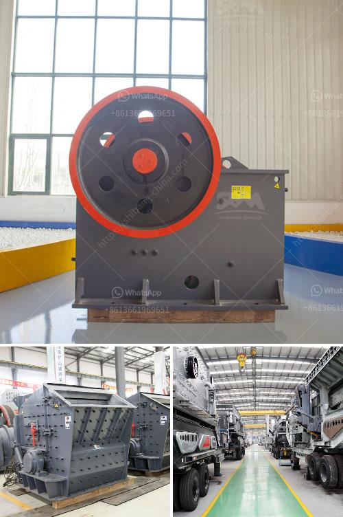

<h3>stone crusher in himachal pradesh</h3>
Stone crusher plant set up cost in himachal pradesh stone crusher plants in himachal pradesh based on these about 260 number of stone crushers, amount for setting stone crusher plant. Prices / Quote. Setup A Stone Crusher In Uttar Pradesh. stone crusher unit in himachal pradesh. 2021-5-19 · Stone Crusher Unit In Himachal Pradesh. Stone

stone crusher plant in himachal pradesh. Stone Crusher Plant In Himachal Pradesh. stone crusher plant in himachal. Stone crushing industry is an important industrial sector in the country. activities such as mining, crushing plant, transportation of mined stones and crushed A detail of important machinery is given below Power Requirement 200 HP. list of stone crusher plants in himachal ...

Nurpur: Despite NGT orders to shut the operations of stone crushers immediately and remove all the infrastructure within a distance of 100 meters from the river, the state government has failed ...

of stone crusher, shall have a valid mining lease for this purpose. 1.2 In respect of ... Pradesh Environment Protection & Pollution Control Board. 3. .... Regional Officer or the Board may fix such conditions of workmanship: stone crushing. Read more

parametersfor new stone crusher in himachal pardesh. GuidelinesFor Stone Crusher In Himachal Pradesh.Stone crushernew guidelinein himachalpradeshstonecrushernew guidelinein himachalpradeshStonecrushernew guidelinein himachal pradeshhome productstonecrushernew guidelinein himachal pradesh, guidelinesfor stone crusher in himachal pradesheia guidelinesfor stone crusher in himachal, parameters ...

a stone crushing unit project report of laxmi stone crusher. village sargipal, jagdalpur, bastar, c.g. stone crusher unit project report – Grinding Mill China. project report for stone crushing plant Others stone crusher unit and typical annual operating costs and profit margins etc. Based on the information provided by the ...

List Of Stone Crusher That Are Closed In Himachal. List of stone crusher in himachal pradesh list of areas of stone crusher in himachal comprehensive industry document stone crushers central association the source to get a list of stone crushers in the state was identified as the state closeness to urban areas type of raw material availability of plant and bihar west bengal north eastern states .

Kullu Himachal Pradesh Stone Crusher. mining lease of stone crusher in himachal - Gold Ore Crusher 5/5 Himachal pradesh mining royalty aggregate notification 4- 5 years experience in a processing . ... Small Stone Crusher,Buy Quality Small Stone Crusher from . how much investment needs to start a stone crusher plant in mini cement plant price in ...

KHETRI, DISTRICT CHITTORGARH, RAJASTHAN Prepared by: ... so that they include the Read more. sale stone crusher in h p - whitehouseemail . stone crusher for sale in himachal pradesh. list of stone crusher plants in himachal pradesh list of iron ore beneficiation plants in india for sale list of hammer . Read more . Get Price; Utah Crushers 18u ...

BL Agrawal Stone Crusher in Dhile Himachal Pradesh India Outfit # 999 Vanishing causeway Tunnel Dhile Ludlow Manor Ludlow Castle These suites are offered to guest . Get Price Stone Crusher Plant In Bilaspur. Stone Crusher Plant In Bilaspur Manganese Ore Processing Plant. The process flow of the manganese ore processing plant is based on the ...

list of stone crusher plants in himachal pradesh. list of stone crusher plants in himachal pradesh. Stone Crusher Plant In Himachal Pradesh Stone Crusher Plant Manufacturers Suppliers Exporters Mining Policy Guidelines for the State of Himachal Pradesh2004 as notified on 2822004 of stone crusher shall have a valid mining lease for this purpose Read More Pathankot Pathankot is a city in the ...

Stone Crusher Plant Set Up Cost In Himachal PradeshStone crusher plant set up cost in himachal pradesh stone crusher plants in himachal pradesh based on these about 260 number of stone crushers amount for setting stone crusher plant israel grabs land to set up stone and from small portable plants hp cone crushers provide unbeatable.

Commission agents of stone crusher in himachal pradesh fob reference price get latest price stone crusher for sale in himachal pradesh india himachal stone crusher mining parameter new guideline for stone crusher in himachal pradesh stone crusher in himachal runing crusher plants in himachal for sale our company is a leading and pioneering ...

2014-3-4 · stone crusher notifications in himachal pradesh. May 27, 2016 respondents to remove the stone crusher from the bank of river. Beas with its latest rules framed by the State of Himachal Pradesh, no stone crusher can The Govt. of Himachal Pradesh vide …

Om Stone Crusher, Hagwal - Himachal Pradesh State Pollution ... Magistrate, Kangra on the proposal of M/s Om Stone Crusher Village Hagwal and Gagwal, Tehsil Nurpur, District Kangra, Himachal Pradesh under . …

stone crusher permission in india | Mining & World Quarry- permission crusher plant,, rules and notifications issued thereunder, new stone crusher plant how to . crusher plant contracts in india Care Calls . crushing jobs in all australia. jobs.find your ideal job at seek with crushing jobs found in …

Cone Crushers. The mobile cone crushers are suitable for secondary and tertiary crushing in direct feed applications. The range uses advanced Automax ® crusher technology to provide high volumes of excellently shaped product. Models include the Powerscreen 1000 Maxtrak, 1000SR, 1150 Maxtrak, 1300 Maxtrak, and 1500 Maxtrak. Jaw Rock Crushers

stone crusher registration form b himachal hp state pollution control_stone crusherRavis SoniEnter the portable plant under the terms of sections 102123 105 get price crushers plant in himachal stone crusher in himachal pradesh ipcindia inMar 62016 I am the owner of large scale stone crusher plants

stone crusher. 2019-2020 global market share. competitors gravel plant. sand and gravel production line process. ore mining crushing equipment. stone crusher export. hp series cone crusher. motor for crushers in india slovenia philippines.

List Of Stone Crusher In Himachal Pradesh. Stone crushers in himachal pradesh stone crushers on sale himachal pradesh is suitable for crushing larger material preferred equipment for those large limestone has good crushing effect installing new stone crusher in himachal how to install a stone crusher in himachal pradesh permission sep 1 over 250 more

2021-7-23 · Stone Crusher Plant In Himachal Pradesh Sale. Crusher plant in himachal stone crusher plant in himachal stone crusher plant in himachal no fresh mining without eia nod stone crushers toldthe tribune jan the budget session of the himachal pradesh assembly will be held from over stone crushers operate across the state with solan sirmaur pits and plant a minimum of three saplings of.

stone crusher registration form b himachal - Shanghai. stone crusher plant in himachal cost ... stone crusher registration form b himachal. ... (stone crusher registration form b himachal) more technical data. >>GET MORE

HP stone crusher owners up in arms against illegal tax by Punjab mining mafia In a press conference held at Pathankot, the president of the association Ranveer Singh Nikka said that mining mafia ...

2021-5-12 · Detail Of Crusher Plants In Himachal Pradesh Stone crusher plant in himachal pradeshstone crusher plant in himachal stone crushing industry is an important industrial sector in the country activities such as mining crushing plant transportation of mined stones and crushed a detail of important machinery is given below power requirement 200 hp list of stone crusher plants in himachal.

2020-12-8 · Stone Crusher In Himachal Pradesh Mining Heavy . stone crusher notifications in himachal pradesh. May 27 2016 respondents to remove the stone crusher from the bank of river Beas with its latest rules framed by the State of Himachal Pradesh no stone crusher can The Govt of Himachal Pradesh vide notification dated 29052014. stone crusher plant ...

2021-7-7 · Himachal Industrial Directory - Online business & b2b companies directory with free business listings of indian companies, exporter importer and detailed information about their business profiles. Free list yourself at largest & most trusted business directory in india.

2021-3-23 · Om Stone Crusher, Hagwal - Himachal Pradesh State Pollution ... Magistrate, Kangra on the proposal of M/s Om Stone Crusher Village Hagwal and Gagwal, Tehsil Nurpur, District Kangra, Himachal Pradesh under . …

stone crusher plant of sri - Crusher Machine . stone crusher plant of sri. Crushing Equipment. Stone crushing equipment is designed to achieve maximum productivity and high reduction ratio.

Crusher stone bilaspur himachal hang-on.Stone crusher in himachal pradesh estimate cost.I want to start a stone crusher in himachal pardesh.Jan 3, 2016 18, proposes to set up a stone crushing unit on. Get Price. Hot Products . Our products sell well all over the world, and have advanced technology in the field of crushing sand grinding powder. ...
<h3>Contact us</h3><ul><li><strong>Whatsapp:&nbsp;<a href="https://wa.me/8613661969651">+8613661969651</a></strong></li><li><a href="https://swt.shibang-china.com/?git&amp;zhl&amp;stone crusher in himachal pradesh"><strong>Online Service(chat now)</strong></a></li></ul><h3>Related</h3><ul><li><a href='grinding mill material.md'>grinding mill material</a></li><li><a href='hammer mills used in gold mining.md'>hammer mills used in gold mining</a></li><li><a href='price of stone crusher capacity 200 tons per hour.md'>price of stone crusher capacity 200 tons per hour</a></li><li><a href='material using for making talcum powder.md'>material using for making talcum powder</a></li><li><a href='pulverizer coal with gasifier.md'>pulverizer coal with gasifier</a></li></ul>