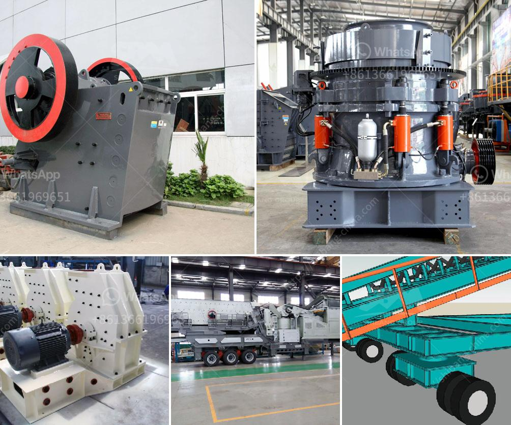

<h3>stone crusher in malaysia</h3>
Stone crusher is mainly used to crush various kinds of stones into small or medium-sized particles. With the development of Malaysia, a variety of stones can be processed into sand including granite, limestone, basalt, river pebbles, etc. The stones are widely used in the construction field, and the sand has become the basic material for construction.

Stone crushers in Malaysia are very popular and well received by the local residents. They provide a solution to all broken or discarded stones and concrete, allowing contractors to use these resources again. The mobile crusher is equipped with a crawler-type design with a luxurious appearance and excellent performance. It has outstanding maneuverability and flexibility, making it suitable for various terrain and working conditions.

The stone crusher in Malaysia has numerous advantages, such as strong mobility, flexible assembly, convenient transportation, integrated operation mode, and high adaptability. It can be operated in a single machine or in multiple units, thus forming a complete production line. It also saves raw materials, reduces transportation costs, and improves efficiency. Moreover, the stone crusher selectively crushes the useful materials, thus reducing the wear and tear of machinery and extending service life.

The stone crusher in Malaysia is self-propelled, which means that it can crush large pieces of stones to the same output size without the need for manual intervention, reducing labor costs. The equipment adopts advanced technology, fully automated operation, low power consumption, and high output. It can crush various materials with different hardness, such as iron ore, limestone, coal gangue, granite, and concrete. The crushed materials can be used for construction, road construction, bridge construction, and other industries.

In addition to its high productivity and environmental protection, the stone crusher in Malaysia is also renowned for its excellent performance in other aspects. For example, it has good sealing performance, which effectively prevents dust from entering the equipment and polluting the surrounding environment. It creates a clean working environment for operators and reduces the harm caused by dust to the human body.

To sum up, stone crushers in Malaysia are not only reliable in quality but also have advantages in terms of automation, energy saving, and environmental protection. They have broad development prospects and will play an important role in infrastructure construction, mining, and other industries. With the continuous improvement of technology, stone crushers will become smarter, more efficient, and more intelligent, fully meeting the needs of industry development and contributing to Malaysia's economic construction.
<h3>Contact us</h3><ul><li><strong>Whatsapp:&nbsp;<a href="https://wa.me/8613661969651">+8613661969651</a></strong></li><li><a href="https://swt.shibang-china.com/?git&amp;zhl&amp;stone crusher in malaysia"><strong>Online Service(chat now)</strong></a></li></ul><h3>Related</h3><ul><li><a href='mobile stone crusher price philippines.md'>mobile stone crusher price philippines</a></li><li><a href='used portable crushing plant philippines.md'>used portable crushing plant philippines</a></li><li><a href='gypsum powder production process pdf.md'>gypsum powder production process pdf</a></li><li><a href='controlling parameter of impact crusher.md'>controlling parameter of impact crusher</a></li><li><a href='ecuador balls for crushing mill.md'>ecuador balls for crushing mill</a></li></ul>