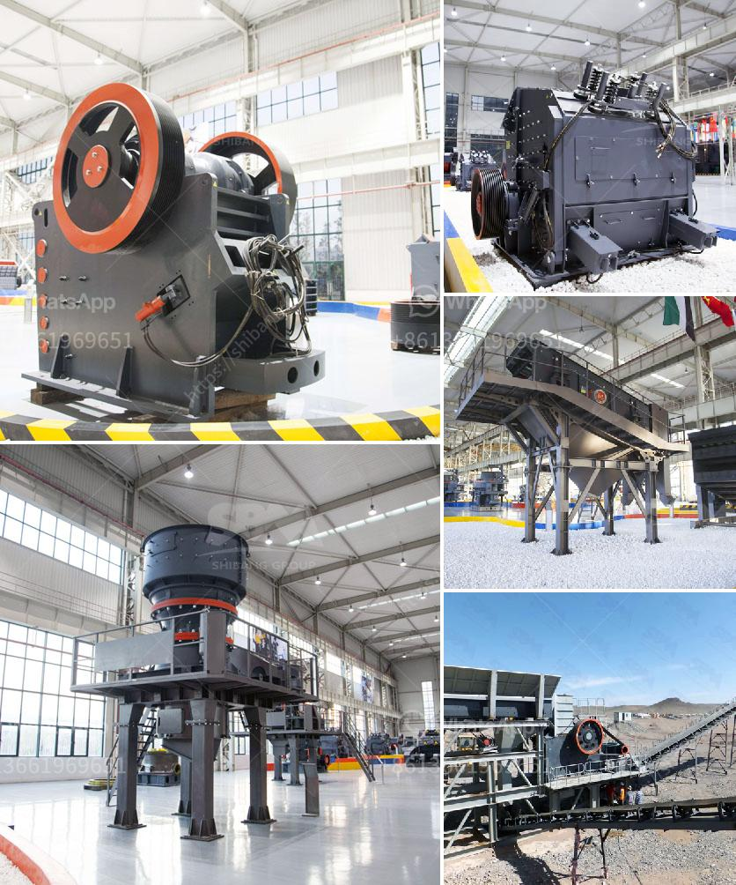

<h3>stone crusher in spain</h3>
Stone crusher is a machine used to crush stones into smaller sizes. It can be used for various purposes, such as construction materials, road building, railway construction, and water conservation. In Spain, many businesses and municipalities use this machinery to break down large rocks into smaller, more manageable sizes.

The stone crusher in Spain is one of the essential and commonly used equipment in the mining industry. It is mainly used to break large rocks into smaller particles for further processing. With the increasing demands for construction materials, infrastructure development, and road building, the stone crusher industry in Spain has been growing rapidly.

There are various types of stone crushers available in Spain, such as jaw crushers, cone crushers, impact crushers, and hammer crushers. Each type of crusher has its own unique features and specifications, making it suitable for different applications.

One of the main advantages of stone crushers is their ability to produce a wide range of sizes of crushed stone. This allows businesses and municipalities to use the crushed stone for various purposes. For example, smaller stones can be used for road base, while larger stones can be used for drainage systems or building materials.

Furthermore, stone crushers in Spain are known for their high efficiency and durability. They are designed to withstand heavy-duty operations and are built to last. This makes them a cost-effective and reliable solution for businesses and municipalities.

In conclusion, stone crushers play a crucial role in the mining industry in Spain. They are widely used to break down large rocks into smaller particles for further processing. With their high efficiency, durability, and versatility, stone crushers have become an essential piece of equipment for businesses and municipalities in Spain.
<h3>Contact us</h3><ul><li><strong>Whatsapp:&nbsp;<a href="https://wa.me/8613661969651">+8613661969651</a></strong></li><li><a href="https://swt.shibang-china.com/?git&amp;zhl&amp;stone crusher in spain"><strong>Online Service(chat now)</strong></a></li></ul><h3>Related</h3><ul><li><a href='ball mill manufacturers in mumbai.md'>ball mill manufacturers in mumbai</a></li><li><a href='company manufactures the best ball mill.md'>company manufactures the best ball mill</a></li><li><a href='slag jaw crusher long size.md'>slag jaw crusher long size</a></li><li><a href='production of barium sulfate main plant equipment.md'>production of barium sulfate main plant equipment</a></li><li><a href='crusher in antioquia stone crusher.md'>crusher in antioquia stone crusher</a></li></ul>