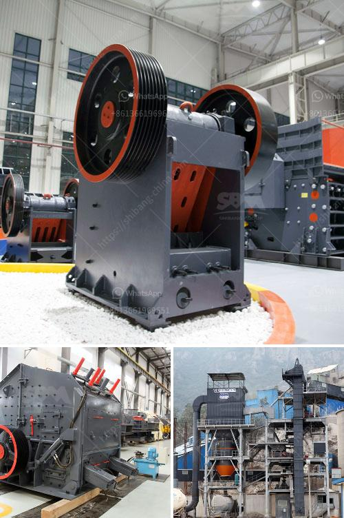

<h3>stone crusher machine assembling flow chart</h3>
Stone crusher machine assembling flow chart is a useful tool for analyzing the overall efficiency and pace of an assembly line. It depicts how the various components of different machines interact with each other to carry out specific tasks, resulting in the final production of a finished product. In this article, we will discuss the essential steps involved in assembling a stone crusher machine and understand how the flow chart helps in streamlining the process.

The first step in the assembling process starts with the procurement of all the required components. These components can include the main body of the machine, electrical motors, conveyor belts, gears, and various other smaller parts. Once all the components are acquired, the assembling process begins. The flow chart helps in organizing and sequencing the steps of the assembly line to ensure smooth functioning.

The second step involves the assembly of the main body of the stone crusher machine. This includes mounting of the frame, the eccentric shaft, bearings, and other crucial parts. The flow chart guides the assembly team to ensure that all necessary parts are included and properly attached before moving on to the next step.

The third step focuses on the installation of the electrical components. This includes connecting the electrical motors, wiring the control panel, and integrating various sensors and safety devices. The flow chart helps to outline the correct wiring connections, ensuring the machine operates safely and efficiently.

The fourth step involves the installation of the conveyor belts and associated mechanisms. This includes aligning the belts, installing the pulleys, and attaching the required supports and guards. The flow chart highlights the specific sequence and steps involved in this process, ensuring that all necessary adjustments are made for optimal performance.

Once the main components are assembled and installed, the next step is to connect the machine to the power supply and test its functioning. The flow chart provides a clear roadmap for this step, indicating the specific tests and quality checks that need to be conducted. This allows the assembly team to identify and rectify any potential issues before the machine is put into operation.

The final step in the assembling process is the adjustment and fine-tuning of the machine. This includes aligning various components, adjusting the crusher settings, and ensuring smooth operation. The flow chart guides the team through this step, ensuring that all necessary adjustments are made to achieve the desired output.

In conclusion, the stone crusher machine assembling flow chart is a useful tool that helps in streamlining the assembling process and ensures the efficient production of a high-quality product. It guides the assembly team through the various steps, ensuring that all necessary components are properly assembled and connected. By following the flow chart, companies can reduce the risk of errors, increase efficiency, and save valuable time during the assembly process.
<h3>Contact us</h3><ul><li><strong>Whatsapp:&nbsp;<a href="https://wa.me/8613661969651">+8613661969651</a></strong></li><li><a href="https://swt.shibang-china.com/?git&amp;zhl&amp;stone crusher machine assembling flow chart"><strong>Online Service(chat now)</strong></a></li></ul><h3>Related</h3><ul><li><a href='marble powder grinding plant manufacturer.md'>marble powder grinding plant manufacturer</a></li><li><a href='quarry crusher with 60 tph.md'>quarry crusher with 60 tph</a></li><li><a href='how much cost to buildton cement plant.md'>how much cost to buildton cement plant</a></li><li><a href='grinding mill machine price.md'>grinding mill machine price</a></li><li><a href='wet grinding mill china.md'>wet grinding mill china</a></li></ul>