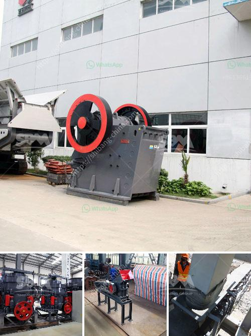

<h3>stone crusher machine company in usa</h3>
Stone crushing machine is the widely used as primary and secondary crushing equipment in mining industry. The stone crushing plant includes stone crusher and stone mill or other related stone crushing machinery. Stone mining industry in USA has extensive history with abundant resource.

The United States has been a pioneer in crushing technology and process innovation in the machinery industry. As one of the earliest companies to develop mining machinery and equipment, the stone crushing machine was developed by Blake from the United States. The structure is simple and easy to manufacture. It can be used for medium and fine crushing of various ores and rocks with compressive strength below 250Mpa. In recent years, with the rapid development of the construction industry in the United States, the demand for stone crusher machines is increasing due to the continuous expansion of infrastructure projects.

In order to provide customers with high-quality products and improve the overall competitiveness of the industry, many crushers and crushing equipment manufacturing companies have emerged. Among them, a prominent stone crusher machine manufacturer in the United States is Machinery.

Machinery is specialized in producing stone crusher machines, sand machines, grinding equipment, and mineral processing equipment. They have a strong R&D team, focus on innovation, and continuously introduce advanced technology from abroad, aiming to provide customers with high-quality stone crushing machines.

Machinery's stone crusher machines have been exported to over 200 countries such as the United States, Canada, Australia, Russia, etc. They are widely used in breaking hard or medium hardness stones and ores, such as iron ore, limestone, quartz, granite, etc. and construction, industries for various purposes.

With years of experience, Machinery has gained a good reputation in the mining machinery industry. They have a complete production chain, from raw material crushing to flour-making, and are committed to providing customers with efficient and high-quality products. They have a professional technical team, including engineers, technicians, and after-sales service personnel, who can provide customers with comprehensive pre-sales, during-sales, and after-sales services to ensure that customers have a worry-free experience.

Machinery's stone crusher machines are reliable, durable, and feature high production efficiency. With their low maintenance costs, easy operation, and reliable performance, these machines have become essential equipment in various industries. They have a wide range of applications, from mining, metallurgy, construction, materials, chemicals, and electric power industries.

In conclusion, the stone crusher machine manufacturer in the United States - Machinery, is a reputable company that has been manufacturing and selling high-quality, reliable, and durable machines for many years. The company is committed to providing customers with advanced and innovative products, improving the overall competitiveness of the industry, and contributing to the development of the United States and other countries. Whether it is in terms of production technology, product quality, or after-sales service, Machinery is dedicated to meeting customer needs and creating a win-win situation.
<h3>Contact us</h3><ul><li><strong>Whatsapp:&nbsp;<a href="https://wa.me/8613661969651">+8613661969651</a></strong></li><li><a href="https://swt.shibang-china.com/?git&amp;zhl&amp;stone crusher machine company in usa"><strong>Online Service(chat now)</strong></a></li></ul><h3>Related</h3><ul><li><a href='how to make a mineral crushing machine.md'>how to make a mineral crushing machine</a></li><li><a href='cement clinker crushing plant.md'>cement clinker crushing plant</a></li><li><a href='companies that manufacture ball mill.md'>companies that manufacture ball mill</a></li><li><a href='raymond roller mills in kolkata.md'>raymond roller mills in kolkata</a></li><li><a href='calcite processing plant.md'>calcite processing plant</a></li></ul>