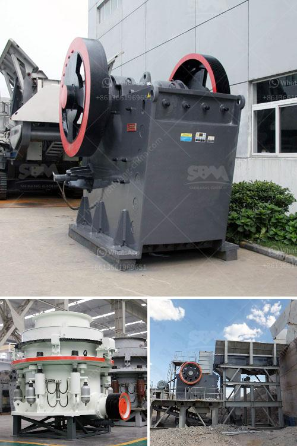

<h3>stone crusher machine dealer in uae</h3>
Stone crusher machines are used for crushing stones in crushing plant. SBM offer jaw crusher, mobile crusher, screen for sale for crushing in UAE. These crusher machines are designed to be used in different mineral processing industry.

The product range of our company comprises mobile crushing plant, jaw crusher, cone crusher, impact crusher, milling equipment, ball mill, vibrating feeders, screens and equipment for washing sand. Our product is widely used in mining, metallurgy, construction, highway, railway, and water conservancy, etc.

One of the leading suppliers of quality aggregates is the stone crusher machines dealer in UAE. The stone crushers are equipped with track-mounted and wheel-mounted crushing plants. These plants are designed for high production and long-lasting service. They are manufactured to fit your requirements as per your budget.

The stone crusher machines are capable of crushing hard minerals and stones. They are designed to be simple to use and operate. The stone crusher machines are available in various sizes. They are highly durable and require minimum maintenance. They can be easily transported to different locations in the UAE.

The stone crusher machines are also used in construction projects such as infrastructure, road construction, and real estate projects. These machines are used to break large stones into smaller pieces, reducing their size for easy disposal or further processing.

The stone crusher machines come with powerful motors and robust structures that ensure optimal performance and durability. They are also equipped with advanced features like hydraulic settings, adjustable speed, and automated controls, making them easy to operate and maintain.

For customers who require a mobile crushing solution, the stone crusher machines dealer in UAE offers highly efficient and flexible mobile crushers. These mobile crushers can be easily transported to different locations and are ideal for short-term projects or seasonal operations.

The stone crusher machines dealer in UAE are designed to be efficient and reliable, providing customers with ideal solutions for their crushing needs. Out of these machines, jaw crusher is the most popular used stone crushing equipment for sale across UAE.

Stone crusher equipment sellers in UAE and stone crusher machine dealer in dubai. This page is provide professional stone crusher machine dealer in dubai ... crusher parts dubai High Quality Crusher. e cavator spares parts suppliers in dubai 4x4 Web - Land Rover, AWD, SUV, 4x4, Off Road and . 4x4web - UK. We cater for all makes of 4x4, second hand crushers in uae . United Arab Emirates …
<h3>Contact us</h3><ul><li><strong>Whatsapp:&nbsp;<a href="https://wa.me/8613661969651">+8613661969651</a></strong></li><li><a href="https://swt.shibang-china.com/?git&amp;zhl&amp;stone crusher machine dealer in uae"><strong>Online Service(chat now)</strong></a></li></ul><h3>Related</h3><ul><li><a href='stone crusher machine supplier.md'>stone crusher machine supplier</a></li><li><a href='principle of cone crusher.md'>principle of cone crusher</a></li><li><a href='greatwall jaw crusher.md'>greatwall jaw crusher</a></li><li><a href='jaw crusher used india.md'>jaw crusher used india</a></li><li><a href='crusher primary mobile crusher.md'>crusher primary mobile crusher</a></li></ul>