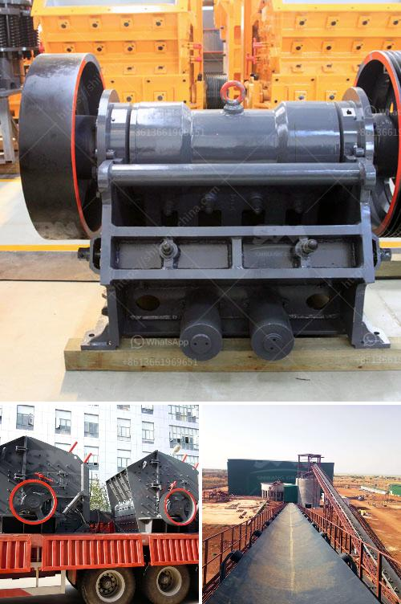

<h3>stone crusher machine in kenya</h3>
Stone crusher machine in Kenya is a stone crushing machine manufacturer in Kenya. The stone crushing machines produced by our company have been exported to more than 90 countries and regions, such as Kenya, Nigeria, Ethiopia, Zambia, Zimbabwe, South Africa, Tanzania, Uganda, etc.

Over the years, our company has accumulated rich industry experience and has constantly received the trust and praise of customers. Today, I will introduce the stone crusher machine in Kenya.

Stone crusher machine in Kenya is mainly used to break different kinds of materials, such as rock, ore, metal, non-metallic ore, stone, etc. Each material is different and requires different types of stone crusher machines to hop on.

This article mainly introduces stone crusher machines for limestone, which can be roughly divided into two categories: roller crusher and impact crusher.

The roller crusher machine is mainly composed of a roller wheel, roller bearing, pressing and adjusting device, and driving device. And the roller itself is driven by an electric motor.

The materials are fed into the crushing chamber from the upper feed opening and are crushed between the rollers and the corrugated lining plate.

The roller crusher machine is widely used in construction, roads, railways, mining, and other industries. It can crush materials with a compressive strength of up to 160Mpa.

The impact crusher machine adopts the impact crushing principle. When the material enters the plate hammer action zone, it is broken by the high-speed impact of the plate hammer, and is thrown to the counterattack device installed above the rotor by the high-speed centrifugal force.

The crushed material is further impacted by the impact plate, and the bouncing back of the counterattack plate to the roller is broken again until the qualified material is discharged through the lower discharge opening.

The impact crusher machine has the advantages of large crushing ratio, uniform product size, simple structure, and convenient maintenance. It is suitable for crushing various brittle materials, such as limestone, coal, etc.

The stone crusher machine in Kenya plays a vital role in the stone crushing industry in Kenya. Since today, it has been sent abroad for thousands of tons of stone materials.

Whether it is the first crushing production line or the second or even the third crushing line, the stone crusher machine in Kenya is a good choice for stone crushing so as to make aggregates for the subsequent road construction or house construction process.
<h3>Contact us</h3><ul><li><strong>Whatsapp:&nbsp;<a href="https://wa.me/8613661969651">+8613661969651</a></strong></li><li><a href="https://swt.shibang-china.com/?git&amp;zhl&amp;stone crusher machine in kenya"><strong>Online Service(chat now)</strong></a></li></ul><h3>Related</h3><ul><li><a href='quarry stone plant.md'>quarry stone plant</a></li><li><a href='benefit analysis for granite mining.md'>benefit analysis for granite mining</a></li><li><a href='granite quarry plants.md'>granite quarry plants</a></li><li><a href='silver copper cone crusher.md'>silver copper cone crusher</a></li><li><a href='three roll mills supplier.md'>three roll mills supplier</a></li></ul>