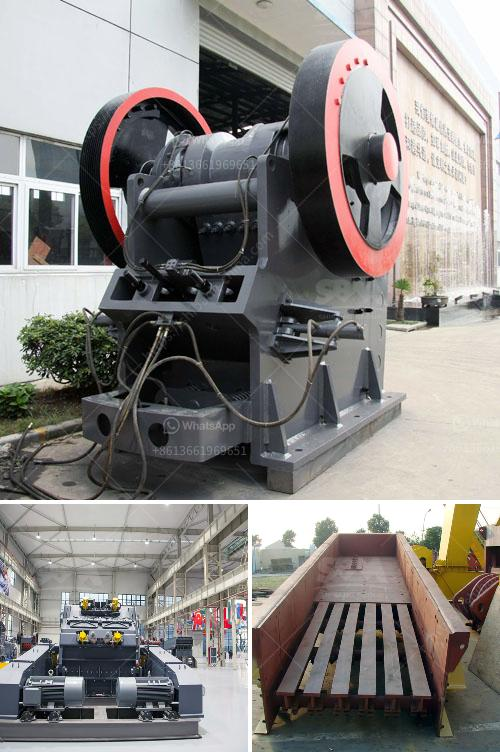

<h3>stone crusher machine in saudi arabia</h3>
Stone crushing machine is used to crush stones into small size or change the form such as limestone, quartz, marble, granite and recycle building waste materials such as debris, asphaltic cement concrete. Usually in stone crushing plant, we crush stones into small particles with diameter of 10mm, 12mm, 19mm, 25mm, 50mm, 100mm.

The mineral resources in Saudi Arabia is relatively abundant, the geological conditions provide a good basis for the development of gold. The mineral resources in Saudi Arabia are also diverse. The country is the world’s largest exporter of petroleum and possesses about 18% of the world’s total proven petroleum reserves.

The industrial sectors of Saudi Arabia are dominated by petrochemicals, oil refining, metal working, construction and fertilizers. Saudi Arabia also mining phosphate, copper, gold, diamonds and uranium. Industrial stone crusher equipment Saudi Arabia. Stone crushing machine can be used to crush stones into small size or alter the form such as limestone, quartz, marble, granite and recycle building waste materials such as debris, asphaltic cement concrete.

The primary objectives of crushing are to reduce the size of large rocks, yield uniform gravel and grind the rocks for aggregate production. Sand making machine resembles the third process of crushing. It is used to get 0-5mm sand, which can be used in the construction industry. Stone crusher is needed to crush the large stone into small particles in order to make stone aggregate or stone powder. Generally, we manufacture all type of spare parts for crusher but below mentioned are some of the spare parts which are used.

Crusher machines are used for crushing of a wide variety of materials in the mining, iron and steel, and quarry industries. In quarry industry, they are used for crushing of rocks into granites for road-building and civil works. Crusher machines are equipped with a pair of crusher jaws namely; fixed jaws and swing jaws.

The swing jaw being the moving part is attached to a rotating eccentric shaft. The fixed jaw is an integral part of the crusher frame. Both jaws are fitted with manganese jaw liners that can be replaced or reversed when worn. During the crushing operation, the toggle plate which acts as a pivot point for the jawstock, controls movement of the lower part of the swing jaw.

These rugged machines are manufactured with heavy-duty parts for constant operation and long life. Typical applications for our single-toggle jaw crushers are in mining, quarrying and recycling. The machines are designed to withstand the heavy loads and rugged operating conditions in the mining and quarrying industries.

In Saudi Arabia, liming crusher is widely used in mining, metallurgy, chemical engineering, building materials etc. liming crusher’s sales market in Saudi Arabia is very well. In the past few years, I have been in the forefront of the mining machinery industry, and I learned something from the application and summary of large numbers of projects in Saudi Arabia. I have experienced the development of Saudi Arabia and I have a relatively understanding of Saudi Arabia's industrial equipment and industry structure.

In conclusion, as we can confidently say that the stone crushing machines in Saudi Arabia are capable of crushing various kinds of stones such as granite, quartz, dolomite, calcite and other stones. The long experience in the fields has built skills and a workforce that know exactly how to make the best machines to enhance the production efficiency. With such a supportive environment, it is no wonder that Saudi Arabia is becoming one of the top stone crushing machine suppliers in the region.
<h3>Contact us</h3><ul><li><strong>Whatsapp:&nbsp;<a href="https://wa.me/8613661969651">+8613661969651</a></strong></li><li><a href="https://swt.shibang-china.com/?git&amp;zhl&amp;stone crusher machine in saudi arabia"><strong>Online Service(chat now)</strong></a></li></ul><h3>Related</h3><ul><li><a href='floating processing mining plants.md'>floating processing mining plants</a></li><li><a href='quartz crushing machine.md'>quartz crushing machine</a></li><li><a href='cost of a silica crusher.md'>cost of a silica crusher</a></li><li><a href='rejection coal mills with double seal.md'>rejection coal mills with double seal</a></li><li><a href='conveyor belts for shelves.md'>conveyor belts for shelves</a></li></ul>