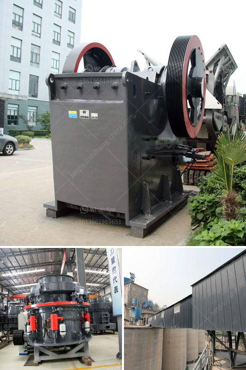

<h3>stone crusher machine price</h3>
The price of a stone crusher machine is likely to be one of the most important considerations for most businesses. However, this is not the only factor that should be considered. There are quite a few factors that will determine the overall price of the machine. These factors should be taken into consideration in order to ensure that the machine is going to be priced correctly.

One of the biggest factors that will determine the price of the machine is the raw materials that are used to manufacture it. The cost of raw materials can vary greatly depending on where they are sourced from and how they are processed. The price of the machine will also depend on how much skill and expertise is required to manufacture it. Machines that are manufactured in countries where labor is cheaper will generally be priced lower than those that are manufactured in countries where labor is more expensive.

Another factor that will affect the price of stone crusher machine is the technical advancements. Technology has advanced greatly in recent years and this has resulted in machines that are more efficient and easier to use. This has also led to an increase in the price of the machine. Machines that incorporate the latest technology will generally be priced higher than those that do not.

The price of the machine will also depend on the type of machine that is being purchased. Machines that are designed for a specific purpose, such as crushing stones, will generally be priced higher than those that are more general purpose. There are also different sizes of machines available, and the price will generally increase as the size of the machine increases.

The overall condition of the machine will also have an impact on the price. If the machine is brand new and in perfect working condition, it will generally be priced higher than a machine that is used or in need of repairs. The age and maintenance history of the machine will also be taken into consideration when determining the price. Machines that have a long history of reliable performance will generally be priced higher than those that have had a history of frequent breakdowns or repairs.

Finally, the reputation and brand name of the manufacturer will also play a role in determining the price. Well-known and reputable manufacturers that have a track record of producing high-quality machines will generally charge a higher price than lesser-known or generic brands.

In conclusion, there are several factors that will affect the price of a stone crusher machine. These factors include the raw materials used, the level of technology incorporated, the type and size of machine, its overall condition, and the reputation of the manufacturer. Considering these factors will ensure that the machine is priced correctly and will meet the requirements of the business.
<h3>Contact us</h3><ul><li><strong>Whatsapp:&nbsp;<a href="https://wa.me/8613661969651">+8613661969651</a></strong></li><li><a href="https://swt.shibang-china.com/?git&amp;zhl&amp;stone crusher machine price"><strong>Online Service(chat now)</strong></a></li></ul><h3>Related</h3><ul><li><a href='calcium carbonate production line picture.md'>calcium carbonate production line picture</a></li><li><a href='gold wash plant at south africa gold mine.md'>gold wash plant at south africa gold mine</a></li><li><a href='cement plant machinery supplier in korea.md'>cement plant machinery supplier in korea</a></li><li><a href='roller screen for coal.md'>roller screen for coal</a></li><li><a href='precipitated calcium carbonate process.md'>precipitated calcium carbonate process</a></li></ul>