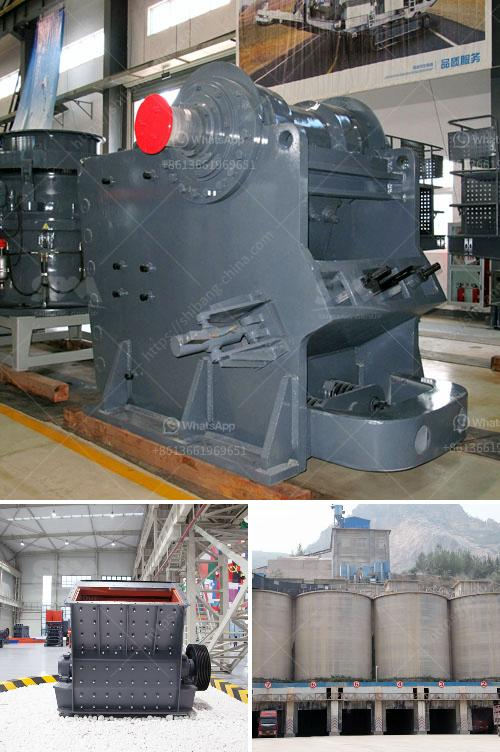

<h3>stone crusher machine sale in zambia</h3>
Abstract: Zambia is a mineral resource - rich country in Africa and it has various kinds of mineral ores, such as, coal, iron ore, gold ore, copper ore, and zinc and so on. It has a big demand for improving economy level with mining industry. SBM¡¯s large and small rock crushing machine products are welcomed by Zambia clients for the production efficiency and high quality.

LM series vertical grinding mill is generally used in the grinding process of metallurgy, building materials, chemical, mining and other mineral industries. It can be used for grinding limestone, calcite, barite, talc, porous rock, gypsum, bentonite and other materials with a Mohs hardness under 9.3. It is widely used in the ore milling industry, and it is also suitable for gypsum, talc, calcite, limestone, marble, dolomite, barite, granite, kaolin, bauxite, iron oxide and other materials crushing.

Stone crusher machine sale in Zambia has more advantages than traditional stone crushers, including large crushing ratio, low energy consumption, sturdy and durable structure, etc. Customers can choose the appropriate model according to their actual needs. It is widely used in coal mining industry, the ore mining industry, and the metallurgy industry, etc.

At present, the main crushing equipment in the mining field is: jaw crusher, cone crusher, impact crusher, VSI crusher and mobile crushing plant, etc. Jaw crusher is used for primary crushing and the impact crusher and cone crusher are used in secondary crushing. Ball mill and xzm ultrafine mill are the important grinding equipment. Ball mill grinder machine plays an important role in Africa mining industry as a leading mining crusher manufacturer and exporter in China, we understand that rigorous demand of products with higher production efficiency and lower energy consumption.

Stone crusher machine is widely used in construction, mining and mineral processing industries and in crushing equipment which is also widely recognized. Shanghai SBM Stone Crusher Machine has strong competitiveness in the market. With the continuous improvement of technological innovation, the stone crusher machine has efficient production capacity and excellent performance. In the processing of bauxite, it is indispensable to choose a good equipment for smashing.

With the development of Zambia's infrastructure, construction and mining industries, the demand for equipped stone crusher machine on Zambia market is increasing. With the rapid development of infrastructure construction in mining, water conservancy and transportation sectors, stone crusher industry is expected to surge. The reason behind this surging demand is due to the government's ambitious plans to develop infrastructure projects, further propelling the growth of the mining industry, and the increasing demand for stone crusher machines in the country. In conclusion, the stone crusher machine has been widely recognized by the global market as a high-quality, reliable stone crushing equipment, and it is an important mining equipment. The major stone crushers are jaw crusher, impact crusher, cone crusher, VSI crusher.
<h3>Contact us</h3><ul><li><strong>Whatsapp:&nbsp;<a href="https://wa.me/8613661969651">+8613661969651</a></strong></li><li><a href="https://swt.shibang-china.com/?git&amp;zhl&amp;stone crusher machine sale in zambia"><strong>Online Service(chat now)</strong></a></li></ul><h3>Related</h3><ul><li><a href='rock crushing plants for sale.md'>rock crushing plants for sale</a></li><li><a href='used 500 tph stone crusher prices.md'>used 500 tph stone crusher prices</a></li><li><a href='ball mill education.md'>ball mill education</a></li><li><a href='quarry crusher plant in ethiopia.md'>quarry crusher plant in ethiopia</a></li><li><a href='combined gold and diamond wash plants.md'>combined gold and diamond wash plants</a></li></ul>