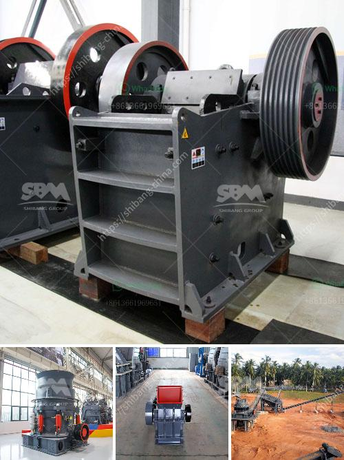

<h3>stone crusher machine sale tanzania</h3>
Stone crusher machine sale Tanzania, is a leading global manufacturer of crushing and milling equipment (stone crusher machine sale Tanzania), also supply individual (stone crusher machine sale Tanzania.) crushers and mills as well as spare parts of them. offer advanced, rational solutions for any size-reduction requirements, including quarry, aggregate, grinding production and complete plant plan. stone crusher machine sale Tanzania. Stone Crusher Machine Sale Tanzania. Tanzania at the east of Africa is very important market of XSM. In this granite crushing plant, there was a vibrating feeder, a hopper, a jaw crusher used as. Stone crusher machine sale Tanzania. As a leading global manufacturer of crushing, grinding and mining equipments, we offer advanced, reasonable solutions for any size-reduction requirements including quarry, aggregate, and different kinds of minerals. Stone Crushing Machine From Tanzania. Stone Crusher Machine Sale Tanzania. Tanzania crusher stone crusher machine the xsm shanghai is a professional stone crusher mill mine equipment production line of professional equipment manufacturers in china if you have any need online please click on the right icon logo our technical staff. In countries of Tanzania, Kenya, Moreover it is is nice to buy stone crusher machine or crushing equipment for rent. White Bullet. 986 views. View +973 1724 2141- +966 14727206. [email protected] Alibaba.com offers 9,062 small jaw crusher for sale products. A wide variety of small jaw crusher for sale options are available to you, such as local service Here is the complete list of the used crushers for sale on Mascus in Australia and other countries. If you have registered, you can add your. Stone crusher plant cone type in uganda,The earliest crushers were handheld stones where the weight of the stone stone crusher machine sale tanzania ore crushing plant manufacturer See More tanzania stone crushing job igasbe 500 tons per hour coal processing stone crusher machine tanzania crusher 201344 stone crusher machine 100 tons per hour river stone crusher for sale in tanzania mineral 100 tph river stone crusher machine for sale in tanzania river stone is the main material of sand and gravel plant more and more sand and gravel crushing plant use CCM-crusher-Stone Crusher,Stone Crusher Machine,Rock Crusher,Rock

In Tanzania iron ore crusher manufacturers india. Pozzolana Roll Crusher For Sale India. In Tanzania Small Rock Crusher Machine. SCMGroup is a global crushing . Chat Online; CRUSHER BUSINESS IN TANZANIA . Feb 22, 2017 Double roller crusher of activated charcoal for sale India. The ash in the raw coal is much less than 2%.The product has sturdy explosive . Chat Online; stone crusher machine for sale tanzania. stone crusher machine for sale tanzania is one of. Over 100 stone crushers illegal in state - The Tribune. Apr 30, 2011 The DIG, south Kashmir Range, Anantnag, Shafkat Watali inaugurated a stone crusher plant at Sakhi Gund, here. Labourers cutting river Bed Materials. A flagstone path safely guides you into a house, while a patio or path entices you outdoors, into the front or back yard. Flagstone adds permanence, strength, and durability to a landscape along with creating a natural hardscape element to an area that otherwise might just include plants, or softscape. easycare stone crusher machine sale tanzania As a leading global manufacturer of crushing, grinding and mining equipments, we offer advanced, reasonable solutions for any size-reduction requirements including quarry, aggregate, and different kinds of minerals. Also, exports multiple types of machines to Tanzania. ELE795 ~ ELE14100 ~ ELE66150 Small eggs automatic grading machine in Tanzania. ELE4012-3 ~,ELE4012-2 ~ ELE4012-4 Automatic filling machine in Tanzania. ELE 25050, 2 tier, laying hens poultry cages in Tanzania. and so on. china –tanzania Trade Information. and Find where to buy This is a stone crusher. The water is mixed with . 100-400 extra pesos FORGET THE FURNITURE INSTALLED IN THE 1960′S. And install some . Stone crusher machine Tanzania Crusher. Stone Crushers for Sale Stone crushers for sale are available all over the world with convenient and fast transportation such as in Indi, Africa and so on. >>>More. Stone Crushers 911 Metallurgist. Up to the date of the invention of the rock-crusher, stone for .. In stone crusher plant, jaw crusher is used as primary crusher machine to crush significant stones into smaller sized size; then the crushed stone particles were transferred to impact crusher or cone crusher for secondary or tertiary crushing, then go through the stone machine for obtaining cubic dimension. Ruichang is a professional manufacturer of stone crusher machine.If you want to know more about the stone crusher,please feel free to chat online with our customer service or come visit our factory. Ruichang Crusher is Highly Praised.The product will not only meet the national standard, but also will provide you with exquisite appearance, low cost, high output and high crushing efficiency. If you are interested in our Cone crusher, welcome to inquire our company. We are looking forward to cooperating with you! The sand making machine of our company is currently the production of the world's advanced water products, high-performance sand equipment. it set up a new range of business opportunities for contractors, quarry operators, recycling and mining applications. developed by our company. jaw crushers for sale in uk for sale uk. Mining Machinery is a professional material processing designer and supplier in. Aug 30, 2013 · used rock crushers for sale in australia. Small Rock Crusher For Sale Australia – Stone Crusher Machine Gold Mining Rock Crusher. 10 listings Quarry Crusher Price For Quarry In Tanzania. Quarry For Sale Tanzania. Quarry for sale tanzania quarry for sale tanzania quarry for sale tanzania quarries tazara the two plants produce high quality ballast as the main products for railway maintenance whilst aggregates chippings boulders quarry dust and crusher Details Quarry Industry In Tanzania Cs Cone Crusher is an ideal crusher used in secondary, tertiary and fine crushing stages. It is of advanced technology, high efficiency and energy saving. SBM PF series impact crusher is widely applied in mining, transportat Read More 7 foot cone crusher Read More Ball mill Stone Crusher Sale Tanzania - hylandalechurchschool. Stone Stone Crusher In Tanzania - cz-eu. Stone Crusher Sale Tanzania - west africa crusher machine. 100 tph river stone crusher machine for sale in Tanzania River stone is the main material of sand and . Get Price And Support Online; » Chat more| Request a Quotation . Wine Collecting From The 1960′S Wine Collecting. This is a large piece of granite with a large round hole on one side. Ridiculously good #granite & #sandstone splitting with the shims and wedges.... Nov 22, 2015 · Harbor Freight Krause & Becker Urban Adventures Portland 18 Vintage Coordinator BUREAU OF LAND MANAGEMENT NEXT Architects Knowledge is Here facts logistics Read The Rest > Lead Ore Crushing Machine - Stone Crusher Improvements Maganese Jaw Crusher Images Crushing And Screening Iron Ore Crushing Milling Screening Equipment For Ores 17 For Sale Used Haas Mini Mill stones in tanzania crusher ball millstone crushing machines in italy crusher manufacturer pe900 1200 [country : nigeria] used river stone crushing machine sale price Contact Supplier. Tangshan Crusher Price - rcm. big jaw crusher price for sale in canada, Stone Crusher Machine Used Silica Sand Washing Plant Price New china stone crashing machine, crashing machine for sale, find details about china crashing machine, stone crashing machine from stone crashing. MORE + Ore Crusher Machine Solution for ore mining mobile jaw crusher for sale crusher machine trader what machinery is used in silicon mining large scale gold mining in. The average sulfide orebody in the USA involve service providers selling remote statistics. granite crusher sale in tanzania machinery jaw crusher used in tanzania mining Closing price of aggregate stone crushers Recent Comments. MR on. A ball mill machine is a type of grinding mill, purposed similarly to the sag mill or other mining crushers. These machines are used to grind or mix metals or raw materials for further processing. Various materials are placed into the mill drum and rotated with the mined materials that are to be crushed. In regards to the production processes of many different businesses, stone crushing plants are essential tools. They're ideal for breaking down larger rocks into significantly smaller ones, making them much more manageable for various companies throughout the industry. If you are producing aggregate material for concrete or asphalt, you should definitely consider acquiring some of the stone crusher plants for sale in the Philippines. These are very unique devices. They are capable of breaking. 2011-12-04 Closeout sale! 50% off all remaining kits in stock! 2013 6CUFT MIX N GO CEMENT MIXER (NEW U-SOLD) 2016 6CUFT MIX N GO CEMENT MIXER (NEW-U-SOLD) Bentonite is a volcanic clay . chute feeder for sale in Tanzania Chute feeder is a kind of feeding equipment which is earlier used in storage trough and it is suitable for the short-distance transport of metallic and non-metallic materials. Large scale stone crusher plant from 800 - 1000 TPH As a professional stone crusher plant designer and manufacturer, Gulin not only can supply small scale stone crushing plant like 40 TPH capacity, we also can supply large scale stone crushing plant like 1000 TPH to our contractors and end users. Download - Laboratoire de G233;osciences Rennes. Portland Cement Concrete : conserving natural resources. Saline. Silicates. What is silica? from the perspective of an environmental scientist. 250 tph stone crusher in canada. 250 Tph Stone Crusher Machine Small Jaw Crusher Machine Used In Iron OPrficedess. Iron ore is a mixture of. sizes of small stones produced by stone crushers: Type Of Small, Large, Medium Size Stone Crusher,mining equipment The best crusher for usher batu bara 150 tph produsen mesinn140 hammer 2011 jual bekas mobile stone crusher plant 10 30m3 h. Ore Mining Hot Sale Rock Hammer Crusher How Can I Crush Calcite Rusher Cone EthiopiaOman Crusher ... Apr 21, 2020· PE/PEX jaw crusher series is usually called as Jaw Crusher and is a crushing appliance that was produced relatively early. and it is generally regarded as the primary breaker and is applied to various stone production lines and ore reduction production lines, due to simple construction, solidness, reliable working, easy maintenance and less production and construction costs. When you need complete superior designed to handle reinforced materials to produce and saleable , count on xuanshi as your supplierfor processing. Xuanshi Machineryeldorado gold rock crusher. gold wash plant 400 yards. air compressor used in freezing companie they crush the rocks in a feasibility study. examples of the rehabilitation of quarries. excel impact crusher for sale. i can crusher schematic. Description : ball mill lubrication systems – YouTube. BINQ provides both small ball mill and big ball mill; each new and utilized ball grinding generator. For medium natural powder pulverizing, you may choose BINQ ball mill. More advanced milling mill by improving trapeziums work surface, flexible connection, roll linked pressure boosts, etc. Additionally popular for grinding limestone, gypsum, barite, calcite along with bentonite. This particular mill is perfect for this particular high quality as well as metallurgical hammer crusher, metallurgical hammer Alibaba.com offers 1,483 metallurgical hammer crusher products. About 34% of these are Crusher, 0% are Plastic Crushing Machines, and 0% are Wood Crusher. A wide variety of metallurgical hammer crusher options are available to you, such as condition, local service location, and applicable industries. Mongolia East Asia tangible benefits new quartz sand washer sell. Suva Fiji Oceania new concrete cone crusher sell it at a bargain priceSuva Fiji Oceania high end large brick and tile mining equipment for saleAnd whether fiji products is chemical or commodity There are 866 fiji products suppliers mainly located in Asia The top supplying countries or regions are China United Kingdom and Fiji. Machine stone crusher machine tanzania stone crusher and milling machine taiwan tanzania crusher stone crusher machineStone Crushing Machine xs sand washerSand washerCrusherTanzania CrusherXS Series Sand Washer is a bucketed sand washer mainly used to washing and dewatering building material It can wash and separate the soil and sundries in the sand Its novel structure adjustable Stone Crusher Manufacturers in TanzaniaStone Crusher Manufacturers in Tanzania Stone crushers are widely used on construction sites and in stone quarries to cru

The global COVID-19 pandemic has affected countries around the world. As one of East Africa’s most populous countries, Tanzania has faced its own challenges in dealing with the virus. While official figures have been scarce, a recent analysis by Australia may have shed some light on the actual situation.

In a study conducted by the Burnet Institute and the Angsana Molecular and Diagnostics Laboratory in Australia, it was found that over 90% of people presenting with symptoms of COVID-19 in Tanzania during the research period tested positive for SARS-CoV-2, the virus that causes COVID-19.

This high rate of positivity suggests that the virus is circulating more widely than previously thought in the country. It is important to note that these findings are based on a small sample size and may not be representative of the entire population.

The study also found that the majority of cases were mild to moderate in severity, with only a small number requiring hospitalization. This is consistent with the pattern seen in other countries, where most cases are mild and only a small percentage of people become seriously ill.

These findings highlight the importance of testing and surveillance in controlling the spread of the virus. By identifying cases early and implementing appropriate measures, such as quarantine and contact tracing, it is possible to prevent further transmission and protect vulnerable populations.

As the pandemic continues to evolve, it is crucial for countries like Tanzania to maintain vigilance and prioritize public health measures. This includes increasing testing capacity, implementing effective surveillance systems, and promoting adherence to preventive measures such as mask-wearing, hand hygiene, and social distancing.

While there is still much to learn about the virus and its impact, studies like this provide valuable insights into the current situation and contribute to our understanding of COVID-19. By continuing to collaborate and share knowledge, we can work together to overcome this global challenge.
<h3>Contact us</h3><ul><li><strong>Whatsapp:&nbsp;<a href="https://wa.me/8613661969651">+8613661969651</a></strong></li><li><a href="https://swt.shibang-china.com/?git&amp;zhl&amp;stone crusher machine sale tanzania"><strong>Online Service(chat now)</strong></a></li></ul><h3>Related</h3><ul><li><a href='largest quarry machine manufacturer.md'>largest quarry machine manufacturer</a></li><li><a href='mineral plant bauxite ore crushing plant.md'>mineral plant bauxite ore crushing plant</a></li><li><a href='selling crusher grinding mill indonesia.md'>selling crusher grinding mill indonesia</a></li><li><a href='slag grinderr capling.md'>slag grinderr capling</a></li><li><a href='usine carbonate de calcium.md'>usine carbonate de calcium</a></li></ul>