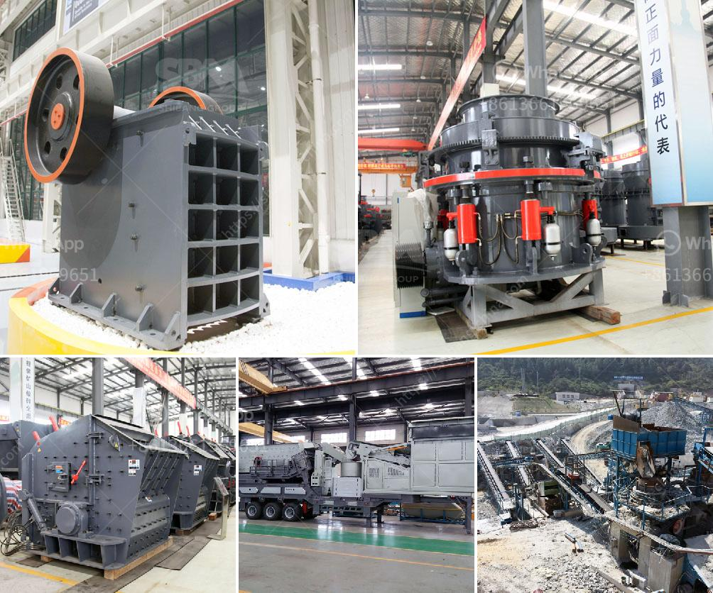

<h3>stone crusher machine size 100 x 100 cm</h3>
Stone crusher machine is a machine used to crush large stones into small stone sizes. The stone crusher machine works by using high pressure to break the stone into smaller sizes. This machine is widely used in processing stones in mining or in infrastructure development projects. The stone-crusher machine relies on dodge and blake to destroy the rock.

Jaw crusher is one of the most popular stone crushing machines used in the world. Jaw Crusher is an ideal stone crusher machine and can destroy stones well. Jaw Crusher has a very high pressure so it can destroy very hard stones. Jaw Crusher has many advantages so it is widely used in the construction and mining process.

1. Jaw Crusher is a Stone machine with a simple structure so that the maintenance and maintenance process is easier and cheaper.

2. Jaw Crusher has a flexible capacity, making it easier to break rocks. We can adjust the capacity to the process to be carried out.

3. Jaw Crusher has protection from over load so as to ensure the safety and condition of all rocks processed.

4. The use of stone crusher machine will provide high efficiency for the users plus operating costs that can be minimized in such a way.

5. The final result of particles and the ratio of crushed later is very qualified and in accordance with the desired size. The jaw crusher machine also ensures that there is minimal dust emissions.

This stone crusher machine works by using high pressure to break materials into smaller sizes. This machine is widely used in processing stones in mining or in infrastructure development projects. The stone-crusher machine relies on dodge and blake to destroy the rock. Jaw crusher is one of the most popular stone crushing machines used in the world. Jaw Crusher is an ideal stone crusher machine and can destroy stones well. Jaw Crusher has a very high pressure so it can destroy very hard stones.
<h3>Contact us</h3><ul><li><strong>Whatsapp:&nbsp;<a href="https://wa.me/8613661969651">+8613661969651</a></strong></li><li><a href="https://swt.shibang-china.com/?git&amp;zhl&amp;stone crusher machine size 100 x 100 cm"><strong>Online Service(chat now)</strong></a></li></ul><h3>Related</h3><ul><li><a href='sand mining equipment manufacturers in south africa.md'>sand mining equipment manufacturers in south africa</a></li><li><a href='zimbabwe crusher rental.md'>zimbabwe crusher rental</a></li><li><a href='small scale tantalum milling machine supplier.md'>small scale tantalum milling machine supplier</a></li><li><a href='mobile crusher parker 50th crusher for sale.md'>mobile crusher parker 50th crusher for sale</a></li><li><a href='prices of industrial conveyor belts.md'>prices of industrial conveyor belts</a></li></ul>