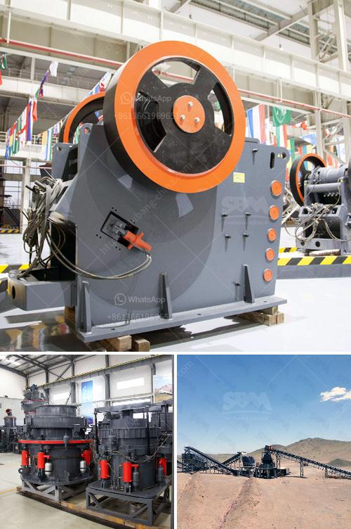

<h3>stone crusher machine supplier</h3>
Stone Crusher Machine Supplier: The increasing development of rock crushing industries in the past few years has led to the wide spread production of mining crushers around the world. More and more manufacturers are trying to make their crushers stand out from others. In order to achieve the goal of low-cost, high efficiency, sturdy and durable mechanical structure, the stone crusher machine supplier the crushing machine is manufactured construction of highways, railways, airports, and other national infrastructure projects.

As a professional stone crusher machine manufacturer and exporter, Aimix’s aggregate crusher for sale and other related crusher equipment has been sold to more than 30 countries. In addition, our experts are still researching and designing more advanced machines to improve the performance and efficiency of the equipment.

The company mainly produces five series of products, including crushing equipment, sand making equipment, mineral processing equipment, grinding equipment, and building material equipment. At the same time, the company provides a full range of services, including pre-sale, in-sale, and after-sales services. Customized production and flexible configuration are available for various stone crushing plants.

In the world of rock crushing, there are different types of stone crushers available on the market. These include cone crushers, jaw crushers, impact crushers, and roll crushers. Some of these may use vertical or horizontal shafts to break up the materials. The impact crushers have horizontal rotor shafts and blow bars that hit the stones and throw them against plates inside the machine. Once the rocks break down, they fall through a screen opening where they are further separated into different sizes.

When choosing a stone crusher machine supplier, it is necessary to ensure that the equipment is safe and reliable, and the after-sales service is guaranteed. The crushing equipment manufactured by our company has been successfully used in the stone production and sand making production line, which shows the advanced technology of HXJQ crusher.

The essential difference between the stone production line and the sand production line is as follows:

The production process of the stone production line is: material storage bin-vibrating feeder-jaw crusher-impact crusher-vibrating screen-final stone materials. These machines are connected with chute or belt conveyor. The sand and stone produced by the sand making machine are transferred to the vibrating screen.

The specific process is: the stone is evenly sent to the jaw crusher by the vibrating feeder for coarse crushing. The coarsely crushed stone is sent to the sand making machine for further crushing by the belt conveyor; the finely divided stone is sent to a vibrating screen for screening by a belt conveyor. The stones that meet the particle size requirements are sent to the finished product pile by the finished belt conveyor; the stones that do not meet the requirements are sent back to the sand making machine for breaking again, forming a closed circuit for multiple cycles. The finished product particle size can be combined and graded according to the user's needs.
<h3>Contact us</h3><ul><li><strong>Whatsapp:&nbsp;<a href="https://wa.me/8613661969651">+8613661969651</a></strong></li><li><a href="https://swt.shibang-china.com/?git&amp;zhl&amp;stone crusher machine supplier"><strong>Online Service(chat now)</strong></a></li></ul><h3>Related</h3><ul><li><a href='calcium carbonate grinding ball mill.md'>calcium carbonate grinding ball mill</a></li><li><a href='three roll mills supplier.md'>three roll mills supplier</a></li><li><a href='ball mill grinding china.md'>ball mill grinding china</a></li><li><a href='price for mobile stone crushers in japan.md'>price for mobile stone crushers in japan</a></li><li><a href='stone crusher machine in kenya.md'>stone crusher machine in kenya</a></li></ul>