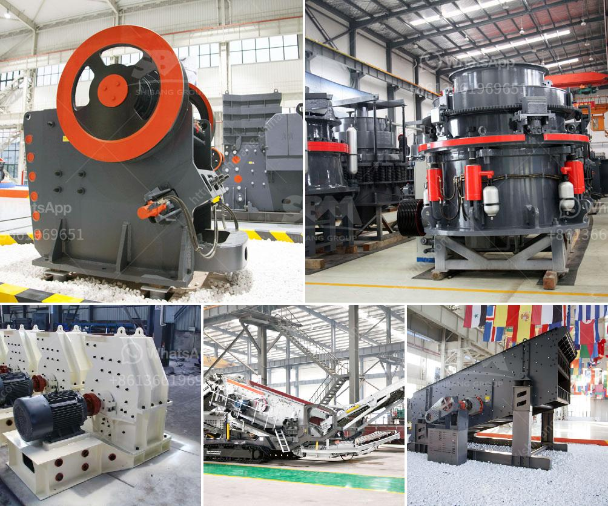

<h3>stone crusher machinery turkey</h3>
Stone Crusher Machinery Turkey is in great demand because of the booming construction and mining industry in Turkey. As we all know, Turkey is a fast growing country with extensive construction and mining projects. But how can we choose the suitable stone crusher machinery from Turkey? Let's explore it together.

The first thing that we should be taken into consideration is the stone crushing plant's design. This is very important because it will affect the whole production line. However, there are many stone crusher manufacturers in Turkey and it is not easy to choose a suitable one. There are many factors that should be taken into consideration. For example, the stone hardness, feeding size, finished product granularity, and production capacity are important factors to be considered.

The second thing that should be taken into consideration is the stone crusher machinery's quality. Because the stone crusher machinery is used in large scale construction and mining industry, being durable and efficient is more important. Therefore, professional manufacturers are usually strict in the choice of materials and manufacturing process. In addition, excellent after-sales service is also necessary. When we encounter problems in machine operation or maintenance, the after-sales service team can give us guidance and support.

The third thing that should be taken into consideration is the stone crusher machinery's price. We should compare the price among different manufacturers and choose a reliable and cost-effective manufacturer. In this case, we can not only save money, but also ensure the quality of the stone crusher machinery.

As a professional stone crusher machinery manufacturer, we, Fote Heavy Machinery, can provide you with high-quality products and perfect after-sales service. Fote Heavy Machinery is committed to providing the best solutions and turn-key projects for global customers. Our main products include stone crushing plant, ore processing plant, powder grinding plant, cement production plant, etc. With advanced technology, excellent quality and intimate service, Fote Heavy Machinery is becoming more and more popular among global customers.

In conclusion, stone crusher machinery Turkey is in great demand because of the booming construction and mining industry. In order to choose the suitable stone crusher machinery, we should take many factors into consideration, such as the stone properties, production capacity, cost-effectiveness and so on. Fote Heavy Machinery, as a professional stone crusher manufacturer and exporter, can provide customers with high-quality products and perfect after-sales service. Taking Fote as an example, let's discuss about the stone crusher machinery Turkey in further details.
<h3>Contact us</h3><ul><li><strong>Whatsapp:&nbsp;<a href="https://wa.me/8613661969651">+8613661969651</a></strong></li><li><a href="https://swt.shibang-china.com/?git&amp;zhl&amp;stone crusher machinery turkey"><strong>Online Service(chat now)</strong></a></li></ul><h3>Related</h3><ul><li><a href='jaw crusher specification.md'>jaw crusher specification</a></li><li><a href='diesel compressors for sale in south africa.md'>diesel compressors for sale in south africa</a></li><li><a href='screening and wash plant manufacturers in south africa.md'>screening and wash plant manufacturers in south africa</a></li><li><a href='best stone crusher in kenya.md'>best stone crusher in kenya</a></li><li><a href='production process of cement.md'>production process of cement</a></li></ul>