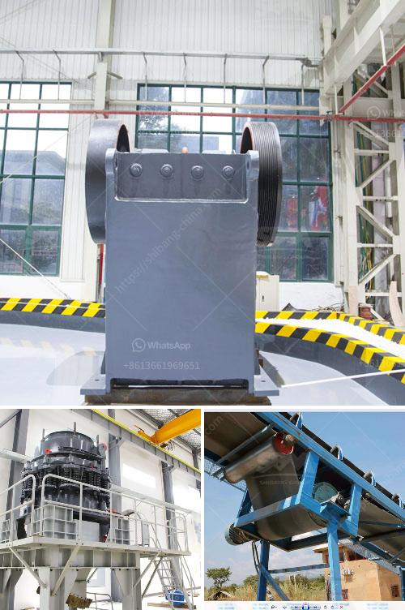

<h3>stone crusher machines in peru</h3>
Peru, officially known as the Republic of Peru, is a country in South America. It is renowned for its rich cultural heritage, ancient ruins, and breathtaking landscapes. With a growing construction industry, there is a high demand for stone crusher machines in Peru.

Stone crusher machines are essential equipment in mining and stone quarrying. In quarrying and mining operations, stone crusher machines help to break down the raw materials into fine particles. The crushing process involves obtaining rocks or minerals to be crushed into smaller size. These machines come in various sizes and types, ensuring the ideal crushing results for every application.

One of the key factors contributing to Peru's economic growth is its mining sector. The country is blessed with abundant natural resources such as copper, gold, silver, and zinc. Stone crusher machines play a crucial role in extracting these valuable minerals. Crushing is the first step in the raw material processing and mining operations. Utilizing stone crusher machines minimizes costly downtime and improves efficiency in the mining process.

Another significant industry that relies on stone crusher machines is the construction industry. The stone crushing industry has consistently witnessed immense growth over the last few years. This is due to the increasing demand for stones and high-quality aggregates that are used as raw materials in various construction activities such as road construction, bridges, buildings, and railways. Peru's construction industry is no exception, and stone crusher machines are widely used for crushing stones in construction projects.

As Peru continues to experience economic growth, the demand for stone crusher machines is expected to rise exponentially. For this reason, various manufacturers and suppliers offer a wide range of stone crushing machines, ensuring availability and affordability for every construction and mining project.

In conclusion, stone crusher machines play an essential role in the mining and construction industries. These machines provide the necessary crushing process to extract valuable minerals and produce high-quality aggregates for construction purposes. As Peru's economy continues to flourish, the significance of stone crusher machines in the country's development is undeniable. With a wide range of options available, Peru's construction and mining industries can rely on these machines for their crushing needs.
<h3>Contact us</h3><ul><li><strong>Whatsapp:&nbsp;<a href="https://wa.me/8613661969651">+8613661969651</a></strong></li><li><a href="https://swt.shibang-china.com/?git&amp;zhl&amp;stone crusher machines in peru"><strong>Online Service(chat now)</strong></a></li></ul><h3>Related</h3><ul><li><a href='clinker crsher plant for sale.md'>clinker crsher plant for sale</a></li><li><a href='used ultra fine wet grinding mill gold ore.md'>used ultra fine wet grinding mill gold ore</a></li><li><a href='sell crusher conica peru.md'>sell crusher conica peru</a></li><li><a href='grinding equipment raymond mill.md'>grinding equipment raymond mill</a></li><li><a href='cost of mining process of calcium carbonate.md'>cost of mining process of calcium carbonate</a></li></ul>