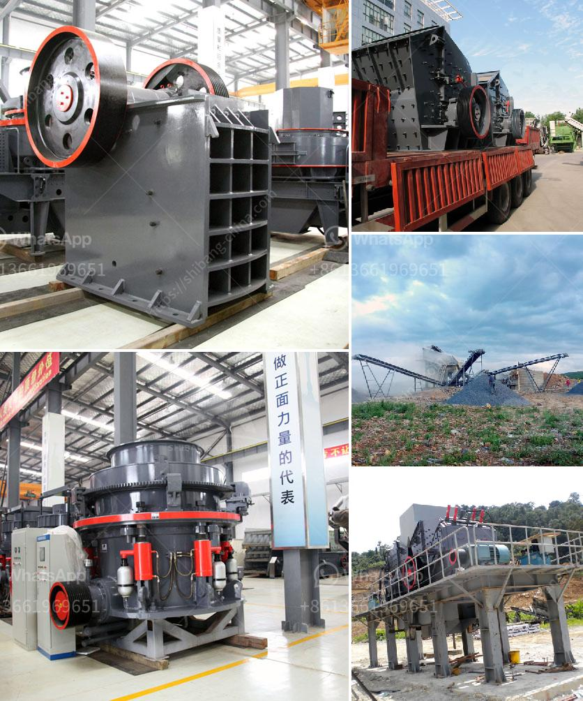

<h3>stone crusher manufacture</h3>
Stone crusher, as the name implies, is used to crush stone and rock. It can process all kinds of rocks and ores, such as granite, basalt, limestone, rock, concrete, aggregate, gravel, dolomite, and quartz. It includes vibrating feeder, jaw crusher, hammer crusher, impact crusher, cone crusher, vibrating screen, and other equipment.

Stone crushers are commonly used in mining, construction, metallurgy, and various other industries. They are an integral part of large-scale earthwork operations and mining projects. They are a powerful tool for breaking down stones into smaller pieces and making gravel, sand, or rock dust.

The manufacturing of stone crushers is a complex process. Most of the large factories have professional machines that assemble components to produce high-quality products. These machines are operated by skilled workers who have expertise in assembling and manufacturing stone crushers. The whole manufacturing process involves several steps, including:

1. Designing: The first step in manufacturing a stone crusher is the development of a blueprint or design. This includes determining the specifications and features of the crusher, which will help in deciding the overall layout and dimensions.

2. Fabrication of components: Once the design is finalized, the next step is to fabricate the different components of the stone crusher. This includes manufacturing the frame, jaw plates, side plates, toggle plates, bearings, and other essential parts.

3. Assembly: After all the components are fabricated, they are then assembled together to form the complete stone crusher. Skilled workers use specific tools and techniques to ensure that all parts are properly aligned and fitted.

4. Testing and quality control: Before the stone crusher leaves the factory, it undergoes rigorous testing to ensure its functionality and quality. This includes checking the performance of the crusher under various conditions, ensuring that all components are functioning correctly, and inspecting for any defects or damages.

5. Packaging and shipping: Once the stone crusher has passed all quality control tests, it is carefully packed to prevent any damage during transportation. It is then loaded onto trucks or containers and shipped to its destination.

In addition to manufacturing, stone crusher manufacturers also provide after-sales service. This includes installation, training, and maintenance support to ensure the proper functioning of the crusher. Most manufacturers offer warranty and technical support to address any issues that may arise during the usage of the stone crusher.

Stone crushers have become essential equipment in various industries due to their ability to crush rocks efficiently and produce high-quality aggregates. They are key components in the construction, mining, and recycling industries. With advancements in technology, stone crushers are now available in different sizes and capacities to cater to the diverse needs of customers.

In conclusion, the manufacture of stone crushers involves several steps, including designing, fabricating components, assembly, testing, packaging, and shipping. Stone crusher manufacturers strive to produce high-quality and reliable equipment to meet the demands of various industries. With their expertise and experience, they play a crucial role in the development and progress of infrastructure projects worldwide.
<h3>Contact us</h3><ul><li><strong>Whatsapp:&nbsp;<a href="https://wa.me/8613661969651">+8613661969651</a></strong></li><li><a href="https://swt.shibang-china.com/?git&amp;zhl&amp;stone crusher manufacture"><strong>Online Service(chat now)</strong></a></li></ul><h3>Related</h3><ul><li><a href='roller coal mill.md'>roller coal mill</a></li><li><a href='concrete waste crusher plant malaysia.md'>concrete waste crusher plant malaysia</a></li><li><a href='copper ore ball mill torky.md'>copper ore ball mill torky</a></li><li><a href='industrial ball mill price and dimensions.md'>industrial ball mill price and dimensions</a></li><li><a href='working hours of a crusher plant.md'>working hours of a crusher plant</a></li></ul>