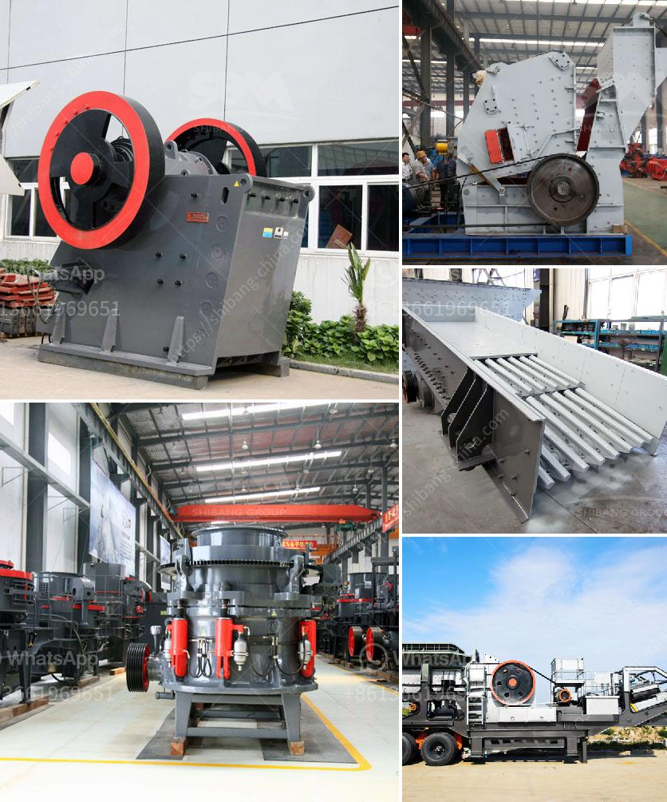

<h3>stone crusher manufacturers in ludhiana</h3>
Stone crusher manufacturers have a wide spectrum of products in research, design, manufacturing, sales, installation, and commissioning of different types of stone crushers. Prominent manufacturers, including zenith Machinery, aim to deliver high-performance crushing equipment, and some of them even provide comprehensive after-sales service.

Ludhiana, a city in Punjab, is widely known as a commercial hub of Northern India. This industrial city plays a significant role in the economy of the state and is home to various manufacturers and industries. Amongst them, stone crusher manufacturers in Ludhiana are a prominent group, offering a wide range of quality crushing machines.

Stone crushers are widely used in mining, construction, metallurgy, chemical, petrochemical, transportation, energy, building materials, and other industries. These industries need various types of stone crushers for different purposes, such as crushing stones into desired size for processing aggregates, crushing large stones into gravels for landscaping, crushing stones to make concrete, or preparing stones for road construction.

The stone crusher manufacturers in Ludhiana are working hard to meet the diverse needs of the customers in the best possible way. They have a dedicated team of professionals who understand the market trends and work accordingly. They continuously invest in research and development to come up with innovative designs to enhance the performance and efficiency of their products.

The stone crusher manufacturers in Ludhiana offer a wide range of products, including crushers, screens, grinders, conveyor belts, and feeders. Some of the prominent manufacturers also provide comprehensive after-sales service and technical support to ensure smooth operation and maximum productivity of their machines.

One of the leading stone crusher manufacturers in Ludhiana, zenith Machinery, has been serving customers for more than decades. With its dedication to quality and commitment to customer satisfaction, the company has earned a strong reputation in the market. Their products are known for their robust construction, high reliability, and excellent performance.

Zenith Machinery offers a wide variety of stone crushers, including jaw crushers, impact crushers, cone crushers, hammer crushers, and vertical shaft impact crushers. These crushers are designed to handle different types of stones, ranging from soft limestone to hard granite. The crushers are available in different sizes and capacities to meet the specific needs of the customers.

In addition to crushers, zenith Machinery also offers screens, grinders, conveyor belts, and feeders. These auxiliary equipment are designed to work in conjunction with the crushers, further enhancing their performance. The screens ensure efficient separation of materials, while the grinders help in reducing the size of the stones. The conveyor belts and feeders facilitate the smooth flow of materials, ensuring maximum productivity.

The stone crusher manufacturers in Ludhiana are continuously evolving to meet the changing demands of the market. They are committed to delivering high-quality products that meet the stringent quality standards. The manufacturers also offer customization options to meet the specific requirements of the customers.

In conclusion, stone crusher manufacturers in Ludhiana play a vital role in the construction industry. Their products are crucial in various processes, ranging from crushing stones for processing aggregates to preparing stones for road construction. The manufacturers are dedicated to delivering high-performance machines and providing excellent after-sales service to ensure customer satisfaction. With their continuous efforts in research and development, they strive to bring out innovative designs to meet the evolving needs of the customers.
<h3>Contact us</h3><ul><li><strong>Whatsapp:&nbsp;<a href="https://wa.me/8613661969651">+8613661969651</a></strong></li><li><a href="https://swt.shibang-china.com/?git&amp;zhl&amp;stone crusher manufacturers in ludhiana"><strong>Online Service(chat now)</strong></a></li></ul><h3>Related</h3><ul><li><a href='sand making machine from china.md'>sand making machine from china</a></li><li><a href='harga mesin pemecah batu kapasitas satu ton.md'>harga mesin pemecah batu kapasitas satu ton</a></li><li><a href='talc mining crusher costs.md'>talc mining crusher costs</a></li><li><a href='m sand machine in tamil nadu.md'>m sand machine in tamil nadu</a></li><li><a href='silica water washing plant manufacturers in india.md'>silica water washing plant manufacturers in india</a></li></ul>