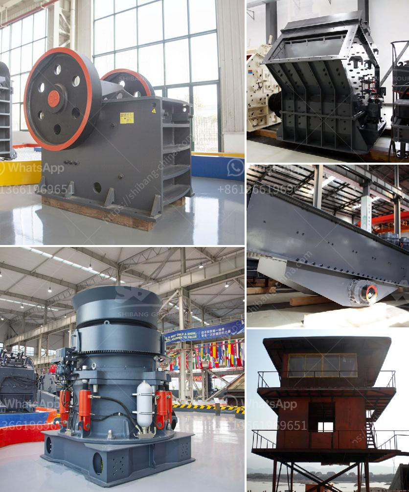

<h3>stone crusher pfs price</h3>
The price of a stone crusher PFS (Pulverized Fuel Sampler) is mainly determined by its size, capacity, and features. With various manufacturers and suppliers in the market, it can be challenging to find the best price for this equipment. However, by considering specific factors, buyers can ensure that they get the right machine at the right price.

First and foremost, the size of the stone crusher PFS plays a significant role in determining its price. Larger machines with higher capacities are generally priced higher than smaller ones. Therefore, buyers should carefully assess their requirements and choose a size that aligns with their needs. It is essential to strike a balance between size and budget to avoid overspending or ending up with an underutilized machine.

The capacity of the stone crusher PFS is another crucial factor to consider. Different models come with varying capacities, which can impact their prices. Buyers should evaluate their production requirements and select a machine that can handle the desired workload effectively. Investing in a machine with a higher capacity can be cost-effective in the long run by saving time and enhancing productivity.

Lastly, the features and functionalities of a stone crusher PFS also affect its price. Different manufacturers offer different options and add-ons that can increase the machine's efficiency and convenience. Buyers should carefully evaluate the features and their relevance to their operations. While additional features may come at an extra cost, they can greatly improve operational efficiency and reduce downtime, making the investment worthwhile.

When searching for the best price for a stone crusher PFS, buyers should consider these factors, conduct thorough research, and compare prices from different manufacturers or suppliers. It can be helpful to reach out to industry experts or consult with equipment professionals to make an informed decision. By finding the right machine at a competitive price, buyers can maximize their investment and ensure long-term success in their crushing operations.
<h3>Contact us</h3><ul><li><strong>Whatsapp:&nbsp;<a href="https://wa.me/8613661969651">+8613661969651</a></strong></li><li><a href="https://swt.shibang-china.com/?git&amp;zhl&amp;stone crusher pfs price"><strong>Online Service(chat now)</strong></a></li></ul><h3>Related</h3><ul><li><a href='stone crusher cement factories in africa.md'>stone crusher cement factories in africa</a></li><li><a href='quarry crushing equipment.md'>quarry crushing equipment</a></li><li><a href='barium powder production machine.md'>barium powder production machine</a></li><li><a href='graphite beneficiation process.md'>graphite beneficiation process</a></li><li><a href='dolomite crusher price.md'>dolomite crusher price</a></li></ul>