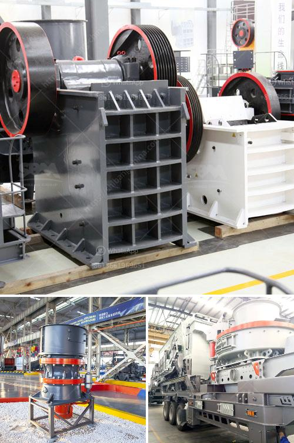

<h3>stone crusher plant brochure</h3>
Stone crushing industry is an important industrial sector in the country engaged in producing crushed stone of various sizes depending upon the requirement which acts as raw material for various construction activities such as construction of roads, highways, bridges, buildings, canals etc. It is estimated that there are over 12,000 stone crusher units in India. The number is expected to grow further keeping in view the future plans for development of infrastructure of roads, canals and buildings that are required for overall development of the country.

In order to meet the ever-increasing demand for high-quality stones, the stone crusher plant plays a crucial role. It not only helps in generating revenue for the company but also provides employment opportunities to the local community. In addition, it helps in utilizing the waste generated from various construction activities such as debris, concrete, bricks, etc.

A stone crusher plant is a profitable venture for new entrepreneurs. The demand for quality stone chips is increasing day-by-day. Stone Crusher Plant Market Opportunity

All the building constructions whether it is housing or industrial construction activities requires crushed stone. Crushed stone is also required for cement based products like RCC pipes, PSC poles, cement concrete hollow blocks, precast cement concrete slabs, well rings, window & door frames and road laying. The demand for crushed stone will continue to grow with the growth of its user industry.

One of the major drivers for the stone crushing plant is the increasing demand from various construction and infrastructure projects. Keeping in view the importance of the construction industry, the stone crusher plant has been developed to produce the required quantity of high-quality stone aggregates which are used for the construction of roads, highways, flyovers, and bridges.

The stone crusher plant brochure is an important promotional tool for showcasing the features and benefits of the company's products. It highlights the various aspects of the stone crusher plant, such as the process flow, machinery details, customer testimonials, etc.

The stone crusher plant brochure provides potential customers with an insight into the company's products and services, helping them make informed decisions. It also serves as a reference guide for customers who want to learn more about the stone crusher plant and its benefits.

In conclusion, the stone crusher plant plays a significant role in the construction industry. It not only helps in generating revenue but also provides employment opportunities and utilizes waste materials. The stone crusher plant brochure is a valuable marketing tool that showcases the features and benefits of the company's products, helping potential customers make informed choices.
<h3>Contact us</h3><ul><li><strong>Whatsapp:&nbsp;<a href="https://wa.me/8613661969651">+8613661969651</a></strong></li><li><a href="https://swt.shibang-china.com/?git&amp;zhl&amp;stone crusher plant brochure"><strong>Online Service(chat now)</strong></a></li></ul><h3>Related</h3><ul><li><a href='granite rock breaking machine manufacturer in mlaysia.md'>granite rock breaking machine manufacturer in mlaysia</a></li><li><a href='stone crusher plant manufacturers china.md'>stone crusher plant manufacturers china</a></li><li><a href='marble grinding factory in dubai.md'>marble grinding factory in dubai</a></li><li><a href='limestone mobile crusher supplier in malaysia.md'>limestone mobile crusher supplier in malaysia</a></li><li><a href='conveyor belts for shelves.md'>conveyor belts for shelves</a></li></ul>