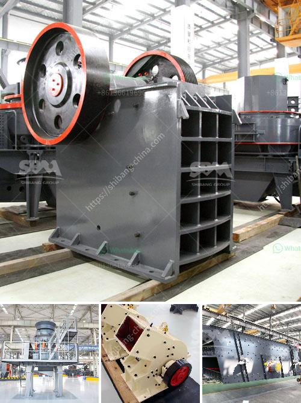

<h3>stone crusher plant components</h3>
Stone crushing and screening plants are effective facilities for crushing all kind of stones which are determined as raw material. Generally, these plants which are obtained from stone quarries and which have different hardness levels such as granite, basalt, limestone, gravel stone and Riverstone can be transformed for use in different types depending on the stone properties and the area to be used. Stone crushing and screening plants are specially designed facilities for producing aggregate or concrete by crushing stones. At these facilities, raw materials such as granite, basalt, limestone, Riverstone, etc. are crushed to produce various sizes and the highest efficiency is used in these plants. 

Usually, the following equipment is required to up plant. Crushers, screening machine, stockpile devices, belt conveyors, washing units, conveying system, control panel, and dust removal system and so on.

Vibratory feeder: vibratory feeder is used for feeding material continuously and uniformly to crusher, it is widely used in sieving and crushing. Raw material such as granite, basalt, limestone, river stone, etc. It is feeded into the jaw crusher, the primary crusher, to reduce the size of stone, and then it is further crushed by cone crusher or impact crusher, the secondary crusher.

Belt conveyor: Belt conveyor plays a very important role in stone crushing plant, it transfer the stone or material to cone crusher or impact crusher for medium crushing, then transfer the crushed materials to vibrating screen for separating. It is widly used in stone crushing process, it can be used as secondary or tertiary crusher in various industries for crushing materials, such as limestone, cement clinker, iron ore, shale, dolomite, granite, gypsum, mixed materials.

Screening machine: In stone crushing plant, screening machine usually consists of a vibrating screen. The vibrating screen is used to screen the crushed stone product into different sizes. The size of the stone material is not only related to the plant's capacity but also related to the use of the product. For small partical size, lastly the materials which go through fine crushing are discharged from the vibrating screen onto a belt conveyor and transported to a stockpile

Dust removal equipment: Dust removal equipment in stone crushing plant is its core equipment, it can protect the environment and keep noise levels down to a minimum. Dust removal plant consists of vibrating feeder, heavy-duty jaw crusher, dust removal equipment, vibrating screen, belt conveyor, and electrical control system.

Control panel: A control panel is a component, part of an electrical control system. It monitors and manages the electrical systems of a plant or an industrial process by efficiently controlling the overall function of the integrated system.

In conclusion, stone crusher plant is useful and necessary for stone crushing industry. The equipment such as jaw crusher, impact crusher, cone crusher, vibrating screen, vibrating feeder and belt conveyor are indispensable in the process of crushing and screening. So the choice of crusher is very important. But remember that the mine should not be dug too quickly because this will lead to a large amount of resources unable to be fully utilized. The stone crusher plant will enable the erstwhile buyer to be pulverized to the certain sieve are designed. This article will talk about the components of the stone crushing plant that you need to determine which materials are reliable.
<h3>Contact us</h3><ul><li><strong>Whatsapp:&nbsp;<a href="https://wa.me/8613661969651">+8613661969651</a></strong></li><li><a href="https://swt.shibang-china.com/?git&amp;zhl&amp;stone crusher plant components"><strong>Online Service(chat now)</strong></a></li></ul><h3>Related</h3><ul><li><a href='roller coal mill.md'>roller coal mill</a></li><li><a href='cement plant ataustralia.md'>cement plant ataustralia</a></li><li><a href='closing of crushing plant.md'>closing of crushing plant</a></li><li><a href='distributor belt conveyor di philippines.md'>distributor belt conveyor di philippines</a></li><li><a href='mobile impact crusher in road construction.md'>mobile impact crusher in road construction</a></li></ul>