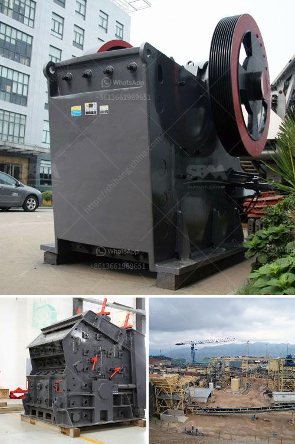

<h3>stone crusher plant in pakistan</h3>
Stone crusher plant in Pakistan plays an important role in the construction industry. The stone crushing industry is becoming an important sector for the construction industry, especially in the rapidly growing infrastructure development projects in Pakistan. The crushing plant is commonly used as a primary stone crusher plant in Pakistan.

It comes with the most advanced technology and the comprehensive features. The applications of crusher plants in Pakistan are various. Coal crushing plant in Pakistan is used widely in Pakistan mining industry for crushing coal, rock, mineral ores, diatomaceous earth, silica, etc. gypsum crushing plant in Pakistan has widely applied for mining, highway construction, water conservancy projects, building rubble and sand processing industry.

The stone crushing plant includes a series of crushers. The jaw crusher, impact crusher, cone crusher, vertical shaft impact crusher, vibrating screen and belt conveyor are all essential machine in the stone production line. The jaw crusher has a big crushing ratio, uniform product size, simple structure, reliable operation, easy maintenance, low operating cost, etc. It is widely used in mining, metallurgy, construction, highway, railroad, water conservancy and chemical industries.

The impact crusher is commonly used for the crushing of limestone, coal, calcium carbide, quartz, dolomite, iron pyrites, gypsum, and chemical raw materials of medium hardness. The impact crusher has a higher crushing ratio than the hammer crusher. The impact rock crusher can process the materials with side length less than 100-500 mm, and its compressive strength can reach up to 350 MPa.

The cone crusher is suitable for crushing ores and rocks with medium and high hardness, such as iron ore, limestone, copper ore, quartz, and granite. It is widely used in the crushing of construction materials in the metallurgy, construction, road construction, chemical industry, and silicate industry.

In conclusion, the stone crusher plant in Pakistan is a powerful machine that can break down large stones into smaller pieces in a matter of minutes. It can crush stones into different sizes and shapes to meet the diverse needs of the construction industry in Pakistan. This machine is widely used in cement, mining, construction, and other industries. With the increasing demand for construction materials, the stone crushing plant will play an important role in Pakistan's economic development.
<h3>Contact us</h3><ul><li><strong>Whatsapp:&nbsp;<a href="https://wa.me/8613661969651">+8613661969651</a></strong></li><li><a href="https://swt.shibang-china.com/?git&amp;zhl&amp;stone crusher plant in pakistan"><strong>Online Service(chat now)</strong></a></li></ul><h3>Related</h3><ul><li><a href='industrial gypsum rotary kiln.md'>industrial gypsum rotary kiln</a></li><li><a href='gypsum powder production process pdf.md'>gypsum powder production process pdf</a></li><li><a href='ball mill capacity 26 x 41.md'>ball mill capacity 26 x 41</a></li><li><a href='small scale gold refinery plant equipments.md'>small scale gold refinery plant equipments</a></li><li><a href='grinding mill machine cost price south africa.md'>grinding mill machine cost price south africa</a></li></ul>