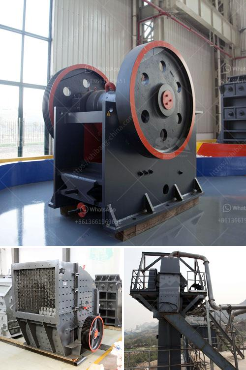

<h3>stone crusher plant manufacturers china</h3>
As the leading stone crusher plant manufacturer in China, we have been specialized in manufacturing and exporting various types of stone crushers, stone crushing plant, and the so-called aggregate crusher line for many years. Our executive management and technical staff members are equipped with modern production techniques and machinery. With thousands of successful projects under our belt, we guarantee that our machines and plants are of superior quality, durable, and reliable.

China has been a pioneer in the field of stone crusher manufacturing for decades. We are one of the leading stone crushing plant manufacturers in China and have been specializing in this field for over 30 years. Our range of jaw crushers, impact crushers, cone crushers, vertical shaft impact crushers, vibrating screens and feeders is known for their exceptional quality, reliability, and performance. We have been serving clients in the quarrying, mining, recycling, construction, and chemical industries, among others.

One of the reasons why our stone crusher plant is favored by numerous customers all over the world is our strict quality control policies. We adhere to the principle of "quality first" and have established a comprehensive quality management system. From the procurement of raw materials to the assembly and testing of the finished machines, our quality control team ensures that each part and component meets the highest standards. This commitment to quality has earned us a reputation as a top stone crusher plant manufacturer in China.

In addition to the quality of our machines, our professional and high-quality after-sales service has also contributed to our success. We have a dedicated team of service engineers who are well-trained and experienced in solving all kinds of technical problems. Whether it's installation, commissioning, maintenance, or repairs, our team is readily available to assist our customers. We believe that excellent after-sales service is crucial to maintaining long-term relationships with our clients.

In recent years, our stone crusher plants have gained popularity in various parts of the world. Our machines have been exported to more than 80 countries, including South Africa, Tanzania, Nigeria, Botswana, Uganda, United Arab Emirates, Ghana, Sierra Leone, India, Indonesia, Singapore, Australia, Sri Lanka, Vietnam, Bangladesh, Saudi Arabia, Uzbekistan, Egypt, and many other countries. We have built excellent relationships with our customers by providing them with high-quality products and outstanding service.

As stone crusher plant manufacturers in China, we strive to provide our customers with the best machines and plants at the most competitive prices. We continuously invest in research and development to improve our products and meet the ever-changing demands of the market. Our commitment to innovation and customer satisfaction has made us a leader in the industry.

In conclusion, as one of the leading stone crusher plant manufacturers in China, we have a proven track record in providing high-quality machines and excellent service to our customers. Our dedication to quality, technical expertise, and customer satisfaction has distinguished us from our competitors. Whether you need a single machine or a complete stone crushing plant, we are confident that we can meet your requirements. Contact us today to discuss your project and let us be your trusted partner in crushing and screening solutions.
<h3>Contact us</h3><ul><li><strong>Whatsapp:&nbsp;<a href="https://wa.me/8613661969651">+8613661969651</a></strong></li><li><a href="https://swt.shibang-china.com/?git&amp;zhl&amp;stone crusher plant manufacturers china"><strong>Online Service(chat now)</strong></a></li></ul><h3>Related</h3><ul><li><a href='chromite ore crusher in pakistan.md'>chromite ore crusher in pakistan</a></li><li><a href='limestone jaw crusher for sale.md'>limestone jaw crusher for sale</a></li><li><a href='rock crusher mercadolibre.md'>rock crusher mercadolibre</a></li><li><a href='europe crusher producers.md'>europe crusher producers</a></li><li><a href='jaw crusher specifications.md'>jaw crusher specifications</a></li></ul>