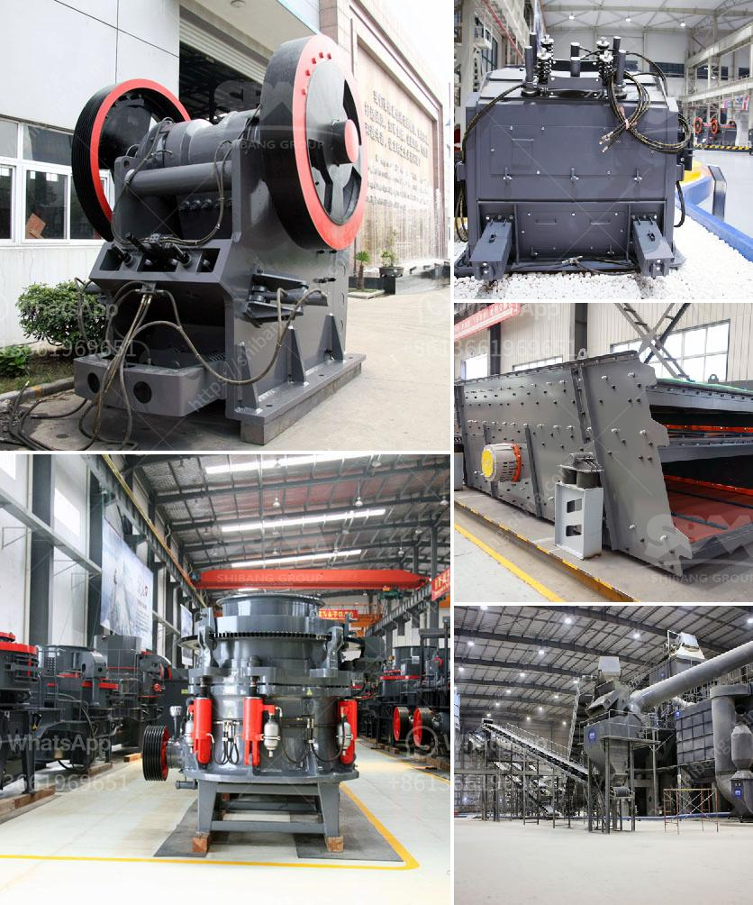

<h3>stone crusher plant south africa</h3>
Stone Crusher Plant South Africa is located in Johannesburg, South Africa. It is the prominent and leading provider of construction machinery and mining equipment. The crusher plant is located in South Africa and it is used for crushing stones and gravels into sand or powder for building aggregates and construction purposes.

Stone crushing plants are also popular in South Africa. These plants combine the crushing process and screening process together and there are also many different types of these crushing plants. According to the different needs of customers, the stone crushing plant can be equipped with jaw crusher, impact crusher, cone crusher, vibrating screen and belt conveyor.

The stone crusher plant South Africa is highly automated, with low operation cost, high crushing ratio, low power consumption and high crushing capacity. It is a good choice for construction and mining industry. The vibrating feeder feeds the raw materials into jaw crusher for crushing, then the crushed materials are transported to impact crusher or cone crusher for further crushing through belt conveyor. After being crushed, the materials are screened by vibrating screen and the qualified materials are transported to sand making machine for shaping or sand washing machine for cleaning.

Stone Crusher Plant South Africa has various benefits. Firstly, it is cost-effective. The stone crushing plant includes low operation cost and high production capacity. Secondly, it is flexible. These plants can be adjusted according to different customer requirements. Lastly, the stone crusher plant South Africa is reliable and easy to use. It adopts high quality bearings, which ensures the smooth operation of the whole machine.

In conclusion, Stone Crusher Plant South Africa is a cost-effective and flexible solution for many stone crushing applications. It is widely used in various fields such as mining, construction, and highway construction. So if you are looking for a stone crusher plant in South Africa, you can consider buying one from a reliable manufacturer like SBM Machinery.
<h3>Contact us</h3><ul><li><strong>Whatsapp:&nbsp;<a href="https://wa.me/8613661969651">+8613661969651</a></strong></li><li><a href="https://swt.shibang-china.com/?git&amp;zhl&amp;stone crusher plant south africa"><strong>Online Service(chat now)</strong></a></li></ul><h3>Related</h3><ul><li><a href='belt conveyors used in crushing plant.md'>belt conveyors used in crushing plant</a></li><li><a href='price of smallest chippings crusher plant.md'>price of smallest chippings crusher plant</a></li><li><a href='mobile dolomite impact crusher for hire.md'>mobile dolomite impact crusher for hire</a></li><li><a href='pe 100 jaw crusher.md'>pe 100 jaw crusher</a></li><li><a href='price stone crusher dragon.md'>price stone crusher dragon</a></li></ul>