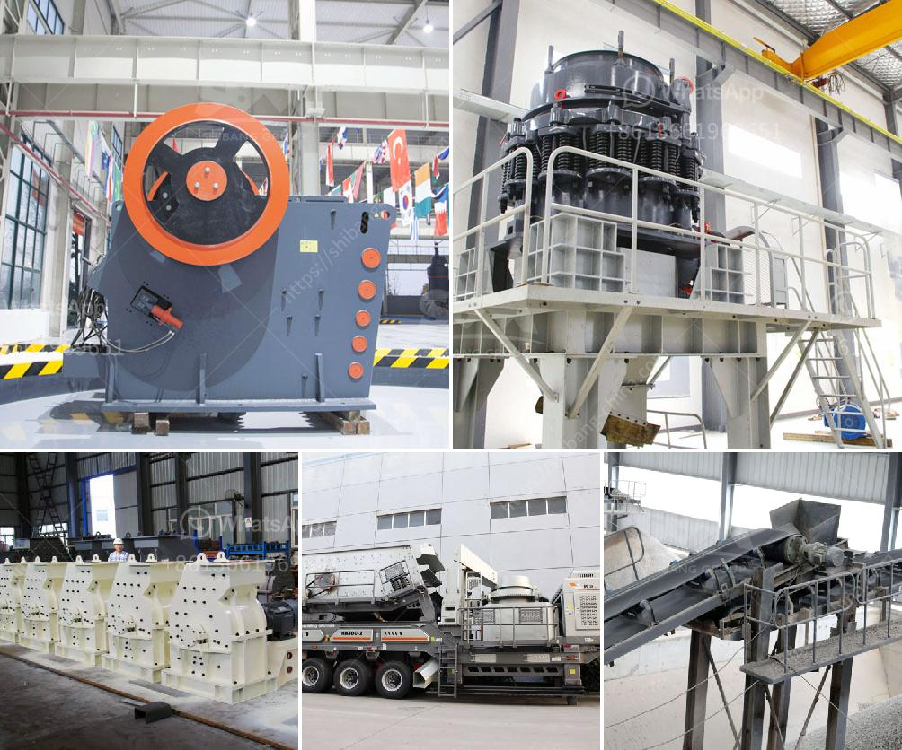

<h3>stone crusher plants in mexico</h3>
Stone crusher plants in Mexico have gained immense popularity in recent years because of their ability to crush various stones into different sizes, efficiently and effectively. These plants have revolutionized the way stones are crushed and transformed into different articles for various purposes. Whether it is for road construction, building construction, or any other project that requires crushed stones, stone crusher plants in Mexico are the go-to solution.

One of the main reasons behind the popularity of these plants is their versatility. They can crush stones of different hardness levels, ranging from soft to extremely hard. This ensures that no matter what type of stone needs to be crushed, these plants can handle it with ease. In addition, stone crusher plants in Mexico are available in different configurations and capacities, making it easy for businesses to choose the most suitable plant according to their requirements.

Another factor contributing to the popularity of these plants is their high efficiency. The advanced technology used in these plants allows for quick and efficient crushing of stones, resulting in higher productivity and reduced operational costs. These plants are not only efficient but also durable, ensuring long-term usage without any major maintenance or breakdowns.

Moreover, stone crusher plants in Mexico are also environmentally friendly. Many of these plants are equipped with dust suppression systems, reducing the emission of harmful dust particles into the atmosphere. This makes them suitable for use in urban areas without causing any harm to the environment or nearby communities.

Overall, stone crusher plants in Mexico have become an integral part of the construction industry. Their ability to crush stones into different sizes, their versatility, efficiency, and environmental friendliness have made them a preferred choice for businesses across various sectors. As the demand for crushed stones continues to grow, the popularity of these plants is expected to increase in the coming years.
<h3>Contact us</h3><ul><li><strong>Whatsapp:&nbsp;<a href="https://wa.me/8613661969651">+8613661969651</a></strong></li><li><a href="https://swt.shibang-china.com/?git&amp;zhl&amp;stone crusher plants in mexico"><strong>Online Service(chat now)</strong></a></li></ul><h3>Related</h3><ul><li><a href='working hours of a crusher plant.md'>working hours of a crusher plant</a></li><li><a href='project cost of stone crusher of 100 tph.md'>project cost of stone crusher of 100 tph</a></li><li><a href='limestone crusher for sale.md'>limestone crusher for sale</a></li><li><a href='how to start stone crusher project.md'>how to start stone crusher project</a></li><li><a href='2 meter concrete crusher.md'>2 meter concrete crusher</a></li></ul>