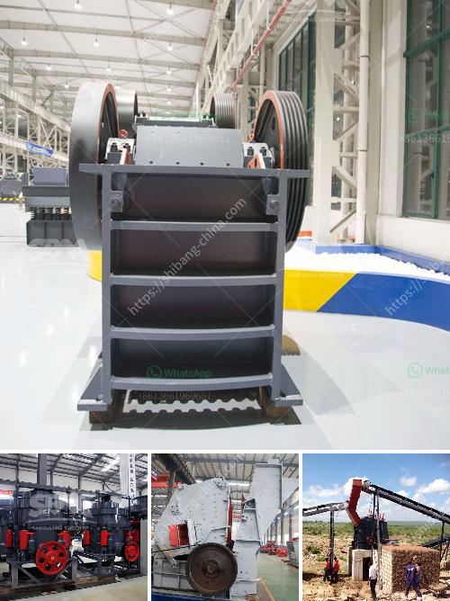

<h3>stone crusher portable</h3>
Stone crusher portable are mostly used for quarrying, mining, building materials production and road construction. Crushing and screening machines are very vital for construction projects. Stone crusher equipment plays an important role in the construction industry because it determines the quality of the crushed stone and its subsequent usage.

The portable stone crusher plant is equipped with some wheels, which can be removed or moved around. Therefore, it is convenient for users to transport or reassemble after breakage or disassembly. It is especially suitable for the small crushing site with small working site, such as urban construction waste disposal. Different from traditional fixed stone crusher, portable stone crusher can be used as a primary and secondary crusher to conserve materials.

As the name implies, portable stone crusher is not fixed by equipment installation. When broken, it can be broken at any time and by any position, so it is flexible. Portable stone crusher can save many cost for customers. Portable stone crusher incorporates all the crushing plants into one which completely avoids the site constraints of the fixed crushing plants and the high transportation cost of the raw materials. Portable stone crusher incorporates all the equipment together on one truck, which has high chassis, narrower body compared with other trucks, so it can significantly reduce the transportation cost and flexibly move on various highways and working site areas.

Stone crushing process plays a crucial part in producing the needed sizes of aggregate materials, which are the major raw materials used in construction and road building. Crushing activities are used as a means of preparing the raw materials for subsequent processing, such as grinding, screening, size classification, and transportation.

Portable stone crushers are widely used in the construction site, sand stone factory, hydropower station and concrete dam site, various materials will be processed and stages for crushing can be divided into three teaser, namely primary crushing stage, secondary crushing stage and fine crushing stage.

Within the portable stone crusher, different crushers will be used in different crushing stages. For example, jaw crusher is used for primary crushing stage, impact crusher is used for secondary crushing stage, CS series cone crusher is used for fine crushing stage, and mobile crusher can be equipped with a high-efficiency tertiary crusher to produce aggregate materials with standardized grain sizes.

In conclusion, portable stone crusher is an ideal product for quarrying and mining industry. It is suitable for all kinds of crushing operations. Due to its flexible design, it can be relocated or transported easily and that means the portable stone crusher is not restricted by the distance from the crushing site. Moreover, it can be customized according to different customer requirements, so it is widely welcomed in the market and plays an important role in various construction projects.
<h3>Contact us</h3><ul><li><strong>Whatsapp:&nbsp;<a href="https://wa.me/8613661969651">+8613661969651</a></strong></li><li><a href="https://swt.shibang-china.com/?git&amp;zhl&amp;stone crusher portable"><strong>Online Service(chat now)</strong></a></li></ul><h3>Related</h3><ul><li><a href='double toggle jaw crushers.md'>double toggle jaw crushers</a></li><li><a href='silica quartz crushing plant.md'>silica quartz crushing plant</a></li><li><a href='ball mill drive system.md'>ball mill drive system</a></li><li><a href='high energy ball mill price.md'>high energy ball mill price</a></li><li><a href='tanzania small stone crusher sale.md'>tanzania small stone crusher sale</a></li></ul>