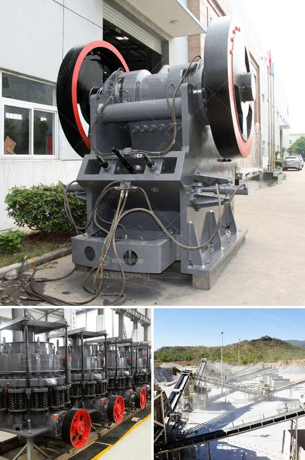

<h3>stone crusher price in south africa</h3>
Stone crusher is widely used as quarry crushing machine in construction quarrying and mining plant in South Africa for aggregates, sand, mine ore recovery. quarry stone crusher south africa - Gold Ore Crusher. South Africa Quarry Crusher,quarry business crusher,Quarry … Quarry crusher and rock crusher supplier in China-. Zenith. Zenith is a professional manufacturer of ...

Stone Crusher Machine Price In South Africa 5 Tertiary Crusher feeds material onto screens to screen it into graduate sizes (progressive smaller) until the pieces are small enough to fall through the opening at the bottom. Crushers apply to secondary or tertiary crushing applications.

Stone Crusher,Mobile Crusher,Cone Crusher,Grinding Mill,Sand Making Machine. South Asia 8%, Southern Europe 8%, Northern Europe 8%. Tags: South Africa Stone Crushing Plants For Sale | South Africa Granite Quarry Crushing Equipment | Stone Crushing Machine Crusher In Cement Plant | Factory Directly Jaw Crusher Advantages For Sale ...

09.12.2013· Used Stone Crusher In South Africa hpc cone crusher. hammer crusher. mobile crusher machines in south africa. south africa mobile crusher from germany quarry crusher stone crusher machine from china keelvik.this page is about the keelvik stone crusher machine,or mobile crusher machine in south africa,cone sale in usa; the powercrusher.
<h3>Contact us</h3><ul><li><strong>Whatsapp:&nbsp;<a href="https://wa.me/8613661969651">+8613661969651</a></strong></li><li><a href="https://swt.shibang-china.com/?git&amp;zhl&amp;stone crusher price in south africa"><strong>Online Service(chat now)</strong></a></li></ul><h3>Related</h3><ul><li><a href='mobile jaw crusher tons per hour.md'>mobile jaw crusher tons per hour</a></li><li><a href='mobile glass crushing plant.md'>mobile glass crushing plant</a></li><li><a href='how to decrease the dust in a crushing plant.md'>how to decrease the dust in a crushing plant</a></li><li><a href='flow diagram for limestone process.md'>flow diagram for limestone process</a></li><li><a href='powder making machine.md'>powder making machine</a></li></ul>