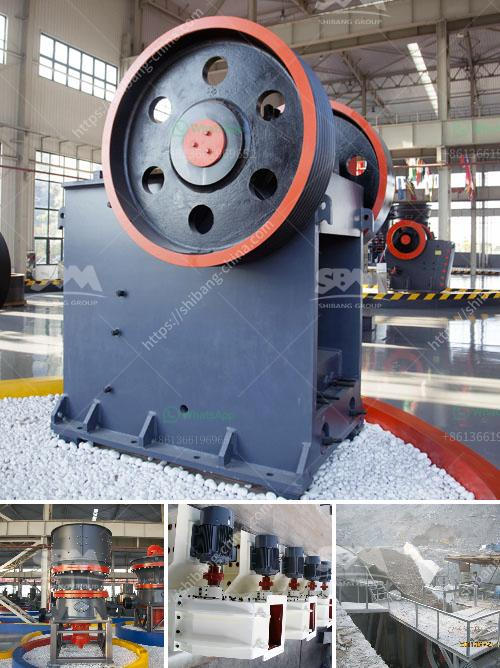

<h3>stone crusher sale in peru</h3>
In the mining industry, many people know that to buy equipment, such as crushers, is a necessary process. Since the formation of the Peru Gold Mine, it has been continuously exploited for thousands of years. It is different from other ores. The selection of mining machinery is important. For the majority of investors, choosing a suitable stone crusher is essential.

Stone crushers are equipment that crush larger rocks into smaller ones. The pieces obtained can be used for various purposes, such as road building, construction, train tracks, and so on. Stone crushers come in a variety of models and sizes, and their operation is based on the mechanical principles of compression or impact. The selection of crushers is based on the required final product size and the capacity needed.

Peru is known for its rich mineral resources, especially for copper, zinc, lead, silver, and gold. Therefore, Peru has a large number of mining companies and mineral processing plants. Stone crushers are widely used in various mining fields. Many models and types of crushers are available for sale in Peru, such as jaw crushers, impact crushers, cone crushers, mobile crushers, etc.

The construction industry in Peru is also booming. As a developing country, Peru needs more infrastructure construction to improve the living conditions of its citizens. Stone crushers are essential equipment for this industry. Since they can break stones into smaller pieces, they are used in the building of houses, roads, bridges, and other structures.

In recent years, with the development of technology, stone crushers have become more advanced and portable. Mobile crushers are now widely used in the mining industry. They are small in size and can be moved easily, making them convenient for on-site work. For instance, if stone is needed to be crushed at a specific location, a mobile crusher can be brought to that location, crushing the stones on-site.

In Peru, stone crushers with a capacity ranging from 300 to 500 tons per hour are sold. These crushers are mainly purchased by enterprises with large processing capacity. More advanced models, such as hydraulic cone crushers, are also popular among larger mining companies, as they can achieve higher production levels with minimal energy consumption.

When purchasing a stone crusher, buyers need to consider various factors, such as the hardness of the material, the required final product size, and the capacity needed. It is always advisable to consult with experts or experienced engineers to choose the right crusher for specific needs. Furthermore, it is important to choose a reliable and reputable supplier to ensure the quality and performance of the equipment.

In conclusion, stone crusher sales in Peru play a crucial role in the development of the mining and construction industries. They are essential equipment for breaking stones into smaller pieces and are used in various applications. It is important for buyers to carefully consider their specific requirements and seek professional advice when purchasing a stone crusher.
<h3>Contact us</h3><ul><li><strong>Whatsapp:&nbsp;<a href="https://wa.me/8613661969651">+8613661969651</a></strong></li><li><a href="https://swt.shibang-china.com/?git&amp;zhl&amp;stone crusher sale in peru"><strong>Online Service(chat now)</strong></a></li></ul><h3>Related</h3><ul><li><a href='quarry rock stone crusher germany machine manufacturer.md'>quarry rock stone crusher germany machine manufacturer</a></li><li><a href='ultra fine grinder mill.md'>ultra fine grinder mill</a></li><li><a href='cement plant ataustralia.md'>cement plant ataustralia</a></li><li><a href='feasibility study for the establishment of quarry.md'>feasibility study for the establishment of quarry</a></li><li><a href='rubber conveyor belt manufacturers in turkey.md'>rubber conveyor belt manufacturers in turkey</a></li></ul>