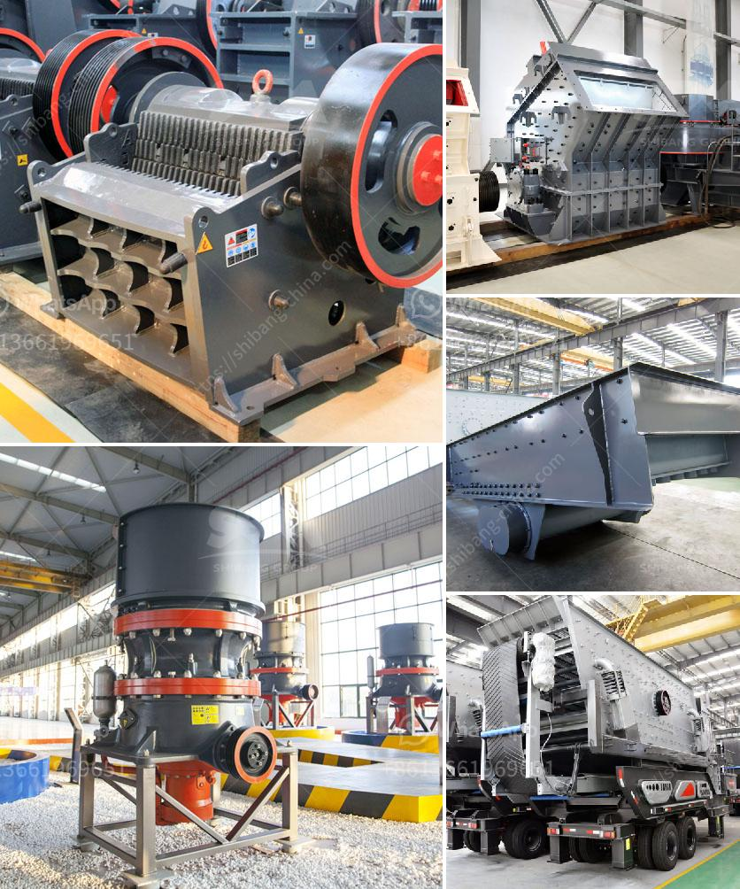

<h3>stone crusher second hand south africa</h3>
The process of making stone from the stone quarry involves the use of heavy-duty machinery to start with. The stone is initially fed into the primary crusher, which breaks it down even further into manageable sizes. A secondary crusher then reduces it further to the desired size. The crushed stone is then screened to separate it into different grades. 

In South Africa, stone crusher machines are widely used for processing various stones into small size or aggregate well suited for various construction applications. These machines are typically used when the rocks are processed into construction material or used for landscaping.

Second hand stone crusher machines can be purchased from numerous sources, including online auctions. There are a variety of brands and models available, all offering different specifications and features. It is important to thoroughly research and inspect the machinery before making a purchase to ensure it is in good working condition and will meet the required task.

There are several advantages of buying a second hand stone crusher machine. Firstly, it is a cost-effective option as the initial investment is significantly lower compared to buying a new machine. This is particularly appealing to small and medium-sized construction companies or individuals on a limited budget. Additionally, purchasing second hand equipment allows for immediate use, as there is no need for the tedious wait associated with placing an order and waiting for delivery.

Second hand stone crushers also offer environmental benefits. By reusing existing equipment, it reduces the demand for new machinery, thus minimizing the production of waste materials and emissions associated with manufacturing. This aligns with the growing global focus on sustainability and responsible resource management.

South Africa has a rich mining history, and the demand for stone crushers is constantly increasing due to the country's growing infrastructure and construction needs. Stone crushers are widely used in various sectors such as mining, smelting, building materials, highway, railway, water conservancy, chemical industry, and many more.

When purchasing a second hand stone crusher in South Africa, it is important to consider a few factors to ensure you get a reliable machine. Firstly, check the overall condition of the machine, including its appearance and functionality. It is also advisable to inspect the service history and maintenance records to determine the reliability and performance of the machine. Additionally, it is crucial to test the machine's performance on-site, if possible, to ensure it meets your specific requirements.

Second hand stone crushers are available in different sizes and capacities, ranging from small handheld models to larger industrial machines. Consider your specific needs and the type of stone crushing you will be undertaking. It is also important to assess the availability of spare parts and the ability to service the machine locally.

In conclusion, purchasing a second hand stone crusher in South Africa can be a cost-effective and environmentally friendly option for many businesses and individuals. By conducting thorough research and inspections, you can find a reliable machine that meets your specific requirements. However, it is crucial to exercise caution and ensure the machine is in good working condition before finalizing the purchase.
<h3>Contact us</h3><ul><li><strong>Whatsapp:&nbsp;<a href="https://wa.me/8613661969651">+8613661969651</a></strong></li><li><a href="https://swt.shibang-china.com/?git&amp;zhl&amp;stone crusher second hand south africa"><strong>Online Service(chat now)</strong></a></li></ul><h3>Related</h3><ul><li><a href='crushing of concrete in pakistan.md'>crushing of concrete in pakistan</a></li><li><a href='two roll mill supply in sri lanka.md'>two roll mill supply in sri lanka</a></li><li><a href='cost 100tpd cement plant india.md'>cost 100tpd cement plant india</a></li><li><a href='stone quarry crusher project report pdf.md'>stone quarry crusher project report pdf</a></li><li><a href='coal dry processing plant.md'>coal dry processing plant</a></li></ul>