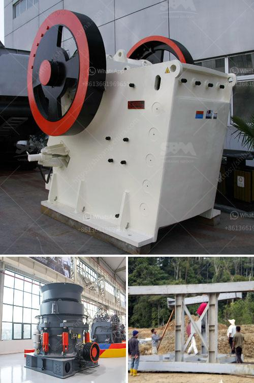

<h3>stone crushers in china</h3>
Stone crushers are widely used in mining, metallurgy, construction, highway, railroad, and chemistry industries. As a lot of rock minerals and construction materials need to be crushed, stone crushing industry is booming in China. Due to the great development in China's economic strength and construction industry, stone crushers have been extensively used to improve the efficiency of the work.

Stone crushers can be classified into primary crushing, secondary crushing, and tertiary crushing machienes according to production need and final products reqiurements. Following are several popular stone crushers for sale in China.

Jaw crusher is the most widely used rock crushing equipment. High production rates are achieved through a wide crushing chamber and large gape. The dolomite jaw crusher has a long crushing chamber which delivers aggressive crushing action to nip even hard stone for quick processing and consistent performance.

Cone crusher is the most common fine crusher, and usually used as final crushing machine. It has four types: spring cone crusher, CS cone crusher, hydraulic cone crusher, hcs90 cone crusher. Every cone crusher has their different applications. Vibrating Feeder :

Vibrating Feeder is a kind of linear direction feeding equipment. It features smooth vibrating, reliable operation, long service life and being suitable for feeding. They are widely used in mining, building-material, silicate and chemical industry in the crushing and screening plants.

Impact crusher is used as secondary crusher to crush medium and soft mineral & rock, such as limestone, calcite, granite,barite, gypsum, concrete etc. Impact crusher is widely used in mining, highway, and construction.

Hammer crusher is used for crushing medium hard materials with weak abrasiveness, and the compression strength of the materials to be crushed should not exceed 100MPa, and the water content should be lower than 15%. The materials that can be crushed by hammer crusher include coal, salt, chalk, gypsum, tile and limestone, etc.

With the rapid increasing needs for high-speed railway construction, sand and gravel aggregate demand is especially strong. It has high standard for the production of aggregate and it also needs the high quality and aggregate processing machines.

Mobile crusher has wide application fields, especially for crushing hard rocks such as basalt, granite, pebbles, quartz, limestone, dolomite, coal, iron ore, copper ore, gold ore, etc. With reliable performance and high efficiency, it is always popular in construction and mining industry.

Mobile stone crusher is able to lower the labor strength, improve the labor efficiency and enhance workers’ safety. Hammer crusher can crush materials with different sizes into equal particle, which favors the next procedure. The advantages of hammer crusher is have reliable mechanical structure, high productivity and favorable applicability.

Hammer crusher has such features of compact structure, reasonable configuration, convenient installation, good maintainability and simple operation. It has excellent adaptability to the environment and the crushing site. The performance of the stone crushing plant can be judged according to the product quality. There are mainly two quality indexes of crushed stone: the ratio of elongated and flaky particles and the content of the powder. If these two indicators exceed the specified range, the product quality is unqualified and cannot be used in important projects. Therefore, the crusher equipment manufacturer focuses on the crushing machine quality and service for clients. We adhere to honesty and good quality working attitude to help customers develop sustainable and high-quality products. Our stone crushing machines have been exported to many countries such as Algeria, India, South Africa, Russia, Indonesia, Zambia, Zimbabwe, Pakistan, Kenya, Omen etc. If you want to know more information about stone crushing machines, please feel free to contact us.
<h3>Contact us</h3><ul><li><strong>Whatsapp:&nbsp;<a href="https://wa.me/8613661969651">+8613661969651</a></strong></li><li><a href="https://swt.shibang-china.com/?git&amp;zhl&amp;stone crushers in china"><strong>Online Service(chat now)</strong></a></li></ul><h3>Related</h3><ul><li><a href='induatrial mill crusher supplier.md'>induatrial mill crusher supplier</a></li><li><a href='india stone crusher in bangladesh.md'>india stone crusher in bangladesh</a></li><li><a href='activated carbon gold mining processing equipment supplier.md'>activated carbon gold mining processing equipment supplier</a></li><li><a href='used ez screen plant 1200 xl for sale.md'>used ez screen plant 1200 xl for sale</a></li><li><a href='nigeria quartz plant in kenya.md'>nigeria quartz plant in kenya</a></li></ul>