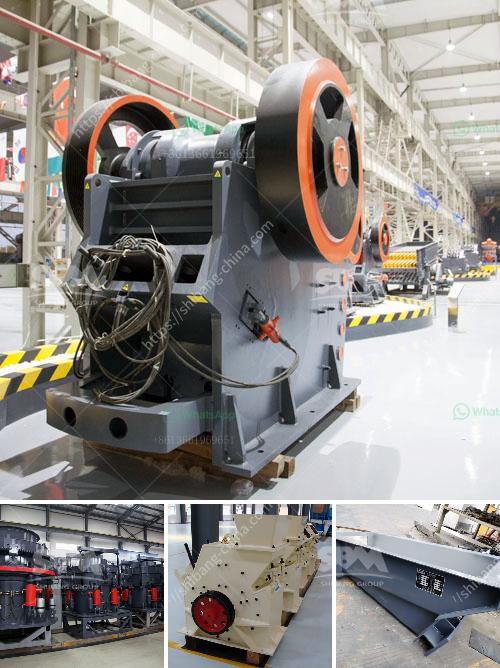

<h3>stone crushers in uttarakhand</h3>
Stone crushers are small-scale industries in the unorganised sector. They provide basic material for road and building construction. They are highly labour intensive. The small-scale stone crushing industry is scattered all over the world, with businesses being located in different parts of countries. This industry exists in all major cities and towns such as Mumbai, Delhi, Kolkata, Chennai, Jaipur, Bangalore, Hyderabad, Nagpur, Indore, Ahmedabad, and many more. 

Uttarakhand, a small state in northern India, is known for its scenic beauty. It is nestled in the Himalayan region and is home to several rivers and mountains. The state is also rich in natural resources, such as minerals and stones. The stone crushers in Uttarakhand play a vital role in the economy of the state. 

Several kinds of stones ranging from limestone to granite are crushed to produce aggregates, gravels, and sand, which are the primary materials used in various construction activities. The stone crushing industry is important for Uttarakhand's economic development as it provides employment opportunities to numerous people, especially in rural areas. 

However, despite the positive impact of stone crushers, some concerns have been raised regarding their operations. Firstly, it is important to note that stone crushing is a highly polluting industry. The dust generated from these crushers can cause respiratory problems and other health issues for both workers and nearby residents. Additionally, the noise generated by the crushers can be a nuisance for people living in the vicinity. 

To address these concerns, the government of Uttarakhand has implemented various regulations and guidelines for stone crushers. These include stipulations for maintaining emission standards and noise pollution control. Additionally, the government has also imposed a ban on the operation of stone crushers near water bodies and forest areas to protect the environment. 

Despite these regulations, some illegal stone crushers continue to operate in Uttarakhand. These unauthorised crushers not only violate environmental norms but also hamper the growth of the organised stone crushing industry. They also pose a threat to the health and safety of workers and nearby residents. 

To tackle this issue, the government needs to strengthen its enforcement mechanisms to identify and shut down illegal stone crushers. It should also create awareness among the people about the hazards of illegal stone crushing and promote the use of licensed and regulated crushers. 

Furthermore, the government should encourage sustainable practices in the stone crushing industry. This can include encouraging the use of advanced technology and machinery that minimises pollution and promotes efficiency. It can also provide training and skill development opportunities to improve the working conditions and productivity of the sector. 

In conclusion, stone crushers play a significant role in the economy of Uttarakhand. While they contribute to the construction industry and provide employment opportunities, their operations need to be regulated to mitigate the negative impacts on the environment and public health. The government should work towards implementing stricter regulations, closing down illegal stone crushers, and promoting sustainable practices to ensure the long-term growth and well-being of the industry.
<h3>Contact us</h3><ul><li><strong>Whatsapp:&nbsp;<a href="https://wa.me/8613661969651">+8613661969651</a></strong></li><li><a href="https://swt.shibang-china.com/?git&amp;zhl&amp;stone crushers in uttarakhand"><strong>Online Service(chat now)</strong></a></li></ul><h3>Related</h3><ul><li><a href='crushing plants for sale in south africa.md'>crushing plants for sale in south africa</a></li><li><a href='how to start a coal mine.md'>how to start a coal mine</a></li><li><a href='cone crusher in the philippines.md'>cone crusher in the philippines</a></li><li><a href='kaolin processing plant south africa.md'>kaolin processing plant south africa</a></li><li><a href='sewa mobile stone crusher di indonesia.md'>sewa mobile stone crusher di indonesia</a></li></ul>