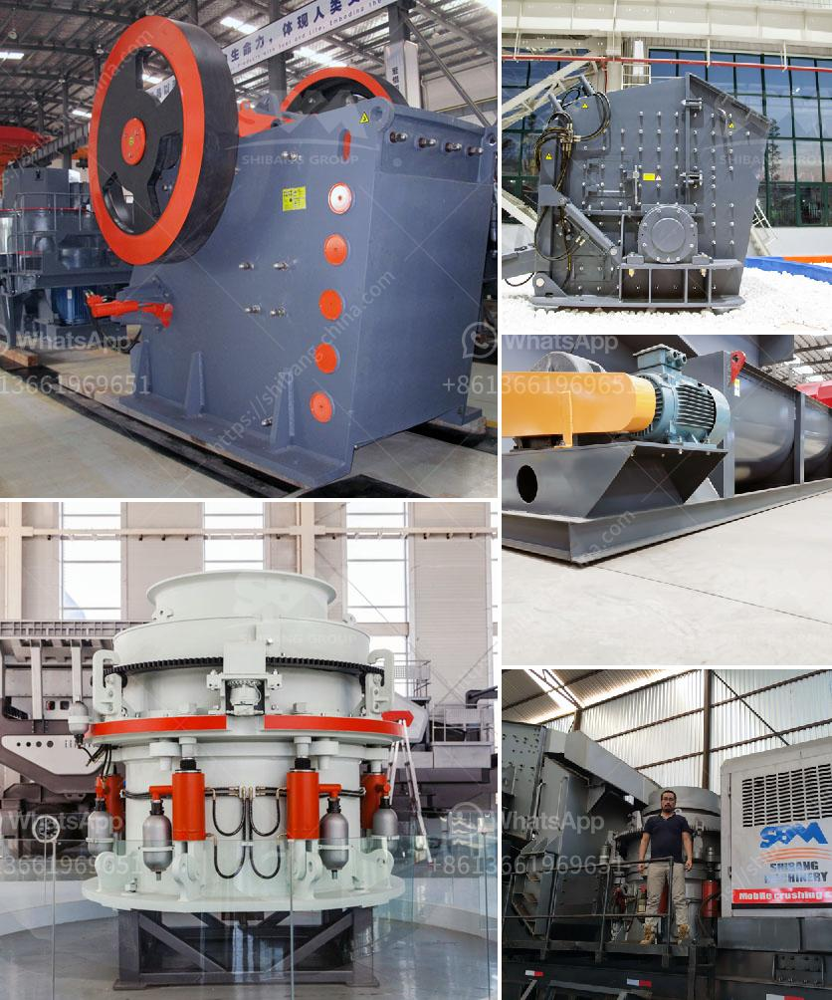

<h3>stone crushers price in south</h3>
With the development of infrastructure construction in various places, the demand for sand and gravel materials is increasing day by day. This requires the use of large amounts of high-quality stone crushing plants, which drives the domestic stone crushers price in South Africa on the rise.

Stone crusher machine price in South Africa mainly depends on the different brands of the suppliers who supply these machines and the level of technology. For example, the stone crusher machine price in South Africa of Zenith, the price of a mobile stone crushing plant with 100 tons per hour capacity is around $10 million. On the other hand, the stone crusher machines made by AIMIX are quite cheaper. The average price of the stone crusher machine in China this year is lower about 8.2% than the same period of the previous year, except for the stone crusher machine price in India.

The price of South African stone crushers costs working hours, productivity, raw limestone size and hardness, and stone crusher machine production line. Generally, the hourly output of a single machine is greater than 2,000 tons, and the whole production line can reach 20,000 tons per hour, which is a high-yield configuration for the economic development of South Africa. Stone crushers with different specifications are suitable for different production requirements of investors.

In South Africa, the suppliers of stone crushers mainly produced raw materials and finished products by themselves, and the supply is highly concentrated. The top three suppliers of stone crushers in South Africa are Oriental Machine Co., Ltd., Atlas Engineering Co., Ltd., and Sino-German Heavy Industry Co., Ltd., all located in Shanghai, China. They have been focusing on technological innovation and R&D, providing more cost-effective and high-quality stone crushing machines for users.

As for the stone crushers prices in South Africa, based on the products on the market in recent years, many of them are Chinese products. Despite their relatively low prices, these products have not lost the trust of local users due to their stable performance, high efficiency, and strong durability. Therefore, many people in South Africa choose to buy stone crushers from China.

With the continuous improvement of science and technology, the price of stone crushers has also increased, but the overall price is still at a reasonable level, which creates more opportunities for the development of stone crusher manufacturers. In addition, the fierce market competition has also contributed to the decrease in stone crushers prices in South Africa.

In summary, the price of stone crushers in South Africa is mainly determined by the size of the production capacity, the type of equipment, and the level of technology. Through comprehensive analysis and comparison, we can find that the price of stone crushers in South Africa is relatively low, and the cost performance is high, which is the gospel for users in need. Stone crushing machine manufacturers have been striving to provide users with high-quality equipment, which is also essential in the process of promoting economic development in South Africa.
<h3>Contact us</h3><ul><li><strong>Whatsapp:&nbsp;<a href="https://wa.me/8613661969651">+8613661969651</a></strong></li><li><a href="https://swt.shibang-china.com/?git&amp;zhl&amp;stone crushers price in south"><strong>Online Service(chat now)</strong></a></li></ul><h3>Related</h3><ul><li><a href='eco stone crusher.md'>eco stone crusher</a></li><li><a href='grinding mill made in germany.md'>grinding mill made in germany</a></li><li><a href='ball mill grinder.md'>ball mill grinder</a></li><li><a href='artificial sand project.md'>artificial sand project</a></li><li><a href='proposal for stone crushing business in kenya.md'>proposal for stone crushing business in kenya</a></li></ul>