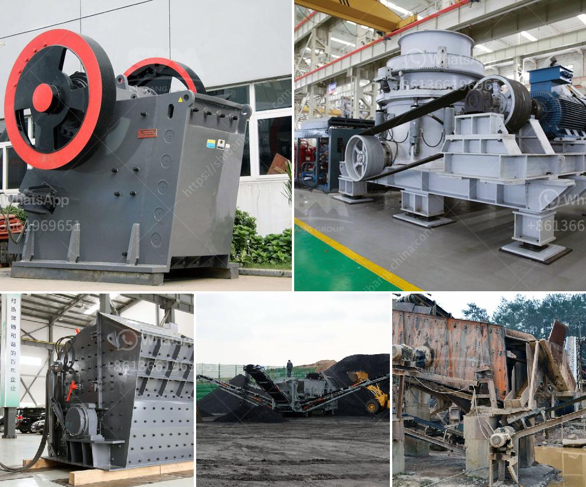

<h3>stone crushers turkey</h3>
Stone crushers are a vital piece of equipment in many industries, including construction, mining, and metallurgy. In Turkey, the use of stone crushers is widespread due to its numerous advantages, such as flexibility, efficiency, and low operating costs. These crushers are ideal for crushing various types of stones, such as granite, limestone, marble, basalt, gravel, and more. 

One of the key advantages of stone crushers in Turkey is their ability to crush hard materials efficiently. Crushing hard stones has always been a challenging task for stone crushers, but with proper design and technological advancements, these machines can easily crush even the hardest stones without any hassle. This feature increases their efficiency and reduces the overall operating costs of the industry.

Moreover, stone crushers in Turkey are highly flexible and versatile machines. They can be used in various applications, ranging from construction sites to quarries and mines. These crushers have the ability to process different types of rocks and stones into desired sizes, making them suitable for a wide range of projects. Whether it's crushing stones for road construction or producing aggregates for concrete, stone crushers in Turkey can efficiently meet the demands of different industries.

Additionally, stone crushers in Turkey are known for their low operating costs. These machines are designed to provide optimal performance while consuming minimal energy. This not only reduces the overall operational expenses but also minimizes the impact on the environment. With the growing emphasis on sustainable practices, many industries in Turkey prefer these crushers as they help achieve their goals of cost-effectiveness and environmental responsibility.

The stone crusher industry in Turkey is witnessing a boom due to the rapid urbanization and infrastructure development projects in the country. This has increased the demand for stones and aggregates, leading to the growth of the stone crusher market. The availability of advanced technologies and the presence of established manufacturers in Turkey further contribute to the industry's growth.

The stone crusher market in Turkey is highly competitive, with numerous manufacturers offering a wide range of crushers to cater to different needs. Therefore, it's crucial for businesses to carefully assess their requirements and choose the right crusher that offers the desired features and benefits. Factors such as production capacity, power consumption, maintenance requirements, and ease of operation should be taken into consideration while making a buying decision.

In conclusion, stone crushers in Turkey are essential equipment for many industries due to their flexibility, efficiency, and low operating costs. They provide a cost-effective solution for crushing hard stones and producing high-quality aggregates. With the booming construction and infrastructure development projects in Turkey, the demand for stone crushers is expected to further rise in the coming years. Businesses should carefully consider their requirements and choose the right crusher that meets their needs to maximize their productivity and success.
<h3>Contact us</h3><ul><li><strong>Whatsapp:&nbsp;<a href="https://wa.me/8613661969651">+8613661969651</a></strong></li><li><a href="https://swt.shibang-china.com/?git&amp;zhl&amp;stone crushers turkey"><strong>Online Service(chat now)</strong></a></li></ul><h3>Related</h3><ul><li><a href='manganese processing plant in south africa.md'>manganese processing plant in south africa</a></li><li><a href='vibro feeder price listing south africa.md'>vibro feeder price listing south africa</a></li><li><a href='marble powder grinding plant manufacturer.md'>marble powder grinding plant manufacturer</a></li><li><a href='crushers manufacturers in south africa.md'>crushers manufacturers in south africa</a></li><li><a href='robo sand making equipment rates in india.md'>robo sand making equipment rates in india</a></li></ul>