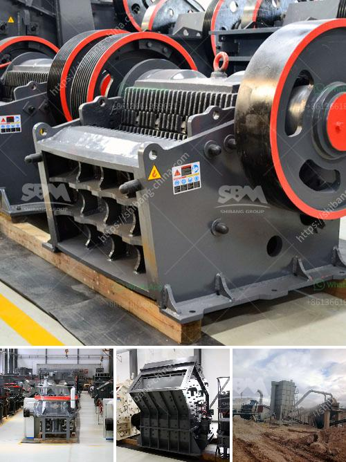

<h3>stone crushing equipment available in northern cape</h3>
Stone crushing equipment is widely used in various industries like mining, metallurgy, building material, highway, railway, water conservancy, chemical industry, and many others. Nowadays, stone crushing equipment has become an essential part of the machinery in different industries like construction, mining, demolition, and recycling.

The mining industry is one of the key sectors driving the growth of the economy in the Northern Cape Province in South Africa. Notably, the manufacturing and construction sectors heavily rely on stone crushing equipment in processing raw materials into finished products.

Stone crushers are extensively used to crush bulk and heavy stones into different sizes efficiently and reliably, be it for road construction, building construction, or other industrial purposes. Stone crushing plants are also necessary for the production of concrete aggregates, asphalt aggregates, and other construction materials.

In the Northern Cape, there are a variety of stone crushing equipment available in the market. These machines are designed with advanced technology and equipped with powerful components for crushing even the hardest stones with ease. Let's explore some popular stone crushing equipment found in the Northern Cape:

1. Jaw Crusher: This is a type of primary crusher widely used in mines due to its ability to crush tough and abrasive materials. It consists of a fixed jaw plate and a movable jaw plate. When the movable jaw plate moves towards the fixed jaw plate, the material is crushed between them.

2. Cone Crusher: Cone crushers are commonly used in secondary and tertiary crushing stages. They are efficient in producing cubic-shaped aggregates with the desired size. The cone crusher operates by compressing the material between an eccentrically rotating mantle and a concave.

3. Impact Crusher: Impact crushers utilize the impact force generated by the rotor to crush materials. They are suitable for various applications, including limestone, granite, and concrete. Impact crushers are known for their high reduction ratios and high productivity.

4. Vibrating Screen: Vibrating screens are essential equipment in stone crushing plants. They help separate different sizes of stones, ensuring the final product meets the required specifications. Vibrating screens operate by vibrating the screen deck, allowing the smaller particles to fall through while larger particles are retained on the screen surface.

5. Conveyor Belts: Conveyor belts play a crucial role in transporting materials from one process to another. In stone crushing plants, conveyor belts are used to transport stones to the next stages of the crushing process or to stockpile them for further processing.

In conclusion, stone crushing equipment is an important part of the machinery used in the Northern Cape Province's mining and construction industries. Various types of stone crushers, vibrating screens, and conveyor belts are available to efficiently process different types of stones for various applications. These machines ensure the production of high-quality aggregates and materials required for infrastructure development.
<h3>Contact us</h3><ul><li><strong>Whatsapp:&nbsp;<a href="https://wa.me/8613661969651">+8613661969651</a></strong></li><li><a href="https://swt.shibang-china.com/?git&amp;zhl&amp;stone crushing equipment available in northern cape"><strong>Online Service(chat now)</strong></a></li></ul><h3>Related</h3><ul><li><a href='crushing plants for sale in south africa.md'>crushing plants for sale in south africa</a></li><li><a href='high pressure micro powder grinder in india.md'>high pressure micro powder grinder in india</a></li><li><a href='graphite mining process.md'>graphite mining process</a></li><li><a href='rock crushers manufacturers.md'>rock crushers manufacturers</a></li><li><a href='raymond mills india.md'>raymond mills india</a></li></ul>