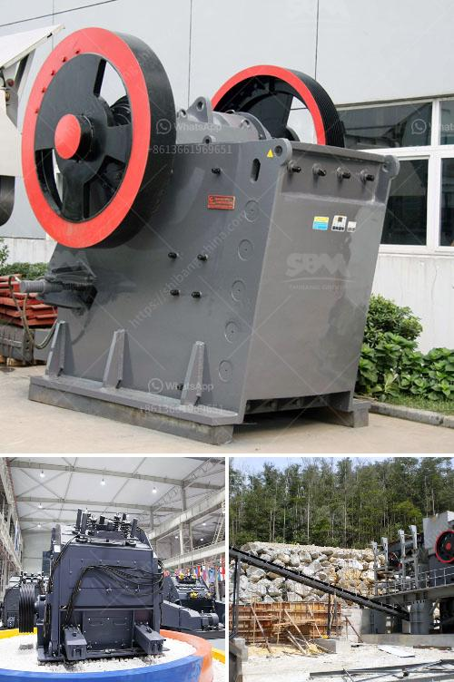

<h3>stone crushing equipment for hire in harare</h3>
Stone crushing equipment is a vital part of mining operations since it can break down large-sized stones into smaller pieces. With the rapid urbanization and infrastructural development in Harare, Zimbabwe, stone crushing equipment is in high demand and plays a crucial role in the construction industry.

The stone crushing equipment available for hire in Harare includes stone crushers, conveyors, loaders, backhoe loaders, and tipper trucks. These machines are ideal for large-scale mining operations or construction projects as they can crush and transport large quantities of stones at a time.

One of the advantages of hiring stone crushing equipment is that it eliminates the need for the project owner or contractor to invest in purchasing expensive equipment. This, in turn, reduces the financial burden and allows them to allocate more capital to other areas of the project. Additionally, hiring equipment provides the project owners the flexibility to access high-quality and well-maintained equipment without worrying about maintenance and storage.

Moreover, stone crushing equipment for hire in Harare promotes sustainable development in several ways. Firstly, it encourages the optimization of resources by utilizing existing equipment instead of manufacturing new machines. This reduces the consumption of raw materials and energy required for manufacturing new equipment, leading to a reduction in carbon emissions and environmental impact.

Secondly, hiring stone crushing equipment reduces the need for new quarries or mining sites. By utilizing existing mining sites, the impact on the environment is minimized, including deforestation and destruction of natural habitats. This approach supports the principle of sustainable development by conserving natural resources and preserving the biodiversity of the region.

Additionally, stone crushing equipment for hire in Harare contributes to job creation and empowerment of local communities. The mining and construction industry is labor-intensive and requires skilled and unskilled workers. By hiring locally, these industries generate employment opportunities for local residents, which leads to poverty reduction and improved livelihoods. Moreover, the transfer of skills and knowledge from experienced contractors to the local workforce enhances their skills and capabilities, making them more employable in the long term.

Furthermore, stone crushing equipment for hire in Harare can lead to increased productivity in the construction industry. The availability of high-quality equipment ensures that construction projects are completed efficiently and within the specified deadlines. This, in turn, attracts more investment to the region as potential investors are assured of timely and successful project execution.

In conclusion, stone crushing equipment for hire in Harare is an essential component of the construction industry and plays a fundamental role in promoting sustainable development. By utilizing existing equipment, reducing the need for new mining sites, creating employment opportunities, and increasing productivity, stone crushing equipment for hire contributes to the overall development of the region. Therefore, it is important for project owners and contractors in Harare to consider hiring stone crushing equipment rather than investing in purchasing new machines. This approach not only benefits the environment but also promotes economic growth and social welfare.
<h3>Contact us</h3><ul><li><strong>Whatsapp:&nbsp;<a href="https://wa.me/8613661969651">+8613661969651</a></strong></li><li><a href="https://swt.shibang-china.com/?git&amp;zhl&amp;stone crushing equipment for hire in harare"><strong>Online Service(chat now)</strong></a></li></ul><h3>Related</h3><ul><li><a href='small rotary burner for sale used in us.md'>small rotary burner for sale used in us</a></li><li><a href='kaolin manufacturing process.md'>kaolin manufacturing process</a></li><li><a href='jaw crushers south africa.md'>jaw crushers south africa</a></li><li><a href='bentonite production process.md'>bentonite production process</a></li><li><a href='machine of coal crusher machine.md'>machine of coal crusher machine</a></li></ul>