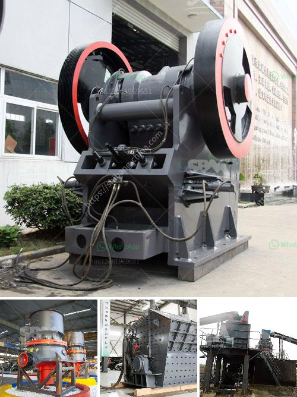

<h3>stone crushing plant manufacturers in</h3>
Stone crushing plant manufacturers in India have been serving the industry for many years. For professionals and enthusiasts alike, stone crushing plants are an integral part of their lives as they provide high-quality aggregates for construction purposes. The manufacturers understand the importance of the machines and equipment used to produce such aggregates, hence they take utmost care during the manufacturing process.

One of the leading stone crushing plant manufacturers in India, Mewar Hitech, has a comprehensive range of products that are designed to provide maximum output with minimum power consumption. The company is equipped with state-of-the-art machinery to deliver consistent quality products across the nation. They have a team of skilled engineers and technicians who continuously strive to improve the efficiency and performance of their machines.

Mewar Hitech offers a wide range of stone crushing plants that are categorized based on their crushing capacity. The primary jaw crusher is used for coarse crushing, followed by cone crushers or impact crushers for secondary crushing. The crushed stones are then screened for various sizes and brought to the designated storage areas by conveyors. Simplicity of design and rugged construction are the key features of their stone crushing plants.

In addition to stone crushing plants, Mewar Hitech also manufactures and supplies a wide range of jaw crushers, cone crushers, impact crushers, vibrating screens, feeders, and belt conveyors. As the market leader, they have successfully catered to the needs of diverse industries such as mining, quarrying, recycling, and construction.

The stone crushing plants manufactured by Mewar Hitech can be stationary or mobile. Their mobile stone crushing plants have a compact design and require minimal installation time. They are also easy to transport and possess unmatched mobility. These plants are equipped with advanced automation systems to ensure optimum productivity and efficiency.

Mewar Hitech's stone crushing plants are known for their superior performance, high reliability, and low operating costs. The company's commitment to quality and customer satisfaction is evident in the fact that their products are used by some of the biggest names in the industry. They have successfully completed numerous projects in various parts of the country and have earned an impeccable reputation for delivering projects on time and within budget.

In conclusion, stone crushing plant manufacturers in India play a crucial role in the construction industry by providing high-quality aggregates for various purposes. Mewar Hitech is a leading manufacturer and supplier of stone crushing plants that meet the highest industry standards. With their state-of-the-art machinery and skilled workforce, they ensure that their products are of superior quality and offer maximum performance. Whether it is stationary or mobile stone crushing plants, their designs are innovative, efficient, and reliable. So, if you are in need of a stone crushing plant, look no further than Mewar Hitech.
<h3>Contact us</h3><ul><li><strong>Whatsapp:&nbsp;<a href="https://wa.me/8613661969651">+8613661969651</a></strong></li><li><a href="https://swt.shibang-china.com/?git&amp;zhl&amp;stone crushing plant manufacturers in"><strong>Online Service(chat now)</strong></a></li></ul><h3>Related</h3><ul><li><a href='impact crusher for sale saudi.md'>impact crusher for sale saudi</a></li><li><a href='silica sand screening plant.md'>silica sand screening plant</a></li><li><a href='copper concentrate ball mill for sale.md'>copper concentrate ball mill for sale</a></li><li><a href='alluvial gold plants for sale south africa.md'>alluvial gold plants for sale south africa</a></li><li><a href='pulveriser machine new technolgy.md'>pulveriser machine new technolgy</a></li></ul>