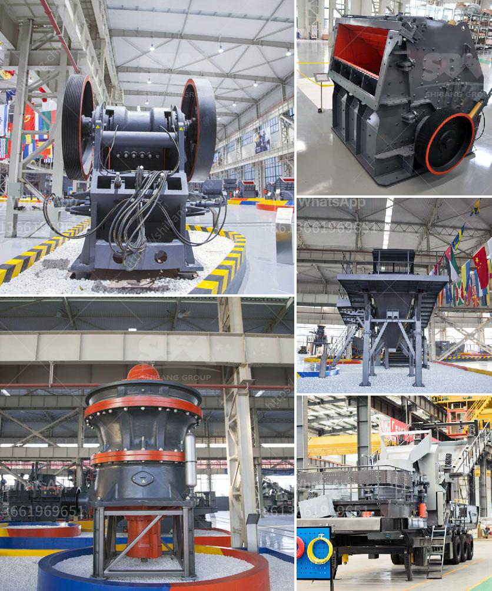

<h3>stone crushing plants in malaysia</h3>
Stone crushing plants are essential for the construction industry, as they produce the base material for many infrastructure projects. Malaysia has a strong commitment to building quality infrastructure, and this has given rise to a thriving stone crushing industry. The mining sector contributes significantly to Malaysia’s economy and has played a crucial role in the country’s development.

Stone crushing plants are a crucial component in the construction industry as they produce the building blocks for creating roads, airports, and buildings. Stone crushers are commonly used for crushing raw materials such as granite, basalt, limestone, pebble, river stone, quartz, copper ore, iron ore, etc. The growing demand for these stones from various sectors such as real estate, construction, infrastructure, industries, etc., is driving the stone crushing equipment market.

In Malaysia, the stone crushing plants offer a wide range of applications, including the production of high-quality aggregates, road materials, and railway ballast. They are also used in the manufacture of cement and other building materials. According to statistics, more than 1,500 stone crushing plants are operating in the region with a workforce of about 15,000 people.

The demand for stone crushing services in Malaysia has increased significantly over the years as the country continues to strengthen its infrastructure. To accommodate the growing demand, many stone crushing plants have been set up in various locations in Malaysia.

Today, Malaysia produces a wide variety of stones in different sizes, shapes, and colors. With the help of advanced crushing technology and mining machinery, the extraction of these valuable resources can be done efficiently and economically. This has made Malaysia a leading supplier of quality stones to different parts of the world.

In conclusion, stone crushing plants are a strategic investment opportunity for the industry players as they contribute to the country's economic growth while satisfying the increasing demand for construction materials. In Malaysia, stone crushing plants create jobs and generate tax revenue for the government and provide a constant supply of stone products for various sectors, thereby contributing to the development of the nation.
<h3>Contact us</h3><ul><li><strong>Whatsapp:&nbsp;<a href="https://wa.me/8613661969651">+8613661969651</a></strong></li><li><a href="https://swt.shibang-china.com/?git&amp;zhl&amp;stone crushing plants in malaysia"><strong>Online Service(chat now)</strong></a></li></ul><h3>Related</h3><ul><li><a href='germany calcium carbonate grinding mill suppliers.md'>germany calcium carbonate grinding mill suppliers</a></li><li><a href='wet process cement.md'>wet process cement</a></li><li><a href='conveyor belt manufacturers in pakistan.md'>conveyor belt manufacturers in pakistan</a></li><li><a href='small rock crusher portable gold mining.md'>small rock crusher portable gold mining</a></li><li><a href='hand stone crushing machines uganda.md'>hand stone crushing machines uganda</a></li></ul>