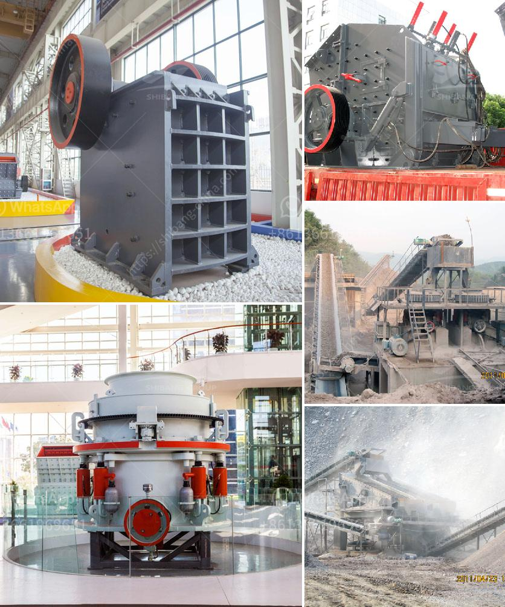

<h3>stone crushing plants</h3>
Stone crushing plants are important equipment for construction and mining industry. The rock crushing plants can be constructed with different types of machines such as jaw crusher, impact crusher, cone crusher, vibrating feeder, vibrating screen, belt conveyor etc. The choice of machinery and equipment depends on the range of the stones raw materials, production capacity and desired final product size.

The rock crushing plants are widely used in quarry, mine, building material, highway, railway and other industries to crush stones or ores into smaller sizes. According to the different crushing process, the plants can be designed with different configurations. For example, the crushing process of granite can be divided into three stages: coarse crushing, secondary crushing, and tertiary crushing. We usually use jaw crusher and impact crusher for coarse crushing, cone crusher for secondary crushing, and vibrating screen for sieving the crushed materials into different sizes.

The stone crushing plants not only have high crushing efficiency, but also have convenient operation and maintenance manual. The machines have the wide application range, which can satisfy the various crushing needs of the customers. They have a flexible use of work methods and require less investment costs. So, it has become the first choice for the crushing plants that are widely used in industrial sectors such as metallurgy, chemical industry, building materials, and electric power.

To estimate the cost to build the crushing plant, we need to determine the raw material primary crushing machine itself and additional auxiliary equipment such as vibrating feeder, vibrating screen and belt conveyor. The general budget for the stone crushing plant cost on a fixed crusher when it comes to investing a fixed crusher machine, it often refers to the following factors power supply and freight and maintenance cost, how much it will take on a stone crushing machine.

More importantly, the stone crushing plants produce high quality rocks and stones for construction and mining industry. For instance, crushed stone is used for asphalt and concrete roads, while sand and gravel are used for the production of cement and bricks. These materials are also used in the manufacture of construction materials such as ceramic tiles and clay pipes. Therefore, the demand for stone crushing plants is increasing in the construction and mining industry.

In conclusion, the stone crushing plant refers to the dedicated device used for the construction sand and stone production. Compared with the traditional sand making production line, its environment friendliness makes it widely applied in the engineering constructions of stone plant, mine, metallurgy, construction materials, highway and railway and water conversancy. What's more, the production line is highly automated with low operation cost, high crushing rate, energy saving, large output, uniform particle size, and good grain shape. So, it is widely accepted by more and more customers in the market.
<h3>Contact us</h3><ul><li><strong>Whatsapp:&nbsp;<a href="https://wa.me/8613661969651">+8613661969651</a></strong></li><li><a href="https://swt.shibang-china.com/?git&amp;zhl&amp;stone crushing plants"><strong>Online Service(chat now)</strong></a></li></ul><h3>Related</h3><ul><li><a href='washing plant suppliers in mozambique.md'>washing plant suppliers in mozambique</a></li><li><a href='course in maintenance of stone crushers.md'>course in maintenance of stone crushers</a></li><li><a href='iron processing equipment in mexico.md'>iron processing equipment in mexico</a></li><li><a href='chrome ore mining plant sudan.md'>chrome ore mining plant sudan</a></li><li><a href='cost analysis of stone quarry in india.md'>cost analysis of stone quarry in india</a></li></ul>