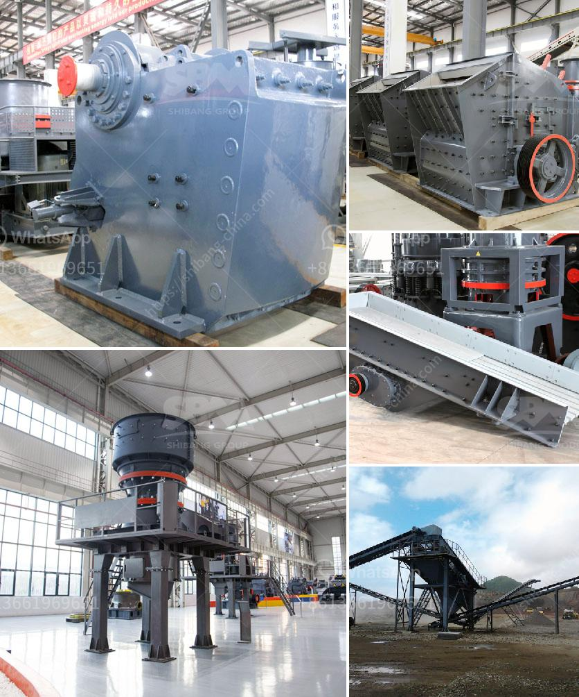

<h3>stone dust making machine</h3>
Stone dust, also known as stone screenings, is a byproduct obtained from crushing various types of stones. This finely crushed stone dust is ideal for use as a base material for pavers and other similar construction projects. In order to efficiently produce stone dust, a stone dust making machine is required. This innovative piece of machinery has revolutionized the process of producing stone dust.

The stone dust making machine is a high-efficiency, low-cost, environmentally friendly and energy-saving stone crushing and sand making machine, which has been widely used in various industries. It is suitable for processing various materials, including granite, limestone, basalt, pebble, quartz stone, river gravel, iron ore, copper ore, etc.

One of the key features of the stone dust making machine is its advanced crushing and shaping technology. This technology ensures that the produced stone dust has a uniform particle size and good particle shape. The machine uses a high-speed rotating rotor with a hammerhead to repeatedly impact the stone materials. This action not only crushes the stones into smaller sizes but also shapes them into cubic particles.

The stone dust making machine is also equipped with a screening device. This device helps to control the particle size of the final product. The oversize materials are screened out and returned to the crusher for further crushing to ensure the uniformity and quality of the stone dust. The screening device also ensures that no large stones or foreign materials enter the final product, avoiding damage to downstream equipment.

In addition to its efficient crushing and shaping capabilities, the stone dust making machine is also known for its low energy consumption. The machine is designed to maximize energy utilization and reduce energy waste. This feature not only saves production costs but also helps to protect the environment by reducing carbon emissions.

Furthermore, the stone dust making machine is easy to operate and maintain. It is equipped with a centralized control system that allows operators to monitor and adjust various parameters, such as the feeding amount, rotor speed, and particle size. The machine is also designed with a quick-wear part replacement system, making maintenance and repairs quick and convenient.

The stone dust produced by the stone dust making machine has a wide range of applications. It can be used as a base material for pavers, as a raw material for concrete production, or as a filler in various construction projects. The uniform particle size and good particle shape of the stone dust make it ideal for these applications, providing strength, stability, and aesthetics to the finished projects.

In conclusion, the stone dust making machine is a versatile and efficient piece of machinery that has greatly improved the process of producing stone dust. With its advanced crushing and shaping technology, low energy consumption, and ease of operation and maintenance, this machine has become an essential tool for the construction industry. Whether for pavers, concrete production, or other construction projects, the stone dust produced by this machine delivers consistent quality and performance.
<h3>Contact us</h3><ul><li><strong>Whatsapp:&nbsp;<a href="https://wa.me/8613661969651">+8613661969651</a></strong></li><li><a href="https://swt.shibang-china.com/?git&amp;zhl&amp;stone dust making machine"><strong>Online Service(chat now)</strong></a></li></ul><h3>Related</h3><ul><li><a href='course in maintenance of stone crushers.md'>course in maintenance of stone crushers</a></li><li><a href='laborte crusing plant.md'>laborte crusing plant</a></li><li><a href='stone mill grinder price.md'>stone mill grinder price</a></li><li><a href='ball mill education.md'>ball mill education</a></li><li><a href='gypsum board production line for sale.md'>gypsum board production line for sale</a></li></ul>