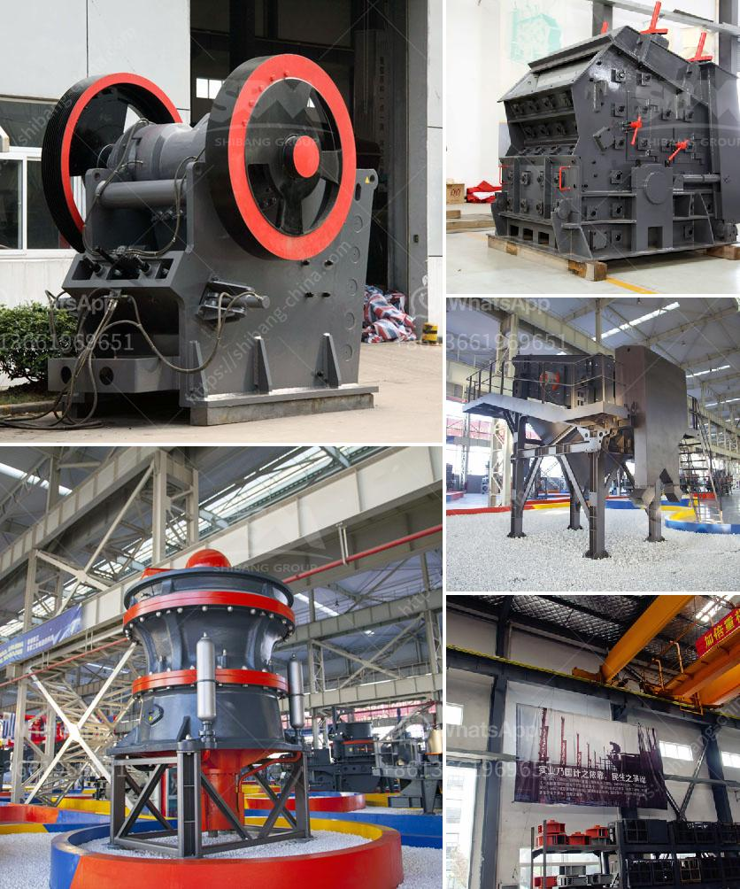

<h3>stone dust processing machine</h3>
Stone dust is a byproduct generated during the crushing process of stones. It is an extremely fine and powdery substance that may have several uses. By utilizing the stone dust processing machine, stone dust can be efficiently converted into useful materials. In this article, we will discuss the stone dust processing machine and its importance in various industries.

The stone dust processing machine is designed to crush, separate, and clean the dust from raw materials. Unlike traditional machines that simply crush stones, this machine uses special blades to disintegrate the stones into smaller particles. These smaller particles are then processed through various screens and blowers to separate the dust from the bigger chunks of stones. Finally, the dust is fed into a further cleaning process for removal of impurities and contaminants.

One of the primary uses of processed stone dust is in construction. As it is a very fine material, it can easily fill the gaps between larger stones, thus providing stability to structures such as roads, bridges, and buildings. Additionally, it can also be mixed with cement, sand, and water to create a durable and strong concrete mix. This makes it an essential component in constructing foundations, flooring, and structural elements.

Another significant application of stone dust is in the manufacturing of bricks and blocks. The fine particles of stone dust act as a binding agent when mixed with sand and cement. This mixture is then molded into desired shapes and cured under controlled conditions. The result is a sturdy and durable building material that is widely used in the construction industry.

Stone dust can also be used as a base material for pavers and tiles. Its compact nature and ability to stabilize larger stones make it an ideal choice for creating driveways, walkways, and patios. Furthermore, it can be mixed with sand and applied as a joint filler between pavers, providing strength and stability to the entire structure.

Apart from construction applications, stone dust also finds use in agriculture and gardening. It can be mixed with soil to improve its drainage and moisture retention capabilities. Additionally, the minerals present in the stone dust enrich the soil, promoting healthier plant growth and increased crop yield.

In conclusion, the stone dust processing machine is an essential tool in converting waste material into valuable products. Its ability to crush, separate, and clean stone dust enables its utilization in various industries. From construction to agriculture, stone dust is a versatile material that plays a significant role in enhancing structural integrity and improving soil quality. By utilizing this machine, we can contribute to a more sustainable and efficient utilization of natural resources.
<h3>Contact us</h3><ul><li><strong>Whatsapp:&nbsp;<a href="https://wa.me/8613661969651">+8613661969651</a></strong></li><li><a href="https://swt.shibang-china.com/?git&amp;zhl&amp;stone dust processing machine"><strong>Online Service(chat now)</strong></a></li></ul><h3>Related</h3><ul><li><a href='closing of crushing plant.md'>closing of crushing plant</a></li><li><a href='high pressure micro powder grinder in india.md'>high pressure micro powder grinder in india</a></li><li><a href='crusher stone crusher 4 ton.md'>crusher stone crusher 4 ton</a></li><li><a href='balls for mining mill.md'>balls for mining mill</a></li><li><a href='stone crushers in china.md'>stone crushers in china</a></li></ul>