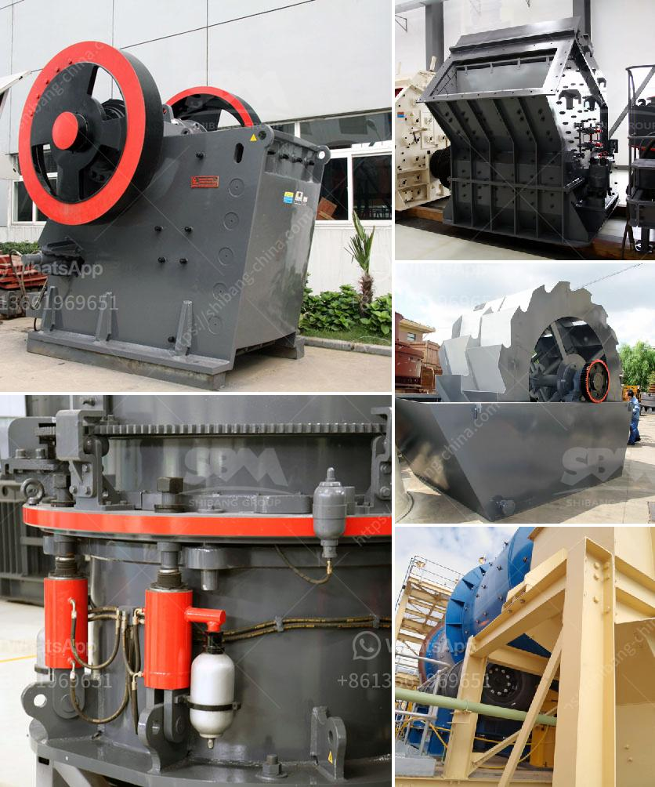

<h3>stone grinder machine for marble</h3>
Marble is a natural stone that boasts elegance and style. Its unique patterns and colors make it a popular choice for countertops, flooring, and other decorative purposes. To maintain its beauty and longevity, marble requires regular care and maintenance. One tool that has proven to be essential in the maintenance of marble is the stone grinder machine.

A stone grinder machine for marble is designed to break down and remove any scratches or imperfections on the surface of the marble. This machine uses various diamond grinding and polishing discs to achieve a smooth and shiny finish.

One major advantage of using a stone grinder machine for marble is its ability to remove deep stains and etchings. These can be caused by spills, acidic substances, or even heavy foot traffic. The machine's powerful motor and abrasive discs work together to eliminate these blemishes, leaving the marble looking as good as new.

Another benefit of using a stone grinder machine for marble is its versatility. It can be used on various marble surfaces, including countertops, floors, and even walls. The machine's adjustable settings allow you to achieve different levels of polishing, from a matte to a high-gloss finish. This versatility makes it a valuable tool for both homeowners and professionals in the stone industry.

In addition to its functionality, the stone grinder machine for marble is also designed with user-friendliness in mind. Its ergonomic handle and lightweight construction make it easy to handle and maneuver, reducing operator fatigue. The machine's compact size also allows it to reach tight corners and edges, ensuring every inch of the marble is treated.

In conclusion, the stone grinder machine for marble is an indispensable tool for those looking to maintain the beauty and integrity of their marble surfaces. Its ability to remove stains, etchings, and imperfections, as well as its versatility and user-friendly design, make it a must-have for any marble enthusiast. With regular use of this machine, your marble surfaces will continue to shine and impress for years to come.
<h3>Contact us</h3><ul><li><strong>Whatsapp:&nbsp;<a href="https://wa.me/8613661969651">+8613661969651</a></strong></li><li><a href="https://swt.shibang-china.com/?git&amp;zhl&amp;stone grinder machine for marble"><strong>Online Service(chat now)</strong></a></li></ul><h3>Related</h3><ul><li><a href='gold hammer mill.md'>gold hammer mill</a></li><li><a href='iron ore beneficiation poland.md'>iron ore beneficiation poland</a></li><li><a href='rock crusher uganda.md'>rock crusher uganda</a></li><li><a href='crusher manufacturers in peru.md'>crusher manufacturers in peru</a></li><li><a href='used small rotary kiln price russia.md'>used small rotary kiln price russia</a></li></ul>