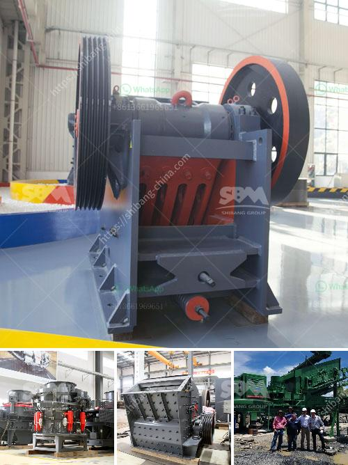

<h3>stone hammer mill machine</h3>
The stone hammer mill machine is a type of equipment used for crushing and grinding hard materials into small pieces. This machine is widely used in industries such as mining, building materials, chemicals, metallurgy, and highway construction. It is specifically designed to reduce the size of coarse materials such as stones, ores, minerals, and rock into smaller particles suitable for further processing or use.

The stone hammer mill machine consists of a rotor that revolves at high speed. The rotor is equipped with hammers, which strike and crush the materials upon rotation. The size and strength of the hammers can vary depending on the application and the hardness of the materials. The crushed materials are then discharged through a screen, which controls the size of the particles that pass through.

One of the key advantages of the stone hammer mill machine is its versatility. It can handle a wide range of materials, including soft to medium-hard rock, limestone, phosphate rock, gypsum, coal, and coke. This flexibility allows the machine to be used in various industries, making it a valuable tool for many businesses.

Additionally, the stone hammer mill machine is known for its high efficiency and low power consumption. The powerful motor and the carefully designed rotor with quality hammers ensure that the machine delivers consistent and reliable performance while consuming minimal energy. This not only reduces operational costs but also contributes to a greener and more sustainable production process.

Another significant advantage of the stone hammer mill machine is its simple and robust construction. The machine is composed of a sturdy frame, a protective casing, a motor, hammers, screens, and bearings. Its straightforward design allows for easy maintenance and repairs, ensuring minimal downtime and maximum productivity.

Furthermore, the stone hammer mill machine offers excellent particle size control. By adjusting the screen size and the rotor speed, the machine can produce a wide range of particle sizes, providing flexibility for different applications. This precision in particle size control is crucial for various industries, such as the production of cement, aggregates, or even pharmaceuticals.

In conclusion, the stone hammer mill machine is a powerful and versatile piece of equipment used for crushing and grinding hard materials. Its high efficiency, low power consumption, and simple construction make it an essential tool in various industries. Whether it is used for mining, construction, or chemical processing, this machine guarantees consistent performance and excellent particle size control. Invest in the stone hammer mill machine, and experience the benefits of efficient and reliable material reduction.
<h3>Contact us</h3><ul><li><strong>Whatsapp:&nbsp;<a href="https://wa.me/8613661969651">+8613661969651</a></strong></li><li><a href="https://swt.shibang-china.com/?git&amp;zhl&amp;stone hammer mill machine"><strong>Online Service(chat now)</strong></a></li></ul><h3>Related</h3><ul><li><a href='quartz silica old plant sale at telgana.md'>quartz silica old plant sale at telgana</a></li><li><a href='stone crusher plant in pakistan.md'>stone crusher plant in pakistan</a></li><li><a href='gyratory crusher second tier concaves.md'>gyratory crusher second tier concaves</a></li><li><a href='europe crusher producers.md'>europe crusher producers</a></li><li><a href='concrete crusher for sale in nigeria.md'>concrete crusher for sale in nigeria</a></li></ul>