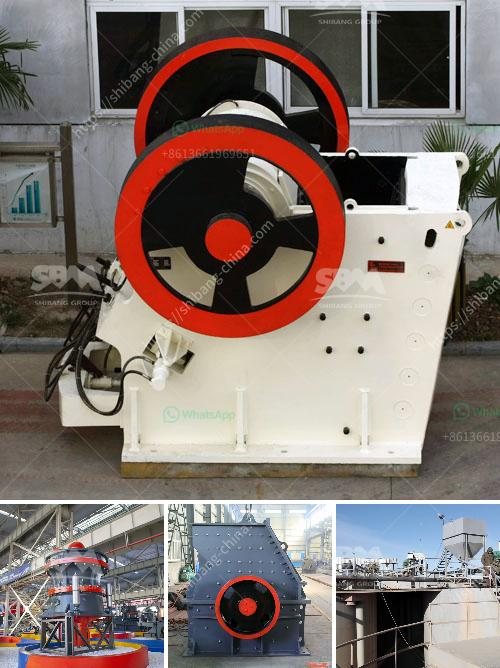

<h3>stone hammer mills in china</h3>
Stone hammer mills in China have been used for centuries to crush and grind different types of materials. This ancient technique has been adapted and improved over the years to become an efficient and reliable method for processing different materials.

One of the main advantages of stone hammer mills is their versatility. They can be used to crush and grind a wide range of materials, such as grains, herbs, spices, and even minerals. The size of the final product can be adjusted by changing the size of the openings in the mill's screens, making it suitable for various applications.

In China, stone hammer mills are widely used in the agricultural sector to grind grains and produce flour. They are also used in the manufacturing industry to crush minerals and produce powders. These machines are especially popular in rural areas where access to electricity is limited. They can be powered by a variety of sources, such as waterwheels, windmills, or even animals.

The construction of stone hammer mills is simple and robust, making them easy to operate and maintain. The main components of a typical stone hammer mill include a rotating shaft, hammers or beaters, and a perforated screen. The material is fed into the mill through a hopper and is pulverized by the rotating hammers or beaters. The pulverized material is then expelled through the perforated screen, while the larger particles are retained for further processing.

Stone hammer mills in China are not only efficient and durable but also environmentally friendly. Unlike modern grinding methods that require electricity or fuel, stone hammer mills use natural energy sources, such as water or wind, reducing the carbon footprint associated with their operation.

In conclusion, stone hammer mills in China are a traditional and effective method for crushing and grinding different materials. Whether used in agriculture or manufacturing, these machines are versatile, easy to operate, and environmentally friendly. They continue to play an important role in various industries, contributing to the development and sustainability of China's economy.
<h3>Contact us</h3><ul><li><strong>Whatsapp:&nbsp;<a href="https://wa.me/8613661969651">+8613661969651</a></strong></li><li><a href="https://swt.shibang-china.com/?git&amp;zhl&amp;stone hammer mills in china"><strong>Online Service(chat now)</strong></a></li></ul><h3>Related</h3><ul><li><a href='cutting milling machine for marble and granite.md'>cutting milling machine for marble and granite</a></li><li><a href='stone crusher machine price.md'>stone crusher machine price</a></li><li><a href='gypsum crushing plant.md'>gypsum crushing plant</a></li><li><a href='crusher machine saudi arabia.md'>crusher machine saudi arabia</a></li><li><a href='crusher on lease basis in nigeria.md'>crusher on lease basis in nigeria</a></li></ul>